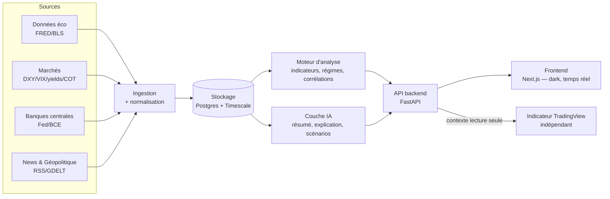

# Tome 0 — Cahier des charges & Vision

> **Statut : ✅ Rédigé** · Version 1.0 · Document maître.
> Tous les autres tomes doivent être compatibles avec celui-ci.

---

## 1. Résumé exécutif

**MacroLens** est une plateforme d'analyse macroéconomique assistée par
intelligence artificielle, destinée à un trader individuel exigeant. Elle vise
l'utilité d'un *Bloomberg Terminal* ou d'un *Trading Economics* sur le volet
macro/contexte, avec une interface moderne, sombre, rapide et intuitive, et une
couche d'IA qui **lit, comprend, résume, explique et met en scénarios** le flux
d'informations économiques et géopolitiques.

La plateforme fait gagner **plusieurs heures d'analyse par jour** en centralisant
et en pré-digérant l'information. Elle est le **pendant macro** d'un indicateur
technique TradingView semi-automatique ; les deux systèmes restent **strictement
indépendants**.

## 2. Principe fondateur (intangible)

MacroLens **n'est pas** un robot de trading. Elle ne doit **jamais** :

- ouvrir, modifier ou fermer une position ;
- acheter ou vendre automatiquement ;
- émettre un **signal d'achat ou de vente** ;
- se substituer au jugement du trader.

Son rôle est **exclusivement** de :

- **centraliser** les informations importantes ;
- **analyser** les données économiques ;
- **expliquer** les événements et leurs mécanismes ;
- **résumer** l'actualité ;
- **présenter des scénarios** possibles avec un niveau de confiance ;
- **prioriser** ce qui compte, pour économiser du temps.

> **Règle d'or produit** : tout ce que produit MacroLens est un *élément de
> contexte* et d'aide à la réflexion. La formulation reste descriptive
> (« l'inflation surprend à la hausse, ce qui soutient historiquement le dollar »)
> et **jamais** prescriptive (« achetez le dollar »). Voir §9 (garde-fous).

## 3. Utilisateurs & cas d'usage

### 3.1 Persona principal
« Trader discrétionnaire assisté » : opère au discrétionnaire avec un indicateur
technique semi-automatique (SMC, liquidité, VWAP, structure). Il perd beaucoup de
temps chaque jour à parcourir calendriers, news et données. Il a besoin d'un
**poste de contexte macro** fiable, synthétique et explicable.

### 3.2 Cas d'usage clés (user stories)
1. **Briefing du matin** : en 3 minutes, comprendre le climat macro du jour, les
   événements à risque, et les marchés à surveiller.
2. **Avant un événement** (CPI, FOMC, NFP) : voir les attentes, les scénarios
   possibles (au-dessus/dans/en-dessous du consensus) et les enchaînements probables.
3. **Réaction à une news** : comprendre en un coup d'œil *pourquoi* une news est
   importante, *quels marchés* elle concerne, et *quels mécanismes* sont en jeu.
4. **Contexte pour une idée technique** : consulter le biais macro d'un actif
   (or, DXY, indices, crypto, pétrole) pour confirmer ou nuancer une intuition —
   sans jamais recevoir d'ordre.
5. **Veille des corrélations** : surveiller les relations inter-marchés
   (DXY↔or, taux réels↔or, VIX↔indices, pétrole↔CAD, etc.).

## 4. Périmètre fonctionnel

### 4.1 Domaines analysés
Inflation · taux directeurs · banques centrales · NFP · CPI · PPI · PMI · PIB ·
chômage · discours des banques centrales · minutes du FOMC · rendements
obligataires · courbe des taux · DXY · VIX · COT Report · flux institutionnels ·
OPEP · stocks de pétrole · géopolitique · guerres · sanctions · élections ·
crises financières · actualités économiques · matières premières · Forex ·
indices · crypto · corrélations entre marchés.

### 4.2 Capacités de l'IA
Lire → comprendre → résumer → expliquer l'importance → identifier les marchés
concernés → expliquer les mécanismes économiques → présenter plusieurs scénarios
→ évaluer son niveau de confiance → prioriser l'information.
**Interdit** : émettre un ordre de trading (voir §9).

### 4.3 Hors périmètre (non-goals)
- Exécution d'ordres, connexion à un broker, gestion de portefeuille.
- Signaux d'entrée/sortie, backtesting de stratégies de trading directionnelles.
- Analyse technique (chart patterns, indicateurs) — c'est le rôle de l'indicateur
  TradingView, qui reste séparé.
- Conseil en investissement personnalisé au sens réglementaire.

## 5. Exigences non fonctionnelles (NFR)

| Catégorie | Exigence cible |
|-----------|----------------|
| **Performance** | Chargement dashboard < 2 s ; réponse API lecture < 200 ms (P95) ; analyse IA d'une news < 8 s. |
| **Temps réel** | Diffusion des mises à jour (données/news) au client en < 5 s via flux push. |
| **Disponibilité** | Cible 99 % (usage individuel) ; dégradation **gracieuse** obligatoire si une source tombe. |
| **Évolutivité** | Ajouter une source ou un actif sans refactor majeur (architecture modulaire, interfaces stables). |
| **Maintenabilité** | Code typé, testé, linté ; documentation par tome ; ADR pour chaque décision structurante. |
| **Sécurité** | Secrets hors du code ; endpoints protégés ; principe du moindre privilège (voir Tome 9). |
| **Coût** | Fonctionner sur un socle **gratuit** (sources publiques + repli) ; l'IA et les sources premium sont **optionnelles** et à coût maîtrisé. |
| **Accessibilité** | Contraste AA, navigation clavier, `prefers-reduced-motion`, responsive mobile→desktop. |
| **Observabilité** | Logs structurés, métriques, traçage des cycles d'ingestion et des appels IA. |

## 6. Contraintes & hypothèses

- **Interface** : moderne, rapide, professionnelle, minimaliste, **dark mode**, responsive.
- **Indépendance TradingView** : MacroLens ne lit pas et ne modifie pas la logique
  technique ; elle expose uniquement du **contexte** (Tome 8).
- **Fondation existante** : le module `macro-intel` (FastAPI + moteur de scoring +
  fusion + providers + SSE) est le **germe** de la plateforme et doit être
  **préservé et étendu**, pas réécrit (voir Tome 1, §Migration).
- **Budget d'un particulier** : privilégier les briques open-source et les paliers
  gratuits ; l'usage d'un LLM est conçu pour être **frugal** (mise en cache,
  traitement par lot, repli déterministe).

## 7. Architecture d'ensemble (aperçu — détaillée au Tome 1)

## 8. Glossaire

| Terme | Définition |
|-------|------------|
| **Biais macro** | Orientation du contexte (haussier/neutre/baissier) d'un actif **du point de vue macro uniquement**, avec niveau de confiance. Jamais un signal de trade. |
| **Scénario** | Enchaînement causal possible (« si CPI > consensus → hausse des taux réels → pression sur l'or »), assorti d'une probabilité qualitative. |
| **Régime de marché** | État macro dominant (risk-on/risk-off, reflation, resserrement…) déduit d'un faisceau d'indicateurs. |
| **Driver** | Variable explicative d'un marché (ex. taux réels et DXY pour l'or). |
| **Nowcasting** | Estimation en temps quasi réel d'un agrégat (ex. PIB) avant sa publication officielle. |
| **COT** | *Commitments of Traders* (CFTC) : positionnement des catégories d'intervenants. |
| **Fusion** | Combinaison **contexte macro** + score technique reçu de l'indicateur, produisant un *renforcement* ou un *avertissement* — jamais un ordre. |

## 9. Garde-fous : éthique, sécurité décisionnelle, conformité

1. **Anti-signal by design** : la couche IA reçoit une consigne système stricte
   lui interdisant tout langage prescriptif ou tout ordre. Un **filtre de sortie**
   (post-traitement) détecte et neutralise les formulations de type « achetez / vendez /
   entrez / SL/TP ». Testé (Tome 5 & 11).
2. **Transparence** : chaque score/biais affiche sa **décomposition** et ses
   **sources** ; chaque analyse IA affiche son **niveau de confiance** et les
   éléments sur lesquels elle se fonde.
3. **Séparation des responsabilités** : macro (MacroLens) et technique (TradingView)
   sont indépendants ; la fusion ne fait que **pondérer** un signal déjà émis ailleurs.
4. **Avertissement permanent** : « Outil d'aide à la décision à but éducatif — ne
   constitue pas un conseil en investissement. » (bandeau UI + licence + API).
5. **Conformité** (détaillée au Tome 9) : pas de conseil personnalisé au sens
   réglementaire ; respect RGPD pour les données utilisateur ; traçabilité des sources.

## 10. Critères d'acceptation du projet (Definition of Done global)

- [ ] Chaque domaine du §4.1 dispose d'une source ingérée et historisée.
- [ ] L'IA produit résumé + importance + marchés concernés + mécanismes +
      scénarios + confiance, **sans jamais** de langage d'ordre (vérifié par tests).
- [ ] Le dashboard dark, responsive, temps réel, atteint les cibles de perf du §5.
- [ ] La plateforme fonctionne en mode **repli gratuit** (sans clé premium ni IA).
- [ ] Sécurité : secrets externalisés, endpoints protégés, dépendances auditées.
- [ ] Observabilité : logs/métriques ; CI verte (lint + types + tests).
- [ ] Indépendance TradingView vérifiée (aucun couplage sur la logique technique).

## 11. Registre des décisions structurantes (index des ADR)

Les ADR détaillés vivent dans les tomes correspondants. Index :

| ADR | Sujet | Tome |
|-----|-------|------|
| ADR-001 | Modulith d'abord, microservices plus tard | 1 |
| ADR-002 | PostgreSQL + TimescaleDB pour les séries temporelles | 1 / 3 |
| ADR-003 | Next.js pour le frontend | 1 / 7 |
| ADR-004 | Redis pour cache + pub/sub temps réel | 1 |
| ADR-005 | LLM optionnel + repli déterministe (frugalité) | 1 / 5 |

---

### Suite

➡️ **Tome 1 — Architecture globale & Fondations** détaille la macro-architecture,
les choix de stack comparés, le découpage en modules, la sécurité transversale et
la trajectoire de migration depuis l'actuel `macro-intel`.
