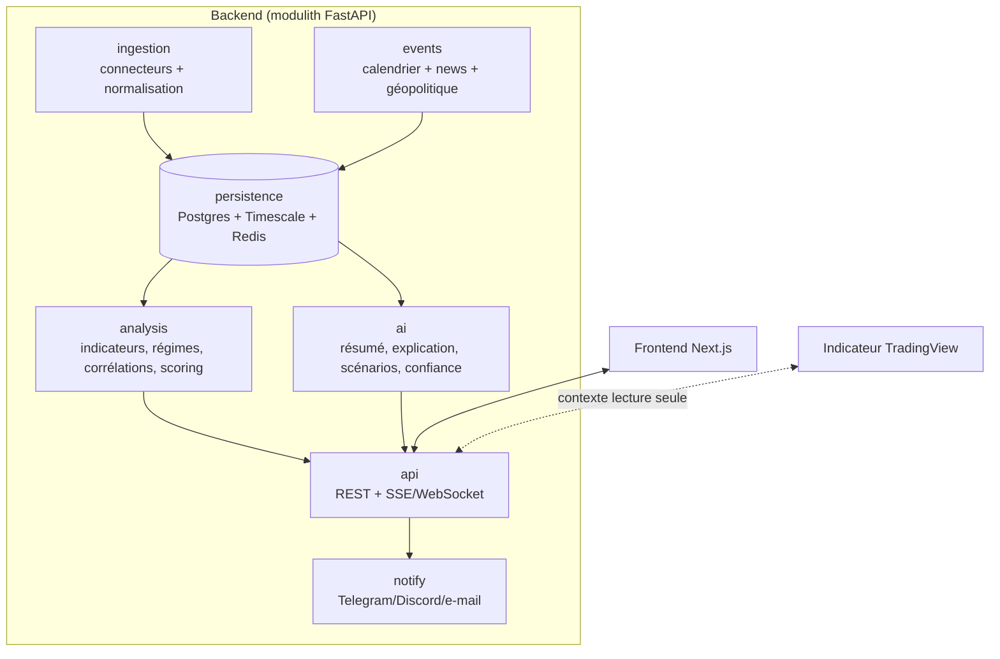
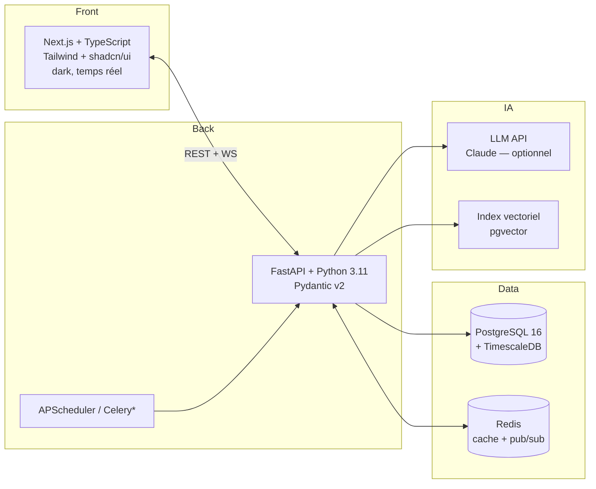
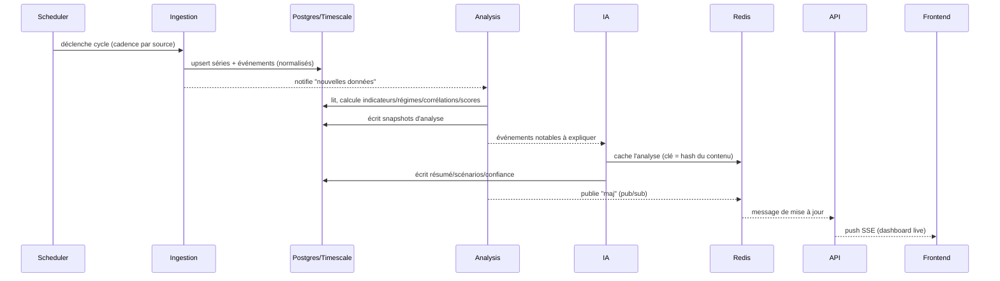

# Tome 1 — Architecture globale & Fondations techniques

> **Statut : ✅ Rédigé** · Version 1.0 · Dépend de : Tome 0.
> Ce tome fixe les fondations. Toute évolution d'un choix ci-dessous nécessite un
> nouvel ADR référencé ici.

---

## 1. Objectifs de l'architecture

1. **Évolutivité** : ajouter une source, un actif ou un type d'analyse sans
   refactor majeur.
2. **Résilience** : la panne d'une source ne fait jamais tomber la plateforme
   (dégradation gracieuse — déjà appliquée dans `macro-intel`).
3. **Frugalité** : socle gratuit fonctionnel ; briques payantes optionnelles.
4. **Maintenabilité** : frontières de modules nettes, code typé et testé.
5. **Continuité** : réutiliser et étendre l'existant `macro-intel`, ne pas le jeter.

## 2. Style d'architecture — ADR-001

### Contexte
Un particulier doit pouvoir déployer, opérer et faire évoluer la plateforme
seul, sur un petit serveur, tout en gardant la porte ouverte à une montée en
charge future.

### Options comparées

| Critère | Monolithe modulaire (« modulith ») | Microservices | Serverless (FaaS) |
|--------|-----------------------------------|---------------|-------------------|
| Complexité opérationnelle | **Faible** | Élevée (orchestration, réseau) | Moyenne (vendor lock-in) |
| Coût pour 1 utilisateur | **Très faible** | Élevé | Variable, imprévisible |
| Latence interne | **Nulle (in-process)** | Réseau entre services | Cold starts |
| Évolutivité vers l'échelle | Bonne (extraction ciblée possible) | **Excellente** | Bonne mais contrainte |
| Vitesse de développement | **Élevée** | Faible au début | Moyenne |
| Adéquation à l'existant | **Parfaite** (`macro-intel` est déjà un modulith FastAPI) | Nécessite un découpage | Réécriture |

### Décision
**Monolithe modulaire (modulith)** avec des **frontières internes strictes**
(bounded contexts) et des interfaces stables, permettant d'**extraire** plus tard
un module en service indépendant si un besoin réel apparaît (ex. la couche IA si
elle devient coûteuse en calcul).

### Justification
Pour un utilisateur unique, les microservices ajoutent un coût et une complexité
non justifiés. Le modulith offre 90 % des bénéfices (modularité, testabilité) sans
la taxe opérationnelle, et `macro-intel` **est déjà** un modulith propre. On
conçoit néanmoins les modules comme des « futurs services » : dépendances
unidirectionnelles, pas d'accès direct aux tables d'un autre module, communication
par interfaces.

## 3. Vue des modules (bounded contexts)



### Responsabilités et règles de dépendance

| Module | Responsabilité | Dépend de | Ne dépend jamais de |
|--------|----------------|-----------|---------------------|
| `ingestion` | Récupérer et normaliser les données externes | `persistence` | `api`, `ai`, `frontend` |
| `events` | Calendrier éco, news, discours, géopolitique | `persistence` | `api`, `frontend` |
| `persistence` | Accès données (repositories), migrations | — | tout le reste |
| `analysis` | Indicateurs, régimes, corrélations, scoring, biais, fusion | `persistence` | `api`, `frontend`, `ingestion` |
| `ai` | Compréhension/résumé/scénarios via LLM + repli déterministe | `persistence` | `api`, `frontend` |
| `api` | Contrats HTTP/temps réel, auth, quotas | `analysis`, `ai`, `persistence` | `frontend` |
| `notify` | Sorties push (verdicts, alertes de contexte) | `analysis` | `frontend` |

> **Invariant** : les flèches ne remontent jamais. `analysis` et `ai` ne
> connaissent pas `api`. Cela garantit qu'on peut tester le cœur sans serveur web
> et extraire un module en service plus tard.

### Correspondance avec l'existant `macro-intel`
Le code actuel préfigure déjà ces modules :

| Module cible | Existant `macro-intel` | Évolution prévue |
|--------------|------------------------|------------------|
| `ingestion` | `app/providers/*` | Ajouter connecteurs (BLS, yields, courbe, VIX, COT, OPEP), scheduler robuste |
| `events` | `providers/news.py`, `central_banks.py`, `economic_calendar.py`, `geopolitics.py` | Référentiel d'événements unifié + minutes FOMC |
| `persistence` | `app/db.py`, `app/models.py` | Migration SQLite → Postgres+Timescale, migrations Alembic, Redis |
| `analysis` | `app/engine/*` | Régimes, corrélations, courbe des taux, nowcasting |
| `ai` | `app/engine/ai_classifier.py` | RAG + résumé/scénarios/confiance + filtre anti-signal |
| `api` | `app/api/*`, SSE | WebSocket, auth, quotas, versionnement `/v1` |
| `notify` | `app/notify/*` | E-mail + règles d'alerte de contexte |

## 4. Stack technique — vue d'ensemble


`*` Celery/RQ envisagé seulement si la charge de tâches asynchrones dépasse ce que
APScheduler gère confortablement (voir ADR-004 & Tome 10).

### 4.1 Backend — pourquoi Python/FastAPI (confirmé)
Continuité avec `macro-intel` ; écosystème data/finance (pandas, numpy,
statsmodels) et IA sans équivalent ; FastAPI = async, typé, docs OpenAPI
automatiques, idéal pour REST + temps réel. **Décision : conserver.**

### 4.2 Base de données — ADR-002

**Besoin** : séries temporelles massives (prix, rendements, indicateurs) **et**
données relationnelles (événements, analyses, utilisateurs) **et** recherche
sémantique (RAG).

| Option | Séries temporelles | Relationnel | Vecteurs (RAG) | Ops |
|--------|-------------------|-------------|----------------|-----|
| PostgreSQL + TimescaleDB + pgvector | **Excellent** (hypertables, compression, agrégats continus) | **Excellent** | **Oui** (pgvector) | **Une seule base à opérer** |
| InfluxDB | Excellent | Faible | Non | Deuxième système à gérer |
| MongoDB | Moyen | Bon (doc) | Via Atlas | Modèle moins adapté au relationnel macro |
| SQLite (actuel) | Limité | Bon | Extension | Parfait en dev, insuffisant en prod |

**Décision** : **PostgreSQL 16 + TimescaleDB + pgvector**. Une seule technologie
couvre les trois besoins → moins d'ops, transactions ACID, SQL standard.
SQLite reste le mode **développement/hors-ligne** (déjà supporté via SQLAlchemy :
l'`DATABASE_URL` bascule sans changer le code). Migrations gérées par **Alembic**.

### 4.3 Temps réel & cache — ADR-004
- **Redis** : cache des réponses coûteuses (analyses IA, agrégats), **pub/sub**
  pour diffuser les mises à jour à toutes les connexions, et *rate limiting*.
- **Transport client** : **SSE** pour le flux descendant (déjà en place, simple,
  reconnexion native) ; **WebSocket** réservé aux besoins bidirectionnels futurs.
- **Ordonnancement** : **APScheduler** (in-process, déjà utilisé) pour les cycles
  d'ingestion. Passage à **Celery/RQ + Redis** uniquement si le volume de tâches
  ou le besoin de parallélisme l'exige (réévalué au Tome 10).

### 4.4 Frontend — ADR-003

| Option | Écosystème | Temps réel | Rendu | Courbe d'apprentissage |
|--------|-----------|-----------|-------|------------------------|
| **Next.js (React) + TypeScript** | **Immense** (shadcn/ui, Recharts, TradingView Lightweight Charts) | SSE/WS natifs | SSR/SSG/CSR | Moyenne |
| SvelteKit | Bon, plus petit | Oui | Excellent | Faible |
| Vue/Nuxt | Bon | Oui | Bon | Faible |

**Décision** : **Next.js + TypeScript**, avec **Tailwind CSS** + **shadcn/ui**
(design system dark, accessible), **Recharts** pour la dataviz standard et
**TradingView Lightweight Charts** pour les séries financières. Justification :
écosystème le plus riche pour un terminal financier, viviers de composants, et
intégration naturelle des graphiques TradingView (cohérence avec l'univers du
trader). Détaillé au Tome 7.

### 4.5 Couche IA — ADR-005
- **LLM optionnel** (Claude via l'API Anthropic) pour compréhension/résumé/scénarios.
- **Repli déterministe** obligatoire (le moteur de règles existant) : la
  plateforme reste utile **sans clé IA**.
- **Frugalité** : mise en cache Redis des analyses par empreinte de contenu,
  traitement **par lot**, et *prompt* contraint. Budget et évaluation au Tome 5.
- **RAG** via **pgvector** pour ancrer les explications dans un corpus (définitions
  macro, historique des publications) et réduire les hallucinations.
- **Filtre anti-signal** en sortie (garde-fou du Tome 0 §9), testé au Tome 11.

## 5. Flux de données de référence



## 6. Sécurité transversale (fondations — détail au Tome 9)

- **Secrets** hors du code (variables d'environnement / gestionnaire de secrets) ;
  jamais commités (déjà : `.env` gitignoré, avertissement au démarrage).
- **Authentification** : la plateforme étant mono-utilisateur au départ, accès
  protégé par **jeton** ; conception prête pour OAuth2/OIDC si multi-utilisateur.
- **Entrées** : validation stricte (Pydantic v2, `Literal`, bornes) — déjà en place
  sur le webhook TradingView.
- **Webhook** : secret partagé, comparaison à temps constant (déjà en place).
- **Transport** : HTTPS obligatoire en production (reverse-proxy Caddy/Nginx).
- **Dépendances** : audit régulier (pip-audit) et épinglage des versions.
- **Moindre privilège** : conteneur non-root (déjà : Dockerfile durci).

## 7. Arborescence cible du dépôt

```
macro-intel/                      # racine de la plateforme (nom de code MacroLens)
├── docs/                         # les tomes (cette documentation)
├── app/                          # backend (modulith)
│   ├── ingestion/                # ex-providers, étendu (Tome 2)
│   ├── events/                   # calendrier, news, discours, géo (Tome 2)
│   ├── persistence/              # db, modèles, repositories, migrations (Tome 3)
│   ├── analysis/                 # ex-engine, étendu (Tome 4)
│   ├── ai/                       # couche IA + RAG + filtre anti-signal (Tome 5)
│   ├── api/                      # REST + temps réel, versionné /v1 (Tome 6)
│   ├── notify/                   # sorties push
│   ├── config.py  main.py
├── frontend/                     # application Next.js (Tome 7)
├── tradingview/                  # intégration indicateur (Tome 8)
├── deploy/                       # docker, IaC, CI/CD (Tome 10)
└── tests/                        # unitaires + intégration + e2e (Tome 11)
```

> Le passage de la structure actuelle (`app/providers`, `app/engine`) vers cette
> cible se fait **progressivement** et **sans rupture** : chaque déplacement de
> module conserve les imports publics ou fournit un alias de compatibilité, et la
> CI (lint + types + tests) garantit l'absence de régression à chaque étape.

## 8. Trajectoire de migration depuis `macro-intel` (sans rien casser)

| Étape | Action | Garantie de non-régression |
|:----:|--------|----------------------------|
| M0 | **État actuel** : modulith FastAPI, SQLite, providers, engine, SSE, tests verts | Base de référence (29 tests) |
| M1 | Introduire **PostgreSQL + Timescale + Alembic** en gardant SQLite en dev | `DATABASE_URL` bascule sans changer le code ; tests sur les deux moteurs |
| M2 | Renommer `providers`→`ingestion`, `engine`→`analysis` avec alias de compat | Imports publics inchangés ; CI verte |
| M3 | Ajouter **Redis** (cache + pub/sub) derrière une interface ; repli sans Redis | Fonctionne toujours sans Redis en dev |
| M4 | Étendre l'**ingestion** (Tome 2) source par source | Chaque source isolée, repli gracieux |
| M5 | Enrichir l'**analyse** (Tome 4) et la **couche IA** (Tome 5) | Repli déterministe conservé |
| M6 | Démarrer le **frontend Next.js** (Tome 7) en consommant l'API existante | Le dashboard HTML actuel reste disponible en repli |

> **Principe** : à aucune étape la plateforme ne cesse de fonctionner. Le dashboard
> HTML actuel et les endpoints existants restent valides jusqu'à leur remplacement
> validé.

## 9. Risques architecturaux & mitigations

| Risque | Impact | Mitigation |
|--------|--------|-----------|
| Dépendance à des API externes (quotas, pannes) | Données manquantes | Repli gracieux (déjà), cache Redis, multi-sources par domaine |
| Coût / latence du LLM | Budget, lenteur | Repli déterministe, cache par empreinte, traitement par lot (ADR-005) |
| Dérive « signal de trading » | Risque produit & conformité | Filtre anti-signal + tests dédiés (Tomes 5 & 11) + consigne système |
| Complexité prématurée | Ralentissement | Modulith d'abord (ADR-001), extraction seulement si besoin réel |
| Croissance de la base | Coût stockage | Compression + agrégats continus Timescale, politiques de rétention (Tome 3) |

## 10. Definition of Done — Tome 1

- [x] Style d'architecture décidé et justifié (ADR-001).
- [x] Choix de base de données, cache/temps réel, frontend, IA décidés (ADR-002→005).
- [x] Frontières de modules et règles de dépendance définies.
- [x] Correspondance avec l'existant `macro-intel` établie.
- [x] Trajectoire de migration sans rupture décrite.
- [x] Sécurité transversale posée (détail renvoyé au Tome 9).

---

### Suite

➡️ **Tome 2 — Ingestion & Sources de données** : catalogue complet des sources
par domaine (fiabilité, fréquence, coût, clé requise), contrat d'un connecteur,
normalisation, planification et résilience. À ouvrir après validation du Tome 1.
