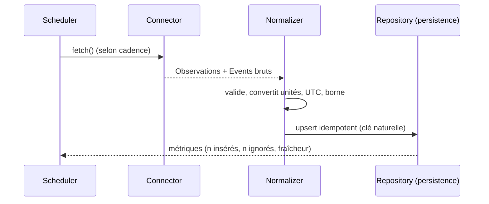
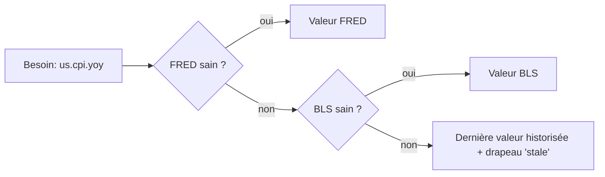

# Tome 2 — Ingestion & Sources de données

> **Statut : ✅ Rédigé** · Version 1.0 · Dépend de : Tomes 0 & 1.
> Ce tome spécifie **comment** MacroLens acquiert, normalise et fiabilise toutes
> les données du §4.1 du Tome 0. Il respecte les frontières du module `ingestion`
> et `events` (Tome 1) et la règle de dégradation gracieuse.

---

## 1. Objectifs & principes du sous-système d'ingestion

1. **Couverture complète** des domaines du cahier des charges (inflation, taux,
   banques centrales, emploi, croissance, marchés, positionnement, énergie,
   géopolitique, prix multi-actifs).
2. **Dégradation gracieuse** : une source qui tombe → repli sur une source
   alternative ou une valeur historisée ; **jamais** d'exception qui casse le cycle.
3. **Idempotence** : rejouer un cycle ne crée pas de doublons (upsert par clé
   naturelle).
4. **Frugalité** : privilégier les **paliers gratuits** ; les sources premium sont
   optionnelles et déclarées.
5. **Traçabilité** : chaque donnée porte sa **source**, son **horodatage de
   collecte** et son **horodatage d'origine**.
6. **Séparation données / événements** : séries temporelles (numériques,
   régulières) vs événements (news, discours, publications datées) — deux modèles
   canoniques distincts (Tome 3).

## 2. Contrat d'un connecteur (interface stable)

Tout connecteur implémente la même interface. C'est la généralisation du pattern
`fetch_*` déjà présent dans `app/providers/`.

```python
# app/ingestion/base.py  (spécification)
from typing import Protocol
from dataclasses import dataclass
import datetime as dt

@dataclass(slots=True)
class Observation:
    """Point d'une série temporelle, normalisé."""
    series_id: str        # ex. "us.cpi.yoy", "market.dxy", "rates.us10y"
    ts: dt.datetime       # horodatage d'origine (UTC)
    value: float
    unit: str             # "%", "index", "bps", "usd", "contracts"...
    source: str           # "fred", "eia", "yfinance"...
    revision: int = 0     # gère les révisions de publications macro

@dataclass(slots=True)
class Event:
    """Événement daté (news, discours, publication), normalisé."""
    event_id: str         # clé naturelle stable (dédup)
    ts: dt.datetime
    category: str         # "release" | "central_bank" | "geopolitics" | "news"
    title: str
    payload: dict         # champs spécifiques (actual/forecast/previous, url, tone...)
    source: str

class Connector(Protocol):
    name: str
    domain: str                 # "inflation", "rates", "energy"...
    cadence_seconds: int        # fréquence de rafraîchissement conseillée
    requires_key: bool

    def healthcheck(self) -> bool: ...
    def fetch(self) -> tuple[list[Observation], list[Event]]: ...
```

**Règles imposées au connecteur**
- `fetch()` ne lève **jamais** : toute erreur → log + retour partiel/vide (repli).
- Les valeurs sont **normalisées** (unités, fuseau UTC, échelle) avant sortie.
- Les clés `series_id` / `event_id` suivent une **nomenclature stable** (§4).
- Le connecteur ne connaît que `persistence` (jamais l'API ni le frontend).

### Cycle de vie (par le scheduler)


## 3. Catalogue des sources par domaine

Légende — **Clé** : clé API requise · **Coût** : palier utilisé · **Repli** : source
de secours si indisponible.

### 3.1 Données économiques (inflation, emploi, croissance, activité)

| Donnée | Source recommandée | Série / endpoint | Fréq. | Clé | Coût | Repli |
|--------|--------------------|------------------|:-----:|:---:|:----:|-------|
| CPI (inflation) | **FRED** | `CPIAUCSL`, cœur `CPILFESL` | Mensuel | Oui (gratuite) | Gratuit | BLS API |
| PPI | **FRED** | `PPIACO` (+ détails) | Mensuel | Oui | Gratuit | BLS API |
| NFP (emploi) | **FRED** | `PAYEMS` | Mensuel | Oui | Gratuit | BLS API |
| Taux de chômage | **FRED** | `UNRATE` | Mensuel | Oui | Gratuit | BLS API |
| PIB réel | **FRED** | `GDPC1` | Trimestriel | Oui | Gratuit | BEA API |
| PMI (ISM/S&P) | **Trading Economics** (ou ISM) | calendrier + valeurs | Mensuel | Oui (limité) | Palier gratuit limité | News/RSS (qualitatif) |
| Anticip. d'inflation | **FRED** | `T10YIE` (point mort 10 ans) | Quotidien | Oui | Gratuit | — |

> **FRED** est la **colonne vertébrale** des séries macro US (ADR-006) : une seule
> intégration couvre CPI/PPI/NFP/chômage/PIB/taux, avec l'historique et les
> révisions. **BLS** sert de source primaire alternative pour l'emploi et les prix
> (données brutes + calendrier de publication).

### 3.2 Taux, courbe & indices de marché

| Donnée | Source | Série / symbole | Fréq. | Clé | Repli |
|--------|--------|-----------------|:-----:|:---:|-------|
| Rendements US 2/10/30 ans | **FRED** | `DGS2`, `DGS10`, `DGS30` | Quotidien | Oui | yfinance `^TNX` |
| Taux réel 10 ans (TIPS) | **FRED** | `DFII10` | Quotidien | Oui | — |
| Pente de courbe 10a-2a | **FRED** | `T10Y2Y` | Quotidien | Oui | dérivé DGS10-DGS2 |
| DXY (dollar) | **yfinance** | `DX-Y.NYB` | Intraday | Non | FRED `DTWEXBGS` (broad, proxy) |
| VIX (volatilité) | **FRED** / yfinance | `VIXCLS` / `^VIX` | Quotidien/Intraday | Oui/Non | l'un l'autre |

> **Nuance importante** : le DXY (ICE, 6 devises) et le *Broad Dollar Index* de la
> Fed (`DTWEXBGS`) ne sont **pas identiques**. On documente le proxy et on ne les
> mélange pas dans une même série (`market.dxy` vs `market.usd_broad`).

### 3.3 Banques centrales & publications officielles

| Donnée | Source | Accès | Fréq. | Clé | Notes |
|--------|--------|-------|:-----:|:---:|-------|
| Discours/communiqués Fed | **federalreserve.gov** RSS | `press_all.xml` | Continu | Non | déjà intégré |
| Discours/communiqués BCE | **ecb.europa.eu** RSS | flux presse | Continu | Non | déjà intégré |
| Minutes du FOMC | **federalreserve.gov** | page + PDF (calendrier fixe) | ~8/an | Non | parsing PDF/HTML, résumé par l'IA (Tome 5) |
| Décisions de taux | **FRED** + calendrier | `FEDFUNDS`, `DFEDTARU` | Réunion | Oui | + événement calendrier |

### 3.4 Positionnement & flux

| Donnée | Source | Accès | Fréq. | Clé | Repli |
|--------|--------|-------|:-----:|:---:|-------|
| COT Report | **CFTC** (Socrata) | API publique `publicreporting` | Hebdo (vendredi) | Non | Nasdaq Data Link (legacy) |
| Flux ETF (ex. or GLD) | Fournisseur ETF | holdings publiés | Quotidien | Non | scraping page officielle |
| « Flux institutionnels » | **Proxy COT + ETF** | — | — | — | Les vrais flux dark-pool sont **premium** → hors socle gratuit (déclaré) |

> **Transparence** : les « flux institutionnels » complets sont des données
> premium coûteuses. MacroLens en fournit une **approximation** via COT + flux ETF,
> clairement étiquetée comme proxy (pas de fausse précision).

### 3.5 Énergie & matières premières

| Donnée | Source | Accès | Fréq. | Clé | Repli |
|--------|--------|-------|:-----:|:---:|-------|
| Stocks pétrole US | **EIA** | API `petroleum` (crude inventories) | Hebdo (mercredi) | Oui (gratuite) | news |
| Décisions OPEP | **News + rapports MOMR** | RSS/officiel (pas d'API propre) | Mensuel/ad hoc | Non | GDELT |
| Prix matières premières | **yfinance** | `GC=F` (or), `CL=F` (WTI), `NG=F`… | Intraday | Non | — |

### 3.6 Prix multi-actifs (Forex, indices, crypto)

| Classe | Source | Symboles | Fréq. | Clé | Repli |
|--------|--------|----------|:-----:|:---:|-------|
| Forex | **yfinance** | `EURUSD=X`, `USDJPY=X`… | Intraday | Non | exchangerate.host |
| Indices | **yfinance** | `^GSPC`, `^NDX`, `^GDAXI`… | Intraday | Non | — |
| Crypto | **CoinGecko** | `bitcoin`, `ethereum`… | Intraday | Non (palier gratuit) | yfinance `BTC-USD` |

### 3.7 Actualités & géopolitique

| Domaine | Source | Accès | Fréq. | Clé | Repli |
|---------|--------|-------|:-----:|:---:|-------|
| News économiques | **Finnhub** / NewsAPI / GNews | API | Continu | Oui (gratuit limité) | RSS (Investing, MarketWatch) — déjà intégré |
| Géopolitique (risque, ton) | **GDELT** 2.0 | API doc | 15 min | Non | valeur de repli — déjà intégré |
| Élections / crises | **Calendrier curé + GDELT + news** | — | — | Non | — |

### 3.8 Corrélations inter-marchés
**Dérivées** (pas une source externe) : calculées par le module `analysis`
(Tome 4) à partir des séries de prix historisées (ex. corrélation glissante
DXY↔or, VIX↔S&P, taux réels↔or). Documenté ici car l'ingestion doit garantir
la **profondeur d'historique** nécessaire (fenêtres de 30/90/250 jours).

## 4. Nomenclature & normalisation

### 4.1 Nomenclature des identifiants
`domaine.sujet[.variante]` en minuscules, stable dans le temps :
`us.cpi.yoy`, `us.cpi.core.yoy`, `us.nfp`, `us.unrate`, `rates.us10y`,
`rates.real10y`, `rates.curve_10y2y`, `market.dxy`, `market.vix`,
`energy.crude_inventories`, `cot.gold.net_noncommercial`, `fx.eurusd`,
`index.spx`, `crypto.btc`.

### 4.2 Règles de normalisation
- **Fuseau** : tout en **UTC** (ISO 8601).
- **Unités** explicites (`%`, `bps`, `index`, `usd`, `contracts`) et cohérentes
  par série ; conversions faites à l'ingestion, jamais en aval.
- **Révisions** : les publications macro sont révisées ; on conserve la version et
  un compteur `revision` (upsert par `(series_id, ts, revision)`).
- **Dédup événements** : `event_id` = hash stable (source + titre + date) — comme
  déjà appliqué aux news (sha1) dans `macro-intel`.
- **Valeurs manquantes** : `None` explicite (jamais 0 par défaut) ; le repli
  documente la substitution.

## 5. Planification (scheduling) — ADR-008

### Contexte
Les sources ont des **fréquences et fenêtres** très différentes : intraday (prix),
quotidien (taux), hebdo (COT vendredi, EIA mercredi), mensuel (CPI/NFP à dates
connues). Marteler une source gratuite = risque de bannissement/quota.

### Décision
**Cadence par connecteur** (`cadence_seconds`) pilotée par **APScheduler**, avec :
- **fenêtres de publication** : on n'interroge intensément une source qu'autour de
  ses horaires connus (ex. NFP le 1er vendredi 12:30 UTC) ;
- **jitter** (léger décalage aléatoire) pour lisser la charge ;
- **coalescing** (déjà activé) : pas d'empilement de jobs ;
- **idempotence** : un cycle rejoué n'insère pas de doublon.

| Classe de source | Cadence de base | Renforcement autour de la publication |
|------------------|-----------------|----------------------------------------|
| Prix (FX/indices/crypto/commodities) | 1–5 min | — |
| Taux, DXY, VIX, courbe | 5–15 min | — |
| News & géopolitique | 10 min | — |
| Releases macro (CPI/NFP/PMI…) | quotidien | 1 min pendant ±30 min autour de l'heure |
| COT | quotidien | vendredi soir (UTC) |
| EIA (pétrole) | quotidien | mercredi 15:00 UTC |

> **Migration** : APScheduler reste le moteur (Tome 1). Passage à **Celery/RQ +
> Redis** uniquement si le parallélisme requis dépasse le confort in-process
> (réévalué au Tome 10).

## 6. Résilience & qualité des données — ADR-007

### Stratégie multi-source & priorité
Chaque **donnée logique** peut avoir plusieurs connecteurs classés par priorité.
Le résolveur prend le premier disponible et sain :



### Contrôles qualité (à l'ingestion)
- **Fraîcheur (staleness)** : si l'âge d'une série dépasse un seuil → drapeau
  `stale` exposé à l'UI (badge « données datées »).
- **Bornes de plausibilité** : rejet/quarantaine des valeurs aberrantes
  (ex. VIX négatif, CPI YoY à 300 %).
- **Circuit breaker** : après N échecs consécutifs, une source est mise en pause
  temporaire (backoff exponentiel) pour ne pas gaspiller le quota.
- **Complétude** : métrique du taux de séries à jour par cycle.

## 7. Rate limiting, quotas & coûts

| Source | Palier gratuit typique | Stratégie |
|--------|------------------------|-----------|
| FRED | ~120 req/min | largement suffisant ; cache quotidien |
| BLS | 500 req/jour (avec clé) | par lot, 1×/jour |
| EIA | généreux (gratuit) | 1×/jour + fenêtre mercredi |
| CFTC (Socrata) | public | 1×/jour + fenêtre vendredi |
| Finnhub | 60 req/min (gratuit) | file + cache |
| CoinGecko | ~10–30 req/min (gratuit) | cache, peu de symboles |
| GDELT | public raisonnable | 1 req/15 min |
| yfinance | non officiel | usage modéré, retries doux |

> **Principe de coût** : tout le socle **fonctionne gratuitement**. Les seules
> dépenses possibles et **optionnelles** : LLM (Tome 5) et éventuelles sources
> premium (PMI détaillé, flux institutionnels réels). Chaque source premium est
> derrière un drapeau de configuration et n'est jamais requise.

## 8. Sécurité des connecteurs
- Clés API via variables d'environnement (jamais dans le code) — déjà en place
  (`.env`, `config.py`).
- Pas de secret dans les logs (masquage).
- HTTPS uniquement, vérification TLS conservée.
- Isolation des erreurs : une clé invalide dégrade **une** source, pas la plateforme.

## 9. Observabilité de l'ingestion (détail au Tome 10)
Par cycle et par connecteur : durée, succès/échec, nb d'observations/événements
insérés vs ignorés (dédup), fraîcheur des séries, état du circuit breaker.
Exposé via un endpoint interne `/health/ingestion` et des métriques.

## 10. Correspondance avec l'existant & plan d'implémentation

| Déjà présent (`macro-intel`) | Devient | Action Tome 2 |
|------------------------------|---------|---------------|
| `providers/market_data.py` (FRED + yfinance) | `ingestion/connectors/rates_fx.py` | étendre séries (DGS2/30, courbe, VIX) |
| `providers/news.py`, `central_banks.py` | `ingestion/connectors/news.py`, `central_banks.py` | + minutes FOMC |
| `providers/economic_calendar.py` | `ingestion/connectors/calendar.py` | + fenêtres de publication |
| `providers/geopolitics.py` (GDELT) | `ingestion/connectors/geopolitics.py` | inchangé (repli déjà OK) |
| — | `ingestion/connectors/cot.py`, `energy.py`, `crypto.py`, `bls.py` | **nouveaux connecteurs** |
| `providers/base.py` (`http_get_json`) | `ingestion/base.py` | + `Observation`/`Event`, résolveur multi-source, circuit breaker |

**Ordre d'implémentation conseillé** (chaque étape indépendante, testée, repli garanti) :
1. Généraliser le contrat (`Observation`/`Event`, résolveur, circuit breaker).
2. Étendre FRED (taux, courbe, VIX, agrégats macro) — plus gros gain, une seule clé.
3. Connecteurs hebdo : CFTC (COT), EIA (pétrole).
4. Prix multi-actifs (FX/indices/crypto) via yfinance/CoinGecko.
5. Minutes FOMC (parsing + résumé délégué à l'IA au Tome 5).
6. BLS en source alternative (résilience CPI/NFP).

## 11. Definition of Done — Tome 2

- [ ] Contrat de connecteur (`Observation`/`Event`, `Connector`) implémenté et testé.
- [ ] Tous les domaines du Tome 0 §4.1 ont **au moins une** source + un repli.
- [ ] Nomenclature `series_id`/`event_id` figée et documentée.
- [ ] Scheduling par cadence + fenêtres de publication + idempotence vérifiée.
- [ ] Résilience : multi-source, staleness, bornes, circuit breaker testés.
- [ ] Aucune source premium requise ; socle 100 % fonctionnel gratuitement.
- [ ] Observabilité d'ingestion exposée.

---

### Suite
➡️ **Tome 3 — Modèle de données & Stockage** : schéma détaillé (hypertables
Timescale pour `Observation`, table d'événements, snapshots d'analyse, index
pgvector), migrations Alembic, compression, agrégats continus et rétention.
À ouvrir après validation du Tome 2.
