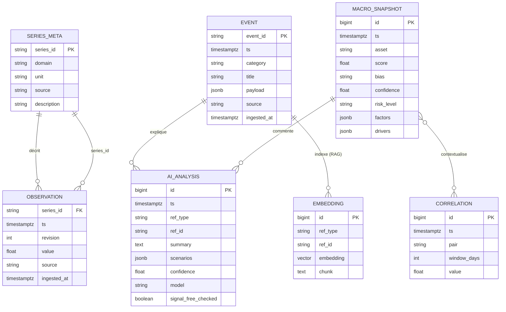

# Tome 3 — Modèle de données & Stockage

> **Statut : ✅ Rédigé** · Version 1.0 · Dépend de : Tomes 0, 1, 2.
> Ce tome fixe le **modèle de données canonique** et sa **matérialisation physique**
> (PostgreSQL + TimescaleDB + pgvector), les migrations, la compression, les
> agrégats et la rétention. Il concrétise l'ADR-002.

---

## 1. Objectifs

1. Stocker efficacement deux natures de données : **séries temporelles** massives
   (prix, taux, indicateurs) et **entités relationnelles** (événements, analyses,
   corrélations, corpus RAG).
2. Garantir **idempotence** et **traçabilité** (source, révision, fraîcheur).
3. Rester **portable** : SQLite en développement, PostgreSQL+Timescale en
   production, **sans changer le code applicatif** (via SQLAlchemy + garde de
   fonctionnalités Timescale).
4. Maîtriser le **volume** dans la durée (compression, agrégats continus, rétention).

## 2. Vue logique (modèle conceptuel)



### Entités
| Entité | Rôle | Nature |
|--------|------|--------|
| `series_meta` | Catalogue des séries (unité, domaine, source, description) | Relationnel |
| `observation` | Points de séries temporelles normalisés (Tome 2) | **Série temporelle** |
| `event` | Événements datés (news, discours, publications) | Relationnel + temps |
| `macro_snapshot` | Résultats du moteur d'analyse (score/biais/confiance) | Série temporelle légère |
| `ai_analysis` | Sortie IA (résumé, scénarios, confiance) rattachée à un event/snapshot | Relationnel |
| `correlation` | Corrélations glissantes inter-marchés (Tome 4) | Série temporelle légère |
| `embedding` | Vecteurs RAG du corpus (Tome 5) | Vectoriel (pgvector) |
| `app_config` / `user` | Config & accès (mono-utilisateur au départ) | Relationnel |

## 3. Matérialisation physique

### 3.1 Moteur (rappel ADR-002)
- **PostgreSQL 16** = socle relationnel ACID.
- **TimescaleDB** = extension pour hypertables (partitionnement temporel
  automatique, compression, agrégats continus, rétention).
- **pgvector** = colonne `vector` + index ANN pour le RAG.
- **SQLite** = mode dev/hors-ligne (les objets Timescale/pgvector sont **gardés**
  et ignorés sur SQLite — voir §6).

### 3.2 DDL de référence (PostgreSQL)

```sql
-- Extensions (prod uniquement)
CREATE EXTENSION IF NOT EXISTS timescaledb;
CREATE EXTENSION IF NOT EXISTS vector;

-- Catalogue des séries
CREATE TABLE series_meta (
    series_id   TEXT PRIMARY KEY,           -- ex. "rates.us10y"
    domain      TEXT NOT NULL,              -- "rates", "inflation"...
    unit        TEXT NOT NULL,              -- "%", "bps", "index"...
    source      TEXT NOT NULL,
    description TEXT DEFAULT ''
);

-- Observations (série temporelle)
CREATE TABLE observation (
    series_id   TEXT NOT NULL REFERENCES series_meta(series_id),
    ts          TIMESTAMPTZ NOT NULL,       -- horodatage d'origine (UTC)
    revision    INT NOT NULL DEFAULT 0,     -- gère les révisions macro
    value       DOUBLE PRECISION NOT NULL,
    source      TEXT NOT NULL,
    ingested_at TIMESTAMPTZ NOT NULL DEFAULT now(),
    PRIMARY KEY (series_id, ts, revision)   -- upsert idempotent
);
SELECT create_hypertable('observation', 'ts', chunk_time_interval => INTERVAL '30 days');
CREATE INDEX ON observation (series_id, ts DESC);

-- Événements
CREATE TABLE event (
    event_id    TEXT PRIMARY KEY,           -- hash stable (dédup)
    ts          TIMESTAMPTZ NOT NULL,
    category    TEXT NOT NULL,              -- release|central_bank|geopolitics|news
    title       TEXT NOT NULL,
    payload     JSONB NOT NULL DEFAULT '{}',
    source      TEXT NOT NULL,
    ingested_at TIMESTAMPTZ NOT NULL DEFAULT now()
);
CREATE INDEX ON event (ts DESC);
CREATE INDEX ON event (category, ts DESC);
CREATE INDEX ON event USING GIN (payload);

-- Snapshots d'analyse (évolution de la table existante)
CREATE TABLE macro_snapshot (
    id          BIGGENERATED ALWAYS AS IDENTITY PRIMARY KEY,
    ts          TIMESTAMPTZ NOT NULL DEFAULT now(),
    asset       TEXT NOT NULL,              -- gold|btc|commodities|...
    score       DOUBLE PRECISION NOT NULL,
    bias        TEXT NOT NULL,
    confidence  DOUBLE PRECISION NOT NULL,
    risk_level  TEXT NOT NULL,
    factors     JSONB NOT NULL DEFAULT '{}',
    drivers     JSONB NOT NULL DEFAULT '{}'
);
SELECT create_hypertable('macro_snapshot', 'ts', chunk_time_interval => INTERVAL '90 days');
CREATE INDEX ON macro_snapshot (asset, ts DESC);

-- Analyses IA
CREATE TABLE ai_analysis (
    id                  BIGGENERATED ALWAYS AS IDENTITY PRIMARY KEY,
    ts                  TIMESTAMPTZ NOT NULL DEFAULT now(),
    ref_type            TEXT NOT NULL,      -- "event" | "snapshot" | "digest"
    ref_id              TEXT NOT NULL,
    summary             TEXT NOT NULL,
    scenarios           JSONB NOT NULL DEFAULT '[]',
    confidence          DOUBLE PRECISION,
    model               TEXT,               -- modèle utilisé ou "rules"
    signal_free_checked BOOLEAN NOT NULL DEFAULT FALSE  -- passé le filtre anti-signal
);
CREATE INDEX ON ai_analysis (ref_type, ref_id);

-- Corrélations
CREATE TABLE correlation (
    id          BIGGENERATED ALWAYS AS IDENTITY PRIMARY KEY,
    ts          TIMESTAMPTZ NOT NULL DEFAULT now(),
    pair        TEXT NOT NULL,              -- ex. "dxy~gold"
    window_days INT NOT NULL,               -- 30/90/250
    value       DOUBLE PRECISION NOT NULL   -- [-1, 1]
);
CREATE INDEX ON correlation (pair, window_days, ts DESC);

-- Corpus RAG
CREATE TABLE embedding (
    id        BIGGENERATED ALWAYS AS IDENTITY PRIMARY KEY,
    ref_type  TEXT NOT NULL,
    ref_id    TEXT NOT NULL,
    chunk     TEXT NOT NULL,
    embedding vector(1536) NOT NULL          -- dimension selon le modèle d'embedding
);
CREATE INDEX ON embedding USING hnsw (embedding vector_cosine_ops);
```

> `BIGGENERATED ALWAYS AS IDENTITY` = notation raccourcie pour
> `BIGINT GENERATED ALWAYS AS IDENTITY` (clé auto-incrémentée standard SQL).

## 4. TimescaleDB — compression, agrégats, rétention

### 4.1 Compression
```sql
ALTER TABLE observation SET (
  timescaledb.compress,
  timescaledb.compress_segmentby = 'series_id'
);
SELECT add_compression_policy('observation', INTERVAL '14 days');
```
Les chunks de plus de 14 jours sont compressés (gain typique 10–20×).

### 4.2 Agrégats continus (rollups)
Pré-calcul des agrégats journaliers pour des requêtes de dashboard rapides :
```sql
CREATE MATERIALIZED VIEW observation_daily
WITH (timescaledb.continuous) AS
SELECT series_id,
       time_bucket('1 day', ts) AS day,
       first(value, ts) AS open, max(value) AS high,
       min(value) AS low,  last(value, ts) AS close,
       avg(value) AS mean
FROM observation
GROUP BY series_id, day;
SELECT add_continuous_aggregate_policy('observation_daily',
  start_offset => INTERVAL '3 days', end_offset => INTERVAL '1 hour',
  schedule_interval => INTERVAL '1 hour');
```

### 4.3 Rétention par table
| Table | Détail conservé | Politique |
|-------|-----------------|-----------|
| `observation` | brut haute résolution | rétention **2 ans** ; au-delà → agrégat journalier conservé (rollup) |
| `observation_daily` | agrégat journalier | **illimité** (léger) |
| `event` | événements datés | **5 ans** |
| `macro_snapshot` | historique des scores | **3 ans** |
| `ai_analysis` | analyses IA | **2 ans** (coûteux, régénérable) |
| `correlation` | corrélations | **2 ans** |
| `embedding` | corpus RAG | tant que le document source est pertinent |

```sql
SELECT add_retention_policy('observation', INTERVAL '2 years');
```

## 5. Stratégie d'indexation

| Table | Index | Motif de requête |
|-------|-------|------------------|
| `observation` | PK `(series_id, ts, revision)` + `(series_id, ts DESC)` | dernière valeur / fenêtre d'une série |
| `event` | `(ts DESC)`, `(category, ts DESC)`, GIN(`payload`) | flux récent, filtre par type, recherche champ JSON |
| `macro_snapshot` | `(asset, ts DESC)` | historique par actif (endpoint `/macro/history`) |
| `ai_analysis` | `(ref_type, ref_id)` | retrouver l'analyse d'un event/snapshot |
| `embedding` | HNSW cosinus | recherche sémantique RAG |

## 6. Migrations & portabilité — Alembic

### 6.1 Outillage
- **Alembic** pour les migrations versionnées (montée/descente).
- Nommage : `NNNN_description.py`, revisions liées, exécutées en CI et au déploiement.

### 6.2 Portabilité SQLite (dev) / PostgreSQL (prod)
Les fonctionnalités Timescale/pgvector n'existent pas sur SQLite. Règle :

```python
# migrations : appliquer les objets Timescale UNIQUEMENT sur PostgreSQL
def upgrade():
    op.create_table("observation", ...)               # standard, portable
    bind = op.get_bind()
    if bind.dialect.name == "postgresql":
        op.execute("SELECT create_hypertable('observation','ts', if_not_exists => TRUE)")
        op.execute("ALTER TABLE observation SET (timescaledb.compress, ...)")
        op.execute("SELECT add_compression_policy('observation', INTERVAL '14 days')")
    # sur SQLite : table simple, index standard -> le code applicatif fonctionne
```
- Le type `vector` est remplacé par un `JSON`/`BLOB` en dev (RAG désactivé sans
  pgvector — repli déterministe conservé, cf. ADR-005).
- **Aucune requête applicative** ne dépend d'une fonction Timescale : les rollups
  sont une **optimisation**, pas une dépendance fonctionnelle. Les mêmes endpoints
  répondent sur SQLite (plus lentement sur gros volumes, acceptable en dev).

### 6.3 Trajectoire depuis l'existant
| Existant (`app/models.py`) | Cible | Étape |
|----------------------------|-------|-------|
| `MarketDatum` | `observation` + `series_meta` | M1 : renommer/mapper, migration Alembic |
| `NewsEvent` | `event` | M1 : `dedup_key` → `event_id`, `impact` dans `payload` |
| `CalendarEvent` | `event` (category=`release`) | M1 : fusion dans le modèle événement unifié |
| `MacroSnapshot` | `macro_snapshot` (+ `drivers`) | déjà proche ; ajout `drivers` |
| — | `ai_analysis`, `correlation`, `embedding`, `series_meta` | M4/M5 : nouvelles tables |

> **Non-régression** : la migration M1 conserve les endpoints existants
> (`/macro/latest`, `/macro/history`) ; les tests d'API du dépôt servent de
> filet. SQLite reste le moteur par défaut en développement.

## 7. Couche d'accès aux données (repositories)

Le module `persistence` expose des **repositories** typés ; `analysis` et `ai`
n'écrivent jamais de SQL directement (frontière du Tome 1).

```python
# app/persistence/repositories.py  (spécification)
class ObservationRepo(Protocol):
    def upsert_many(self, obs: list[Observation]) -> int: ...
    def latest(self, series_id: str) -> Observation | None: ...
    def window(self, series_id: str, since: dt.datetime) -> list[Observation]: ...

class EventRepo(Protocol):
    def upsert_many(self, events: list[Event]) -> int: ...     # ignore les dédups
    def recent(self, category: str | None, limit: int) -> list[Event]: ...

class SnapshotRepo(Protocol):
    def add(self, snap: MacroSnapshot) -> None: ...
    def history(self, asset: str, limit: int) -> list[MacroSnapshot]: ...
```
Avantages : testabilité (mock des repos), découplage du moteur, possibilité de
changer d'implémentation de stockage sans toucher `analysis`/`ai`.

## 8. Sauvegarde, restauration & intégrité
- **Sauvegarde** : `pg_dump` planifié (quotidien) + snapshots du volume ;
  agrégats continus reconstructibles.
- **Restauration** testée (procédure documentée au Tome 10).
- **Intégrité** : contraintes FK (`observation.series_id`), `NOT NULL`, types
  stricts ; migrations transactionnelles.
- **Provenance** : chaque ligne porte `source` et `ingested_at` (audit).

## 9. Performance & dimensionnement
- Le partitionnement temporel (hypertables) borne la taille des index chauds.
- Requêtes dashboard servies par `observation_daily` (agrégat) → réponses < 200 ms.
- Compression → coût de stockage maîtrisé pour un usage individuel (quelques Go/an
  après compression pour un large univers de séries).
- `macro_snapshot` reste léger (quelques enregistrements par cycle et par actif).

## 10. Gouvernance des données
- **Révisions** : les publications macro révisées créent une nouvelle ligne
  `(series_id, ts, revision+1)` ; l'UI peut afficher « donnée révisée ».
- **Fraîcheur** : `ingested_at` + seuils de staleness (Tome 2) → badge UI.
- **RGPD** : seules des données de marché/publiques sont stockées ; la config
  utilisateur (jeton) est minimale et chiffrable (Tome 9). Aucune donnée
  personnelle de tiers.

## 11. Definition of Done — Tome 3
- [ ] Schéma canonique (tables, clés, types, index) figé et migré via Alembic.
- [ ] Hypertables + compression + agrégats continus + rétention en place (prod).
- [ ] Portabilité SQLite/PostgreSQL vérifiée (mêmes endpoints, tests verts).
- [ ] Repositories typés exposés ; aucun SQL hors `persistence`.
- [ ] Sauvegarde/restauration documentée et testée.
- [ ] Provenance & révisions traçables ; politiques de rétention actives.

---

### Suite
➡️ **Tome 4 — Moteur d'analyse macro & Corrélations** : calcul des indicateurs
dérivés, détection de régimes de marché, analyse de la courbe des taux,
corrélations glissantes inter-marchés et nowcasting — le tout alimentant les
scores/biais existants (jamais un signal de trade).
