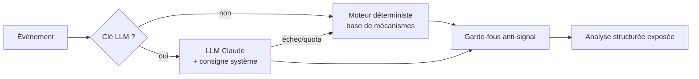

# Tome 5 — Couche Intelligence Artificielle

> **Statut : ✅ Rédigé & implémenté** · Dépend de : Tomes 0-4.
> Code : `app/ai/` (guardrails, knowledge, analyst).

---

## 1. Mission
Lire → comprendre → résumer → expliquer l'importance → identifier les marchés
concernés → expliquer les mécanismes → présenter des scénarios → évaluer la
confiance → prioriser. **Jamais** donner d'ordre de trading.

## 2. Architecture à deux moteurs — ADR-005 (confirmé)

**Pourquoi ce choix** : la plateforme doit rester utile et reproductible sans
clé API et sans réseau. Le LLM **enrichit**, il n'est jamais un point de
défaillance unique. Le repli est déterministe, donc testable et auditable.

## 3. Base de mécanismes (`knowledge.py`)
10 thèmes documentés : inflation, taux directeurs, emploi, croissance,
géopolitique, énergie, sentiment de risque, positionnement, devises, obligations.
Chaque thème porte : `why` (importance), `mechanism` (chaîne causale),
`markets` (effets **historiques** par marché), `scenarios` (2-3 issues),
`keywords` (détection).

C'est le socle qui permet d'**expliquer** sans LLM — la vraie valeur produit.

## 4. Garde-fous anti-signal (`guardrails.py`) — exigence non négociable

**Défense en profondeur, deux niveaux :**

1. **Consigne système** (`SYSTEM_RULES`) injectée dans chaque appel LLM :
   interdictions explicites (acheter/vendre/entrer/sortir, niveaux SL/TP,
   impératif d'action) et obligations (descriptif, mécanismes, scénarios,
   confiance, incertitudes).
2. **Filtre de sortie déterministe** (`enforce`) appliqué à **tout** texte
   exposé, quelle que soit son origine :
   - 14 motifs prescriptifs → reformulation descriptive neutre ;
   - motifs de niveaux de trading (`SL 1920`, `TP: 2050`, `entrée @ …`) → retirés ;
   - retourne un `GuardrailReport` avec les violations, pour l'audit et les tests.

> Le filtre est volontairement **conservateur** : il préfère reformuler que
> laisser passer. Un faux positif dégrade une phrase ; un faux négatif violerait
> le principe fondateur du produit.

**Vérification** : `tests/test_guardrails.py` (10 cas prescriptifs paramétrés,
retrait des niveaux, préservation du texte descriptif) + `test_analyst.py`
(aucune analyse générée ne contient de formulation d'ordre) + `test_api_v1.py`
(le briefing exposé par l'API est vérifié).

## 5. Sortie structurée (`analyst.EventAnalysis`)
`summary`, `why_it_matters`, `mechanism`, `markets`, `scenarios`, `confidence`,
`priority`, `topics`, `engine`, `disclaimer`.

**Priorité** : `critical` (FOMC, guerre, krach…), `high` (CPI, NFP, décision de
taux, sanctions, OPEP…), `normal`, `low`.
**Confiance** : `0,55 × couverture thématique + 0,45 × netteté`, **plafond 90 %**
— jamais de fausse certitude.

## 6. Frugalité & coûts
- Repli déterministe = coût nul par défaut.
- Traitement **par lot** (`analyse_batch`, limite configurable).
- Prompt contraint, `max_tokens` borné, sortie JSON stricte.
- Évolution prévue : cache Redis par empreinte de contenu (Tome 1, ADR-004).

## 7. RAG (prévu, non requis)
`pgvector` + table `embedding` (Tome 3) pour ancrer les explications dans un
corpus (définitions, historique des publications). **Non bloquant** : la base de
mécanismes couvre déjà le besoin d'explication.

## 8. Definition of Done
- [x] Analyse structurée complète produite pour tout événement.
- [x] Fonctionne sans clé (déterministe) et avec clé (enrichi).
- [x] Garde-fous à deux niveaux, testés, appliqués à 100 % des sorties.
- [x] Confiance plafonnée, priorité calculée.
