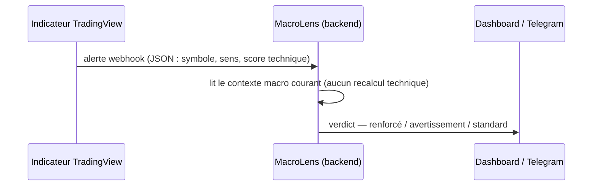

# Tome 8 — Intégration TradingView (indépendance stricte)

> **Statut : ✅ Rédigé & implémenté** · Code : `tradingview/`, `app/api/routes_tradingview.py`, `app/engine/fusion.py`.

---

## 1. Principe d'indépendance
MacroLens ne lit **jamais**, ne modifie **jamais** et ne dépend **jamais** de la
logique technique de votre indicateur. Les deux systèmes ont des périmètres
disjoints :

| | MacroLens | Votre indicateur |
|---|---|---|
| Périmètre | macro, géopolitique, contexte | analyse technique (SMC, liquidité, VWAP, structure) |
| Produit | lectures de contexte, explications, scénarios | signal technique + score de confiance |
| Décide d'un trade ? | **Jamais** | Selon votre méthode |

## 2. Contrainte technique fondatrice
**Pine Script ne peut pas émettre de requête HTTP sortante.** Un indicateur ne
peut donc pas « tirer » le contexte macro en direct. L'architecture inverse le
flux : c'est l'indicateur qui **pousse** son signal.

## 3. Règle de fusion (garde-fou central)
`engine/fusion.py` : le contexte macro **module** un signal technique déjà émis.

| Situation | Verdict | Effet |
|-----------|---------|-------|
| Macro alignée et forte (\|score\| ≥ 40) | `reinforced` | bonus de confiance borné |
| Macro opposée et forte | `warning` | malus + message d'avertissement explicite |
| Macro modérée ou neutre | `standard` | effet quasi nul |

Le bonus/malus est proportionnel à `|score macro| × confiance macro`, **borné** :
la macro ne peut jamais transformer un mauvais signal technique en bon signal.
**Elle ne peut jamais créer un signal à elle seule.**

## 4. Fichiers fournis
- `tradingview/signal_bridge.pine` — à ajouter **à côté** de votre indicateur.
  Remplacez `technicalScore`, `longSignal`, `shortSignal` par vos vraies sorties.
- `tradingview/macro_overlay.pine` — affichage optionnel du contexte (saisie
  manuelle, limite Pine documentée).
- `tradingview/README.md` — procédure de mise en place en 5 étapes.

## 5. Sécurité du webhook
Secret partagé comparé à temps constant (`hmac.compare_digest`), validation
stricte du payload (`Literal` sur le sens, bornes sur le score), normalisation
`long`/`short` → `buy`/`sell`, journalisation du verdict. HTTPS public requis
côté TradingView (tunnel ou reverse-proxy).

## 6. Definition of Done
- [x] Aucun couplage sur la logique technique.
- [x] Fusion bornée, testée (`tests/test_fusion.py`).
- [x] Webhook authentifié et validé (`tests/test_api.py`).
- [x] Limite Pine documentée honnêtement, sans promesse irréalisable.
