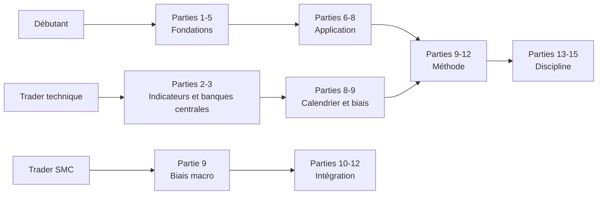

# Maîtriser la Macroéconomie, l'Analyse Fondamentale et le Trading Institutionnel

## De Débutant à Trader Macro-SMC

---

> **Avertissement**
>
> Ce livre est un **ouvrage pédagogique**. Il n'est pas un conseil en
> investissement, ne recommande aucune opération et ne garantit aucun résultat.
> Le trading comporte un risque réel de perte en capital, parfois supérieur au
> dépôt initial. Les exemples chiffrés servent à illustrer un raisonnement : ils
> ne constituent ni une prédiction, ni une promesse. Vous seul décidez, et vous
> seul assumez vos décisions.

---

## Pourquoi ce livre existe

La plupart des traders particuliers connaissent les bougies, les supports et les
résistances. Beaucoup moins savent **pourquoi** le marché bouge.

C'est une asymétrie coûteuse. Un trader technique qui ignore le contexte
macroéconomique ressemble à un marin excellent qui ne regarde jamais la météo :
sa technique est bonne, mais il prend la mer un jour de tempête.

À l'inverse, un économiste qui comprend parfaitement l'inflation mais ignore la
structure de marché sait *où* va le bateau, sans jamais savoir *quand* embarquer.

Ce livre réunit les deux compétences :

- la **macroéconomie** et l'**analyse fondamentale**, qui donnent le **contexte**
  et la **direction probable** ;
- les **Smart Money Concepts** (SMC/ICT), qui donnent le **timing** et le
  **niveau d'exécution**.

L'objectif final : construire un **biais macro professionnel**, puis l'exécuter
avec une méthode technique institutionnelle rigoureuse.

## À qui s'adresse ce livre

| Profil | Ce que vous y trouverez |
|--------|-------------------------|
| **Débutant complet** | Une école d'économie partant de zéro : ce qu'est une économie, comment elle fonctionne, pourquoi les prix bougent. Les parties 1 à 5 sont votre socle. |
| **Trader technique** | La couche qui vous manque : lire un calendrier économique, comprendre une décision de banque centrale, anticiper un régime de marché. Parties 2, 3, 8, 9. |
| **Trader SMC / ICT** | La méthode d'intégration macro + SMC, avec une stratégie complète et des cas pratiques. Parties 9 à 12. |
| **Trader confirmé** | Un support de révision structuré : fiches, checklists, glossaire, exercices. Parties 13 à 15. |

## Comment lire ce livre

Trois parcours possibles selon votre niveau.

**Conseil de méthode.** Ne lisez pas ce livre d'une traite. Chaque partie se
termine par une **fiche de révision** et des **questions d'entraînement** :
répondez-y avant de passer à la suite. Un chapitre lu n'est pas un chapitre
acquis ; un chapitre appliqué à un graphique réel, si.

## Structure de chaque chapitre

Chaque partie suit le même schéma, conçu pour l'apprentissage durable :

1. **Le contenu**, du simple vers l'avancé, avec exemples appliqués aux marchés.
2. **📌 Résumé** — l'essentiel en quelques lignes.
3. **🎯 Points essentiels à retenir** — ce qui doit rester si vous ne gardez rien d'autre.
4. **⚠️ Erreurs fréquentes** — les pièges observés chez la majorité des traders.
5. **🗂 Fiche de révision** — une page à relire avant de trader.
6. **✍️ Questions d'entraînement** — avec corrigé.

## Sommaire

| Partie | Titre | Ce que vous saurez faire ensuite |
|:-----:|-------|----------------------------------|
| **1** | Les bases de l'économie | Comprendre les acteurs et le cycle économique |
| **2** | Les indicateurs économiques | Lire PIB, inflation, emploi, PMI et anticiper leur effet |
| **3** | Les banques centrales | Décoder une décision de taux et un discours |
| **4** | Les taux et les obligations | Lire la courbe des taux comme un signal de cycle |
| **5** | Le dollar et le Forex | Comprendre ce qui fait monter ou baisser une devise |
| **6** | Analyse fondamentale des matières premières | Analyser l'or avec une méthode complète |
| **7** | Géopolitique et marchés | Évaluer l'impact probable d'un choc |
| **8** | Le calendrier économique | Anticiper et lire une publication |
| **9** | Construire un biais macro professionnel | Produire un biais argumenté en 8 étapes |
| **10** | Analyse fondamentale + trading | Articuler contexte et timing |
| **11** | Smart Money Concepts | Lire liquidité, structure et zones institutionnelles |
| **12** | Méthode Macro-SMC complète | Exécuter une stratégie de bout en bout |
| **13** | Psychologie du trader | Tenir votre plan sous pression |
| **14** | Glossaire complet | Maîtriser le vocabulaire professionnel |
| **15** | Annexes | Checklists, exercices, études de cas |

## Une note sur les chiffres cités

Les données historiques mentionnées (crise de 2008, choc Covid de 2020, cycle
d'inflation 2021-2023, tensions bancaires de mars 2023) sont **arrondies et
utilisées à titre illustratif**. Elles servent à faire comprendre un mécanisme,
pas à servir de référence statistique. Vérifiez toujours les chiffres exacts
auprès des sources officielles (BLS, Eurostat, FRED, banques centrales).

Lorsqu'un exemple est **construit pour la démonstration** plutôt que tiré d'un
épisode réel, il est signalé par la mention *« exemple stylisé »*.

## Le principe directeur de tout le livre

Retenez cette phrase, elle traverse les quinze parties :

> **La macro donne la direction probable. La technique donne le point d'entrée.
> Aucune des deux ne donne de certitude.**

Un trader professionnel ne cherche pas à avoir raison. Il cherche à identifier
des situations où **le contexte et l'exécution s'alignent**, puis à gérer son
risque pour survivre aux cas où il se trompe — car il se trompera.

---

*Bonne lecture, et bon travail.*
