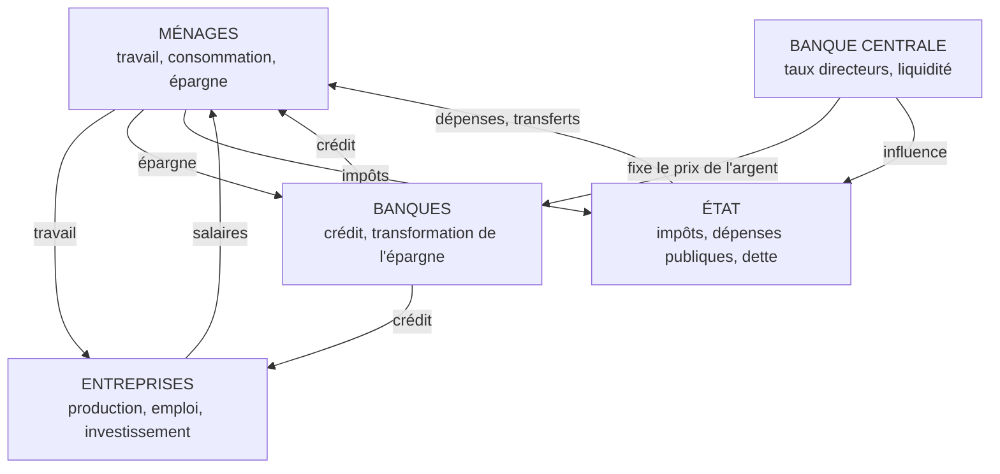
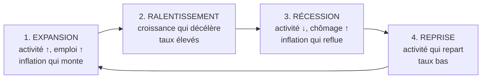

# Partie 1 — Les bases de l'économie

> **Objectif de cette partie.** Comprendre ce qu'est une économie, qui la fait
> tourner, et pourquoi elle avance par cycles. À la fin, vous saurez situer le
> moment du cycle dans lequel se trouve un pays — la première question que se
> pose un trader macro chaque matin.

---

## 1.1 Qu'est-ce qu'une économie ?

Une économie, c'est l'ensemble des **échanges** entre des personnes qui
produisent, vendent, achètent et épargnent.

Réduite à son os, une économie repose sur une seule idée :

> **La dépense de quelqu'un est le revenu de quelqu'un d'autre.**

Cette phrase paraît banale. Elle est en réalité la clé de presque tout ce que
vous verrez ensuite. Si les ménages arrêtent de dépenser, les entreprises
encaissent moins ; si les entreprises encaissent moins, elles embauchent moins ;
si elles embauchent moins, les ménages ont moins de revenus, donc dépensent
encore moins. L'économie est un **système bouclé**, où les effets se renforcent
eux-mêmes — à la hausse comme à la baisse.

### L'économie en une image

Imaginez un village de 100 personnes.

- Le boulanger vend du pain aux 99 autres : c'est son **revenu**.
- Avec ce revenu, il achète de la viande au boucher : c'est la **dépense** du
  boulanger, donc le **revenu** du boucher.
- Le boucher achète des chaussures au cordonnier, etc.

Tant que l'argent circule, tout le monde travaille. Si une rumeur fait peur à
tout le monde et que chacun décide de garder son argent « au cas où », la
circulation ralentit. Personne n'a disparu, aucune compétence n'a été perdue :
**seule la circulation s'est arrêtée**. C'est exactement ce qui se passe dans une
récession.

### Les trois questions de toute économie

| Question | Ce qu'elle détermine |
|----------|----------------------|
| **Que produire ?** | La structure de l'économie (industrie, services, agriculture) |
| **Comment produire ?** | La productivité, la technologie, le capital |
| **Pour qui produire ?** | La répartition des revenus, la consommation |

---

## 1.2 Les cinq acteurs d'une économie moderne

Toute analyse macro commence par identifier **qui fait quoi**. Cinq acteurs
suffisent à comprendre 95 % de ce qui bouge les marchés.



### 1.2.1 Les ménages

Ce sont les particuliers. Ils **offrent du travail** et **consomment**.

Leur comportement se résume à un arbitrage : consommer aujourd'hui ou épargner
pour demain. Cet arbitrage dépend de trois choses :

- le **revenu** (salaires, prestations) ;
- la **confiance** dans l'avenir (peur du chômage = épargne de précaution) ;
- le **coût du crédit** (des taux élevés découragent l'achat à crédit).

Dans une économie développée, la consommation des ménages représente
typiquement **60 à 70 % du PIB**. C'est le moteur principal. D'où l'importance
que les marchés accordent aux ventes au détail et à la confiance des
consommateurs (Partie 2).

### 1.2.2 Les entreprises

Elles **produisent**, **emploient** et **investissent**.

Une entreprise investit lorsque deux conditions sont réunies :

1. elle anticipe une **demande future** suffisante ;
2. le **coût du financement** est inférieur au rendement attendu du projet.

C'est ici que la banque centrale entre en jeu : en montant les taux, elle rend le
second point plus difficile à satisfaire, donc freine l'investissement — et donc
l'activité. **La politique monétaire agit d'abord par le canal du crédit.**

### 1.2.3 Les banques commerciales

Leur rôle est mal compris. Une banque ne se contente pas de garder de l'argent :
elle **crée de la monnaie** en accordant du crédit.

Quand une banque vous prête 200 000 € pour une maison, elle n'ouvre pas un coffre
pour y prendre les billets : elle **inscrit 200 000 € sur votre compte**. La
monnaie apparaît avec le crédit, et disparaît avec le remboursement.

**Conséquence majeure pour le trader :** quand les banques prêtent moins (crise
de confiance, durcissement des conditions), la masse monétaire ralentit
mécaniquement. C'est un puissant frein sur l'économie, souvent plus rapide que
les hausses de taux elles-mêmes. C'est exactement ce que les marchés ont craint
lors des tensions bancaires de **mars 2023**.

### 1.2.4 L'État

Il **prélève** (impôts) et **dépense** (santé, éducation, infrastructures,
prestations). La différence entre les deux est le **déficit**, financé par
l'**émission de dette** (obligations d'État).

Ce point est capital pour la Partie 4 : quand un État émet massivement de la
dette, il augmente l'**offre d'obligations**. Toutes choses égales par ailleurs,
plus d'offre fait baisser le prix des obligations, donc **monter les rendements**
— ce qui renchérit le crédit pour tout le monde.

### 1.2.5 La banque centrale

Elle ne prête pas aux particuliers. Elle fixe le **prix de l'argent** (le taux
directeur) et pilote la **liquidité** du système bancaire.

C'est l'acteur le plus important pour un trader macro, car ses décisions
réévaluent instantanément la valeur de tous les actifs. Toute la Partie 3 lui est
consacrée.

---

## 1.3 Offre, demande et formation des prix

Le prix d'un bien, d'une devise ou d'un actif se forme à la rencontre de l'offre
et de la demande. Trois règles suffisent :

| Situation | Effet sur le prix |
|-----------|-------------------|
| Demande ↑ à offre constante | Prix ↑ |
| Offre ↑ à demande constante | Prix ↓ |
| Demande ↑ **et** offre ↓ | Prix ↑↑ (choc violent) |

**Application marchés.** Le pétrole en est l'illustration la plus pure : une
décision de l'OPEP+ réduisant la production (offre ↓) alors que l'économie
mondiale accélère (demande ↑) produit une hausse rapide et durable.

**Application à l'inflation.** Retenez cette distinction, elle reviendra
constamment :

- **Inflation par la demande** (*demand-pull*) : trop d'argent court après trop
  peu de biens. Typique d'une économie en surchauffe.
- **Inflation par les coûts** (*cost-push*) : le coût de production augmente
  (énergie, matières premières, salaires) et se répercute sur les prix de vente.
  Typique d'un choc pétrolier.

La distinction est cruciale pour anticiper la banque centrale : l'inflation par
la demande se combat efficacement par des hausses de taux ; l'inflation par les
coûts, beaucoup moins — monter les taux ne fait pas apparaître de pétrole.

---

## 1.4 La croissance économique

La croissance, c'est l'augmentation de la production sur une période donnée. Elle
se mesure par la variation du PIB (voir Partie 2).

À long terme, une économie ne peut croître que de deux façons :

$$\text{Croissance} \approx \text{croissance de la population active} + \text{gains de productivité}$$

- **Plus de bras** : plus de personnes travaillent.
- **Plus efficaces** : chaque personne produit davantage à effort constant.

### La productivité, moteur silencieux

La productivité est le rapport entre ce qui est produit et les moyens engagés.
Elle progresse grâce à la technologie, la formation, l'organisation, les
infrastructures.

C'est le facteur le plus important à long terme et le plus ignoré à court terme.
Une économie qui croît **sans gains de productivité** finit par générer de
l'inflation : la demande augmente, mais la capacité à produire ne suit pas.

> **Retenez :** croissance sans productivité = inflation à venir. C'est la
> mécanique de fond du cycle 2021-2023 dans de nombreux pays.

---

## 1.5 Le cycle économique

L'économie ne progresse jamais en ligne droite. Elle avance par vagues : c'est le
**cycle économique**, composé de quatre phases.



### Phase 1 — Expansion

**Ce qui se passe.** La demande est forte, les entreprises embauchent et
investissent, le chômage baisse, le crédit circule.

**Ce qui apparaît en fin de phase.** L'économie approche de ses capacités
maximales : les usines tournent à plein, les entreprises se disputent les
salariés. Les salaires accélèrent, puis les prix. **L'inflation monte.**

**Réaction typique de la banque centrale.** Elle commence à **monter les taux**
pour éviter la surchauffe.

**Comportement typique des marchés (à titre indicatif, pas de règle absolue) :**

| Actif | Tendance historique en expansion |
|-------|----------------------------------|
| Actions | Favorables (bénéfices en hausse) |
| Matières premières industrielles | Favorables (demande forte) |
| Obligations | Défavorables (rendements qui montent) |
| Or | Variable — dépend surtout des **taux réels** (Partie 6) |

### Phase 2 — Ralentissement

**Ce qui se passe.** Les hausses de taux produisent leurs effets, avec un délai
souvent estimé entre **9 et 18 mois**. Le crédit coûte cher, l'investissement
freine, la consommation à crédit recule.

**Signe caractéristique.** L'économie croît encore, mais **de moins en moins
vite**. C'est la phase la plus difficile à lire : les données restent bonnes en
niveau, mais se dégradent en tendance.

> **Point clé pour le trader.** Le marché ne réagit pas au niveau, il réagit au
> **changement de rythme** et à l'**écart avec les attentes**. Une croissance de
> 2 % peut faire monter ou baisser les marchés selon ce qui était anticipé.

### Phase 3 — Récession

**Définition technique courante.** Deux trimestres consécutifs de croissance
négative du PIB. (Aux États-Unis, la datation officielle par le NBER est plus
large : elle intègre l'emploi, les revenus, la production.)

**Ce qui se passe.** Les entreprises réduisent leurs coûts, licencient ; le
chômage monte ; la demande chute ; l'inflation reflue.

**Réaction de la banque centrale.** Elle **baisse les taux** pour relancer
l'activité, parfois de façon agressive.

**Comportement typique des marchés :**

| Actif | Tendance historique en récession |
|-------|----------------------------------|
| Actions | Défavorables (bénéfices en baisse) |
| Obligations d'État | Favorables (fuite vers la qualité, baisse des taux) |
| Or | Souvent favorable (baisse des taux réels, aversion au risque) |
| Matières premières industrielles | Défavorables (demande en berne) |

### Phase 4 — Reprise

**Ce qui se passe.** Les taux bas et les mesures de soutien relancent le crédit.
Les entreprises rebâtissent leurs stocks, réembauchent. La confiance revient.

**Particularité.** Les marchés anticipent : ils remontent souvent **avant** que
les données économiques ne s'améliorent. C'est déroutant pour le débutant qui
voit les actions monter alors que le chômage est encore élevé.

> **Règle essentielle :** les marchés financiers sont des machines à
> **anticiper**, pas à constater. Ils cotent le futur probable, pas le présent.

### Tableau de synthèse du cycle

| Phase | Croissance | Inflation | Chômage | Banque centrale | Courbe des taux |
|-------|-----------|-----------|---------|-----------------|-----------------|
| Expansion | Forte ↑ | En hausse ↑ | Bas ↓ | Commence à resserrer | Se pentifie puis s'aplatit |
| Ralentissement | Décélère ↘ | Encore élevée | Bas mais se retourne | Restrictive, en pause | S'aplatit / s'inverse |
| Récession | Négative ↓ | En baisse ↓ | En hausse ↑ | Assouplit | Se re-pentifie |
| Reprise | Repart ↗ | Basse | Élevé mais s'améliore | Accommodante | Pentue |

Ce tableau est un outil de travail. Chaque matin, situez le pays que vous tradez
dans une de ces quatre colonnes. C'est la première ligne de votre analyse macro.

---

## 1.6 Étude de cas : le choc de 2020, un cycle en accéléré

Le cycle Covid est un cas d'école parce qu'il a comprimé en dix-huit mois ce qui
prend habituellement des années.

| Moment | Phase | Ce qui s'est passé | Réaction observée |
|--------|-------|--------------------|-------------------|
| **Fév.–mars 2020** | Récession brutale | Arrêt de l'activité, effondrement de la demande | Chute violente des actions et du pétrole ; ruée vers le dollar et les obligations |
| **Mars–déc. 2020** | Reprise | Taux ramenés près de zéro, achats d'actifs massifs, soutiens budgétaires | Rebond des actions **malgré** un chômage encore très élevé — le marché anticipe |
| **2021** | Expansion | Réouverture, demande refoulée, chaînes d'approvisionnement sous tension | Matières premières en forte hausse ; inflation qui accélère |
| **2022–2023** | Ralentissement | Cycle de hausses de taux parmi les plus rapides depuis des décennies | Actions et obligations en difficulté simultanément ; dollar très fort |

**Trois leçons durables :**

1. **Les marchés anticipent.** Le creux des actions en mars 2020 a précédé de
   plusieurs mois l'amélioration des données économiques.
2. **L'inflation naît du déséquilibre offre/demande**, pas d'une fatalité. Ici :
   demande soutenue artificiellement + offre contrainte = choc de prix.
3. **La banque centrale arbitre toujours** entre soutenir l'activité et contenir
   les prix. Savoir de quel côté penche son arbitrage est la question centrale
   de la Partie 3.

---

## 📌 Résumé

Une économie est un circuit où la dépense de l'un est le revenu de l'autre. Cinq
acteurs l'animent : ménages, entreprises, banques, État, banque centrale. Les
prix se forment par la rencontre de l'offre et de la demande, et l'inflation peut
venir soit d'une demande excessive, soit d'un renchérissement des coûts. La
croissance de long terme dépend de la population active et de la productivité.
Enfin, l'économie avance par cycles en quatre phases — expansion, ralentissement,
récession, reprise — chacune associée à un comportement typique des taux, de
l'inflation et des classes d'actifs.

## 🎯 Points essentiels à retenir

1. **La dépense de quelqu'un est le revenu de quelqu'un d'autre** : l'économie
   est un système bouclé où les effets s'auto-renforcent.
2. **Les banques créent la monnaie par le crédit.** Un resserrement du crédit
   freine l'économie plus vite que les taux eux-mêmes.
3. **La politique monétaire agit avec retard** (souvent 9 à 18 mois). Ce décalage
   explique pourquoi les banques centrales se trompent régulièrement de dosage.
4. **Distinguez inflation par la demande et inflation par les coûts** : elles
   n'appellent pas la même réponse et ne produisent pas les mêmes trajectoires.
5. **Les marchés anticipent, ils ne constatent pas.** Ils réagissent à l'écart
   entre le réel et l'attendu, pas au niveau absolu d'une donnée.
6. **Situer la phase du cycle est la première étape** de toute analyse macro.

## ⚠️ Erreurs fréquentes

| Erreur | Pourquoi c'est faux | Ce qu'il faut faire |
|--------|--------------------|---------------------|
| « Bonne nouvelle économique = marchés en hausse » | Une donnée trop bonne peut renforcer les anticipations de hausse de taux et faire **baisser** les actions | Toujours se demander : comment cela change-t-il la trajectoire des taux ? |
| Confondre niveau et tendance | Un chômage à 4 % qui **monte** est un signal de retournement, même s'il reste bas | Regarder la dynamique sur 3 à 6 mois, pas le dernier point |
| Croire que la récession est immédiate après une hausse de taux | Le délai de transmission est long | Raisonner en trimestres, pas en jours |
| Ignorer le crédit bancaire | La monnaie est créée par le crédit ; son ralentissement est un frein majeur | Surveiller les conditions de crédit et la santé bancaire |
| Penser que le marché suit l'économie | Le marché **précède** l'économie | Accepter qu'actions et données divergent en bas et en haut de cycle |

## 🗂 Fiche de révision — Partie 1

**Les 5 acteurs :** ménages (consomment) · entreprises (produisent, investissent)
· banques (créent la monnaie par le crédit) · État (dépense, s'endette) · banque
centrale (fixe le prix de l'argent).

**Les 4 phases :**

```
EXPANSION  →  RALENTISSEMENT  →  RÉCESSION  →  REPRISE  →  (retour)
croissance↑   croissance↘        croissance↓    croissance↗
inflation↑    inflation haute    inflation↓     inflation basse
BC resserre   BC restrictive     BC assouplit   BC accommodante
```

**Deux inflations :** par la demande (surchauffe → les taux sont efficaces) · par
les coûts (choc d'offre → les taux sont peu efficaces).

**Une équation :** croissance ≈ population active + productivité.

**Une règle :** le marché réagit à la **surprise**, pas au niveau.

## ✍️ Questions d'entraînement

1. Expliquez avec vos mots pourquoi une baisse de la consommation des ménages
   peut provoquer une hausse du chômage.
2. Une banque centrale monte ses taux de 2 points en un an. Selon vous, à quel
   moment l'économie réelle en ressentira-t-elle pleinement l'effet ?
3. Le pétrole double à cause d'un conflit. S'agit-il d'une inflation par la
   demande ou par les coûts ? La hausse des taux est-elle l'outil adapté ?
4. Les actions montent alors que le chômage est au plus haut. Quelle phase du
   cycle décrit le mieux cette situation ?
5. Le PIB d'un pays croît de 2 %, contre 3,5 % l'an dernier. La croissance est
   positive : pourquoi les marchés peuvent-ils réagir négativement ?
6. Pourquoi une contraction du crédit bancaire peut-elle avoir un effet plus
   rapide qu'une hausse du taux directeur ?

### Corrigé

1. Moins de consommation → moins de chiffre d'affaires pour les entreprises →
   réduction des coûts, donc de l'emploi → moins de revenus pour les ménages →
   nouvelle baisse de la consommation. C'est la boucle « dépense = revenu ».
2. Généralement **9 à 18 mois** après les décisions, avec un pic d'effet différé.
   D'où le risque que la banque centrale resserre trop, l'effet complet n'étant
   pas encore visible au moment où elle décide.
3. **Par les coûts** (choc d'offre). Monter les taux ne crée pas de pétrole : cet
   outil est peu efficace ici, et risque de casser l'activité sans traiter la
   cause. Les banques centrales surveillent alors surtout les **effets de second
   tour** (répercussion sur les salaires et les autres prix).
4. La **reprise**. Les marchés anticipent l'amélioration future ; l'emploi est un
   indicateur retardé qui ne s'améliore que plus tard.
5. Parce que le marché regarde la **tendance** et l'**écart aux attentes**. Une
   décélération de 3,5 % à 2 % signale un ralentissement ; si le consensus
   attendait 2,8 %, la surprise est négative.
6. Parce que le crédit **crée la monnaie**. Si les banques cessent de prêter, le
   financement se tarit immédiatement pour les entreprises et les ménages, sans
   attendre le délai de transmission de la politique monétaire.

---

➡️ **Partie 2 — Les indicateurs économiques** : apprendre à lire les chiffres
qui déclenchent les mouvements de marché.
