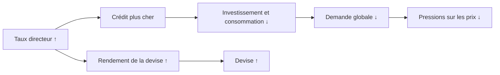

# Partie 3 — Les banques centrales

> **Objectif.** Comprendre l'acteur le plus puissant des marchés financiers :
> ce qu'il contrôle, comment il décide, et comment décoder ses messages.

---

## 3.1 Le rôle d'une banque centrale

Une banque centrale n'est pas une banque ordinaire. Elle ne cherche pas le
profit. Elle poursuit un **mandat** confié par la loi.

| Banque centrale | Zone | Mandat |
|-----------------|------|--------|
| **Fed** (*Federal Reserve*) | États-Unis | **Double mandat** : stabilité des prix **et** plein emploi |
| **BCE** | Zone euro | **Mandat principal unique** : stabilité des prix (~2 %) |
| **BoE** | Royaume-Uni | Stabilité des prix, avec soutien à l'activité |
| **BoJ** | Japon | Stabilité des prix — longtemps confrontée au problème inverse : la déflation |

**Pourquoi cette différence Fed/BCE compte pour vous.** Face à un ralentissement
avec inflation encore élevée, la Fed peut arbitrer en faveur de l'emploi ; la BCE
a juridiquement moins de latitude. Cela crée des **divergences de politique
monétaire**, et donc des tendances durables sur l'EUR/USD (Partie 5).

### Les outils

1. **Le taux directeur** — l'outil principal. C'est le prix auquel les banques se
   financent auprès de la banque centrale ou entre elles. Il se diffuse à tous
   les crédits de l'économie.
2. **Les opérations de bilan** — QE et QT (voir 3.4).
3. **La communication** — le *forward guidance*. Souvent aussi puissante que les
   décisions elles-mêmes : orienter les anticipations suffit parfois à produire
   l'effet recherché.

---

## 3.2 Politique restrictive vs accommodante

C'est la distinction fondamentale.

### Politique restrictive (*hawkish*, « faucon »)

**Objectif :** freiner l'inflation.
**Moyen :** taux élevés, retrait de liquidité.

**Mécanisme de transmission :**



**Effets typiques :** dollar fort · obligations sous pression (rendements en
hausse) · actions freinées, particulièrement les valeurs de croissance ·
**or pénalisé** si les taux réels montent.

### Politique accommodante (*dovish*, « colombe »)

**Objectif :** soutenir l'activité et l'emploi.
**Moyen :** taux bas, injection de liquidité.

**Effets typiques :** devise affaiblie · obligations soutenues · actions
favorisées · **or soutenu** par la baisse des taux réels · cryptos soutenues par
l'abondance de liquidité.

### Le vocabulaire à maîtriser absolument

| Terme | Signification | Traduction marché |
|-------|---------------|-------------------|
| **Hawkish** (faucon) | Priorité à la lutte contre l'inflation | Taux plus élevés / plus longtemps → devise ↑ |
| **Dovish** (colombe) | Priorité au soutien de l'activité | Taux plus bas / plus tôt → devise ↓ |
| **Pivot** | Changement de cap (du resserrement vers l'assouplissement) | Événement majeur, souvent violent sur les marchés |
| **Higher for longer** | Taux maintenus élevés durablement | Message *hawkish* sans nouvelle hausse |
| **Data dependent** | Les décisions suivront les données | La banque centrale refuse de s'engager ; volatilité accrue à chaque publication |

> **Nuance capitale.** *Hawkish* et *dovish* sont **relatifs aux attentes**, pas
> absolus. Une banque centrale qui monte ses taux de 0,25 point alors que le
> marché attendait 0,50 point délivre un message… **dovish**. Le marché achète et
> vend l'écart, jamais la valeur brute.

---

## 3.3 Comment une décision est prise et communiquée

Une réunion de politique monétaire (FOMC aux États-Unis, Conseil des gouverneurs
à la BCE) produit trois éléments, par ordre croissant d'importance pour le
marché :

| Élément | Contenu | Impact |
|---------|---------|--------|
| **1. La décision** | Le niveau du taux | Souvent **déjà anticipé** → impact modéré |
| **2. Le communiqué et les projections** | Texte officiel ; pour la Fed, le *dot plot* (projections de taux des membres) | Impact **fort** : révèle la trajectoire |
| **3. La conférence de presse** | Questions-réponses avec le président | Impact **très fort** : c'est là que le ton se révèle |

**Conséquence pratique :** le mouvement le plus violent n'a souvent pas lieu à
l'annonce du taux, mais **30 à 60 minutes plus tard**, pendant la conférence de
presse. Beaucoup de traders débutants se positionnent sur la décision, sont pris
à contre-pied par la conférence, et concluent que « le marché est manipulé ».

### Le *dot plot*

Propre à la Fed : chaque membre du comité indique, par un point, où il voit le
taux directeur à la fin de chaque année à venir. La **médiane** de ces points
donne la trajectoire anticipée par l'institution.

Un déplacement de la médiane — par exemple de trois baisses anticipées à une
seule — constitue à lui seul un événement de marché majeur.

---

## 3.4 QE et QT : agir par le bilan

Lorsque les taux sont déjà proches de zéro, la banque centrale ne peut plus les
baisser beaucoup. Elle agit alors sur son **bilan**.

### QE — *Quantitative Easing* (assouplissement quantitatif)

La banque centrale **achète des actifs** (principalement des obligations d'État)
sur le marché.

**Effets en chaîne :**
1. Elle crée de la monnaie centrale pour payer ces achats → **liquidité ↑**.
2. En achetant massivement des obligations, elle en fait monter le prix → donc
   **baisser les rendements** de long terme.
3. Les investisseurs, privés de rendement obligataire, se reportent sur des
   actifs plus risqués → **actions, immobilier, cryptos soutenus**.

C'est l'effet de « recherche de rendement » (*search for yield*).

### QT — *Quantitative Tightening* (resserrement quantitatif)

L'inverse : la banque centrale **réduit son bilan**, en cessant de réinvestir les
obligations arrivant à échéance, ou en en vendant.

**Effets :** liquidité ↓ · rendements longs sous pression haussière · actifs
risqués moins soutenus.

| | QE | QT |
|---|---|---|
| **Action** | Achat d'actifs | Réduction du bilan |
| **Liquidité** | ↑ | ↓ |
| **Rendements longs** | ↓ | ↑ |
| **Actions / cryptos** | Favorable | Défavorable |
| **Or** | Favorable (taux réels ↓, dévalorisation monétaire crainte) | Défavorable |
| **Devise** | Plutôt affaiblie | Plutôt renforcée |

> **À retenir :** le QE/QT agit surtout sur les **taux longs** et la
> **liquidité** ; le taux directeur agit surtout sur les **taux courts**. Les
> deux leviers sont complémentaires.

---

## 3.5 Décoder un discours de banque centrale

C'est un art, mais il obéit à des règles. Voici une grille de lecture concrète.

### Signaux *hawkish* (restrictifs)

| Formulation typique | Ce que cela signale |
|---------------------|---------------------|
| « L'inflation reste **trop élevée** » | Pas de relâchement en vue |
| « Nous sommes prêts à **agir davantage** si nécessaire » | Porte ouverte à de nouvelles hausses |
| « Le marché du travail reste **très tendu** » | Crainte de pressions salariales |
| « Il serait **prématuré** d'envisager un assouplissement » | Refroidit les espoirs de baisse |
| « Nous maintiendrons une politique **restrictive** un certain temps » | *Higher for longer* |

### Signaux *dovish* (accommodants)

| Formulation typique | Ce que cela signale |
|---------------------|---------------------|
| « L'inflation **progresse vers notre cible** » | La mission avance |
| « Les **risques deviennent plus équilibrés** » | Fin du biais restrictif |
| « Nous surveillons les **risques pesant sur la croissance** » | L'emploi revient dans l'équation |
| « Une politique **excessivement restrictive** comporte des risques » | Signal de préparation à un assouplissement |
| « Nous approchons de la **fin du cycle** de resserrement » | Pivot en préparation |

### Méthode de lecture en 4 questions

Face à un communiqué ou une conférence, posez-vous **toujours** ces quatre
questions dans l'ordre :

1. **Le ton est-il plus ou moins restrictif que la fois précédente ?** (comparez
   les textes mot à mot — les banques centrales changent leurs formulations avec
   une intention délibérée)
2. **Le ton est-il plus ou moins restrictif que ce qu'attendait le marché ?**
   (c'est cela qui produit le mouvement)
3. **Quels mots ont disparu ou sont apparus ?** La suppression d'une phrase comme
   « des hausses supplémentaires pourraient être appropriées » est un événement.
4. **Que disent les projections chiffrées ?** Elles sont moins interprétables que
   les mots, donc plus fiables.

---

## 3.6 Impact sur les classes d'actifs

### Tableau de référence

| Décision / ton | USD (DXY) | Or (XAUUSD) | Actions | Obligations | Cryptos |
|----------------|:---------:|:-----------:|:-------:|:-----------:|:-------:|
| **Hausse de taux plus forte qu'attendu** | ↑↑ | ↓↓ | ↓↓ | ↓↓ | ↓↓ |
| **Hausse conforme, ton hawkish** | ↑ | ↓ | ↓ | ↓ | ↓ |
| **Hausse conforme, ton dovish** | ↓ | ↑ | ↑ | ↑ | ↑ |
| **Pause avec ton hawkish** | ↑ | ↓ | ↕ | ↓ | ↕ |
| **Pause avec ton dovish** | ↓ | ↑↑ | ↑↑ | ↑ | ↑↑ |
| **Baisse de taux (attendue)** | ↓ | ↑ | ↑ | ↑ | ↑ |
| **Baisse de taux surprise (urgence)** | ↓ puis ↑ | ↑↑ | ↓ | ↑↑ | ↓ |

> **Ligne la plus contre-intuitive : la dernière.** Une baisse de taux *surprise*
> hors calendrier n'est pas une bonne nouvelle : elle signale que la banque
> centrale voit un danger que le marché n'avait pas identifié. Les actions
> baissent, l'or et les obligations d'État montent (fuite vers la sécurité), et
> le dollar peut même **se renforcer** par recherche de liquidité en dollars.
> C'est ce qui s'est produit en mars 2020.

---

## 3.7 Étude de cas : le cycle de resserrement 2022-2023

*Données arrondies, à titre illustratif.*

**Le contexte.** Après le choc Covid, l'inflation américaine dépasse largement la
cible de 2 %, atteignant un pic autour de 9 % à l'été 2022. La Fed, qui avait
d'abord qualifié cette inflation de « transitoire », opère un revirement.

**La séquence :**

| Phase | Action de la Fed | Réaction des marchés |
|-------|------------------|----------------------|
| **Fin 2021** | Reconnaissance que l'inflation n'est pas transitoire ; annonce d'un resserrement | Les valeurs de croissance commencent à corriger |
| **2022** | Cycle de hausses parmi les plus rapides depuis les années 1980, plusieurs hausses de 0,75 point | **Dollar très fort** · actions et obligations baissent **simultanément** (rare) · or sous pression malgré l'inflation élevée |
| **Fin 2022 – 2023** | Ralentissement du rythme, puis pause ; discours *higher for longer* | Marchés volatils, oscillant à chaque publication entre espoir de pivot et déception |

**Les trois leçons pour un trader macro :**

1. **L'or a baissé pendant que l'inflation était au plus haut.** Preuve
   définitive que l'or suit les **taux réels**, pas l'inflation nominale : les
   taux nominaux montaient plus vite que l'inflation anticipée.
2. **Actions et obligations ont chuté ensemble.** La diversification classique
   n'a pas protégé, car les deux classes d'actifs souffraient de la **même**
   cause : la hausse des taux.
3. **Le mot « transitoire » a coûté cher.** Il illustre qu'une banque centrale
   peut se tromper, et que sa correction de trajectoire est elle-même un moteur
   de marché majeur. Ne prenez jamais un discours de banque centrale pour une
   prophétie.

---

## 📌 Résumé

Une banque centrale poursuit un mandat (prix, et parfois emploi) à l'aide de
trois outils : le taux directeur, le bilan (QE/QT) et la communication. Une
politique restrictive (*hawkish*) renforce la devise et pèse sur les actifs
risqués et sur l'or ; une politique accommodante (*dovish*) produit l'inverse.
Ce qui compte n'est jamais le niveau absolu, mais **l'écart entre la décision et
les attentes**. Le mouvement le plus violent survient souvent pendant la
conférence de presse, non à l'annonce.

## 🎯 Points essentiels à retenir

1. **Hawkish et dovish sont relatifs aux attentes**, jamais absolus.
2. **La conférence de presse compte souvent plus que la décision.**
3. **Le taux directeur agit sur le court terme ; le QE/QT sur le long terme et la
   liquidité.**
4. **Une baisse de taux surprise est un signal d'alarme**, pas une bonne nouvelle.
5. **Comparez les communiqués mot à mot** : ce qui disparaît est aussi important
   que ce qui apparaît.
6. **La divergence entre banques centrales** crée les tendances durables sur le
   Forex.
7. **Les banques centrales se trompent.** Leur correction de trajectoire est
   elle-même une opportunité de contexte.

## ⚠️ Erreurs fréquentes

| Erreur | Correction |
|--------|-----------|
| Se positionner sur la décision de taux | La décision est souvent déjà dans les prix ; le ton fait le mouvement |
| Croire qu'une hausse de taux fait toujours monter la devise | Si le marché attendait davantage, la devise **baisse** |
| Ignorer le *dot plot* et les projections | Ils dessinent la trajectoire, donc l'essentiel |
| Interpréter un mot isolé | Comparer au communiqué précédent, en intégralité |
| Penser qu'un pivot est un événement ponctuel | C'est un **processus** qui se construit sur plusieurs réunions |
| Confondre pause et pivot | Une pause *hawkish* n'annonce pas une baisse |

## 🗂 Fiche de révision — Partie 3

**Deux camps :**
```
HAWKISH (faucon)              DOVISH (colombe)
lutte contre l'inflation      soutien de l'activité
taux ↑, liquidité ↓           taux ↓, liquidité ↑
USD ↑ · Or ↓ · Actions ↓      USD ↓ · Or ↑ · Actions ↑
```

**Trois moments d'une réunion :** décision (souvent anticipée) → communiqué et
projections (fort) → conférence de presse (**le plus fort**).

**Bilan :** QE = achats, liquidité ↑, rendements longs ↓ · QT = réduction,
liquidité ↓, rendements longs ↑.

**Les 4 questions de décodage :** plus/moins restrictif qu'avant ? qu'attendu ?
quels mots ont changé ? que disent les chiffres ?

**Piège n°1 :** tout est **relatif aux attentes**.

## ✍️ Questions d'entraînement

1. La Fed monte ses taux de 0,25 point alors que le marché anticipait 0,50 point.
   Le dollar monte-t-il ou baisse-t-il ? Pourquoi ?
2. Quelle différence de mandat existe entre la Fed et la BCE, et pourquoi cela
   peut-il créer une tendance durable sur l'EUR/USD ?
3. Une banque centrale annonce un programme de QE. Quel effet sur les rendements
   obligataires à 10 ans, et pourquoi ?
4. Le communiqué supprime la phrase « des hausses supplémentaires pourraient être
   appropriées ». Comment interprétez-vous ce changement ?
5. Une banque centrale baisse ses taux en urgence, entre deux réunions. Pourquoi
   les actions peuvent-elles **baisser** malgré cette nouvelle a priori favorable ?
6. Pourquoi le mouvement de marché le plus important survient-il souvent après
   l'annonce du taux, et non au moment même ?

### Corrigé

1. Il **baisse**. Le marché avait intégré 0,50 point ; obtenir moins équivaut à
   un message *dovish* relatif. Le différentiel de taux anticipé se réduit.
2. La Fed a un **double mandat** (prix + emploi), la BCE un mandat centré sur les
   **prix**. Face à un ralentissement, la Fed peut assouplir plus tôt. Cette
   divergence de trajectoire modifie le différentiel de taux, moteur central de
   l'EUR/USD.
3. Les rendements à 10 ans **baissent** : la banque centrale achète massivement
   ces obligations, ce qui fait monter leur prix — or prix et rendement évoluent
   en sens inverse.
4. C'est un signal **dovish** : le biais haussier sur les taux est retiré. La
   banque centrale prépare le terrain à une pause, voire à un pivot.
5. Parce que cette baisse d'urgence **révèle un danger** que le marché n'avait pas
   pleinement évalué. Le message implicite (« la situation est grave ») l'emporte
   sur l'effet mécanique de la baisse.
6. Parce que la décision est généralement anticipée, tandis que la **conférence de
   presse** livre le ton, les nuances et les réponses non préparées — c'est là que
   les anticipations sont réellement révisées.

---

➡️ **Partie 4 — Les taux et les obligations** : le marché qui donne le tempo à
tous les autres.
