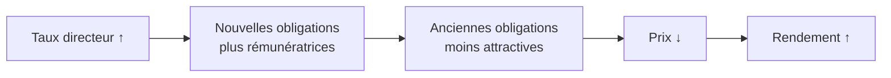
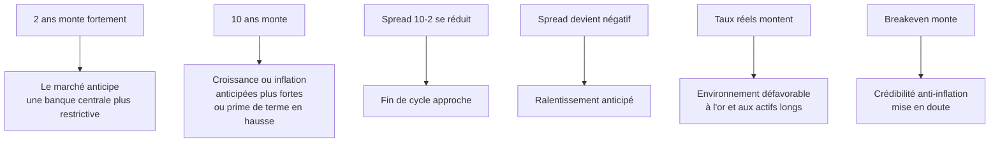

# Partie 4 — Les taux et les obligations

> **Objectif.** Comprendre le marché le plus important du monde — celui de la
> dette d'État — et apprendre à lire la courbe des taux comme un instrument de
> diagnostic du cycle économique.

---

## 4.1 Qu'est-ce qu'une obligation ?

Une obligation est un **prêt** matérialisé par un titre échangeable.

Quand vous achetez une obligation d'État américaine à 10 ans, vous prêtez de
l'argent au Trésor américain. En échange :

- il vous verse un **coupon** (intérêt) périodique ;
- il vous rembourse le **nominal** à l'échéance.

| Terme | Définition |
|-------|-----------|
| **Nominal** (*face value*) | Le montant remboursé à l'échéance |
| **Coupon** | L'intérêt versé, fixé à l'émission |
| **Maturité** | La durée jusqu'au remboursement |
| **Rendement** (*yield*) | Le **rendement effectif** compte tenu du prix payé aujourd'hui |

### Les obligations d'État américaines

| Nom | Maturité |
|-----|----------|
| **T-Bills** | Moins d'un an |
| **T-Notes** | 2 à 10 ans |
| **T-Bonds** | 20 à 30 ans |

Ce marché est considéré comme la référence mondiale du « sans risque » : c'est
l'étalon auquel tous les autres actifs sont comparés.

---

## 4.2 La relation prix / rendement : la clé de tout

C'est le concept que beaucoup de traders n'assimilent jamais correctement. Il est
pourtant simple.

> **Le prix d'une obligation et son rendement évoluent en sens inverse.**

### Pourquoi ? Un exemple chiffré

Vous achetez une obligation :
- Nominal : 1 000 €
- Coupon : 30 € par an
- Rendement : 30 / 1 000 = **3 %**

Le lendemain, la banque centrale monte ses taux. Les nouvelles obligations
émises offrent 50 € par an.

Votre obligation à 30 € devient moins attractive. Personne ne l'achètera à
1 000 €. Pour trouver preneur, son prix doit baisser — disons à 600 €.

Le nouvel acheteur touche toujours 30 € par an, mais n'a payé que 600 € :
son rendement est de 30 / 600 = **5 %**.

**Le coupon n'a pas changé. Le prix a baissé. Le rendement a monté.**



### Conséquence pratique pour le trader

| Vous entendez… | Cela signifie… |
|----------------|----------------|
| « Les rendements montent » | Les obligations **baissent** ; conditions financières plus dures |
| « Les rendements baissent » | Les obligations **montent** ; conditions plus souples |
| « Fuite vers la qualité » | Achat massif d'obligations d'État → rendements ↓ |
| « Sell-off obligataire » | Vente massive → rendements ↑ |

---

## 4.3 Le 2 ans et le 10 ans : deux messages différents

Toutes les maturités ne racontent pas la même histoire. Deux points de la courbe
suffisent pour l'essentiel.

### Le rendement à 2 ans

Il reflète surtout les **anticipations de politique monétaire** à court terme.
Il colle de près à la trajectoire attendue du taux directeur.

> Si le 2 ans bondit après une publication d'inflation, c'est que le marché
> anticipe une banque centrale plus restrictive. **C'est l'indicateur le plus
> direct des anticipations de taux.**

### Le rendement à 10 ans

Il intègre trois composantes :

1. les anticipations de **taux courts moyens** sur dix ans ;
2. les anticipations d'**inflation** de long terme ;
3. une **prime de terme** (rémunération de l'incertitude sur une longue durée).

C'est le taux de référence de l'économie réelle : il influence les crédits
immobiliers, le coût du capital des entreprises, la valorisation des actions.

| | 2 ans | 10 ans |
|---|-------|--------|
| **Reflète surtout** | Anticipations de politique monétaire | Croissance + inflation longues + prime de terme |
| **Réagit à** | Discours et décisions de banque centrale | Perspectives économiques, dette, inflation structurelle |
| **Sensibilité** | Très forte aux données court terme | Plus lente, plus structurelle |

---

## 4.4 La courbe des taux

La courbe des taux relie les rendements de toutes les maturités, du plus court au
plus long.

### Les quatre formes

| Forme | Description | Signification économique |
|-------|-------------|--------------------------|
| **Normale** (pentue) | Les taux longs > taux courts | Situation saine : on exige plus pour prêter longtemps. Croissance attendue |
| **Plate** | Écart quasi nul | Fin de cycle de resserrement ; incertitude |
| **Inversée** | Taux courts > taux longs | Le marché anticipe un **ralentissement** et des baisses de taux futures |
| **Très pentue** | Écart large | Début de cycle ; anticipations de croissance ou d'inflation |

### Le spread 10Y − 2Y

C'est l'indicateur de référence :

$$\text{Spread} = \text{Rendement 10 ans} - \text{Rendement 2 ans}$$

| Valeur | Lecture |
|--------|---------|
| **> +1,0 point** | Courbe pentue — début de cycle, reprise |
| **+0,2 à +1,0** | Courbe normale |
| **0 à +0,2** | Courbe plate — fin de cycle |
| **< 0** | **Courbe inversée** — signal historique de ralentissement |

### Pourquoi une inversion est-elle un signal ?

Raisonnez logiquement. Si un investisseur accepte un rendement **plus faible**
pour prêter sur 10 ans que sur 2 ans, c'est qu'il anticipe que dans quelques
années, les taux seront **beaucoup plus bas** qu'aujourd'hui. Or les taux
baissent quand l'économie faiblit.

**L'inversion est donc le marché obligataire disant, collectivement : « nous
pensons que la banque centrale devra baisser les taux, parce que l'économie va
ralentir ».**

Historiquement, l'inversion de la courbe américaine a précédé la plupart des
récessions des dernières décennies. Mais — et c'est essentiel :

> ⚠️ **Trois avertissements sur l'inversion**
>
> 1. **Le délai est très variable** : de plusieurs mois à plus de deux ans.
>    L'inversion n'est pas un signal de timing.
> 2. **Il y a eu des faux signaux.** Aucune règle économique n'est infaillible.
> 3. **La re-pentification après inversion** est souvent le signal le plus
>    tardif et le plus sérieux : historiquement, la récession survient fréquemment
>    lorsque la courbe **sort** de l'inversion, pas quand elle y entre.

### Ce que fait un trader macro avec la courbe

Elle ne sert pas à entrer en position. Elle sert à **cadrer le régime** :

| Courbe | Régime probable | Implication de contexte |
|--------|-----------------|-------------------------|
| Pentue et se pentifiant | Reprise / reflation | Favorable aux actifs cycliques |
| Plate | Fin de cycle | Prudence, volatilité accrue |
| Inversée | Ralentissement anticipé | Contexte défavorable au risque à moyen terme |
| Re-pentification depuis l'inversion | Transition vers l'assouplissement | Historiquement porteur pour l'or |

---

## 4.5 Le taux réel : le concept qui explique l'or

Le **taux réel** est le taux nominal corrigé de l'inflation.

$$\text{Taux réel} \approx \text{Taux nominal} - \text{Inflation anticipée}$$

Aux États-Unis, on l'observe directement via les **TIPS** (*Treasury
Inflation-Protected Securities*), obligations indexées sur l'inflation. Le
rendement réel à 10 ans (série FRED : `DFII10`) est **la** variable à suivre.

### Pourquoi c'est décisif

L'or ne verse ni coupon ni dividende. Le **coût d'opportunité** de le détenir est
donc le rendement réel auquel vous renoncez en ne détenant pas d'obligations.

| Situation | Coût d'opportunité de l'or | Effet historique sur l'or |
|-----------|---------------------------|---------------------------|
| Taux réel **élevé et en hausse** | Fort — les obligations rapportent réellement | Défavorable |
| Taux réel **bas ou négatif** | Faible ou nul — détenir des obligations fait perdre du pouvoir d'achat | Favorable |

*Illustration chiffrée :*

| | Cas A | Cas B |
|---|---|---|
| Taux nominal 10 ans | 5 % | 2 % |
| Inflation anticipée | 2 % | 4 % |
| **Taux réel** | **+3 %** | **−2 %** |
| Lecture pour l'or | Coût d'opportunité élevé → défavorable | Détenir des obligations fait perdre 2 % par an → l'or devient relativement attractif |

> **Le point d'ancrage de tout le livre :** demandez-vous toujours *« que font
> les taux réels ? »* avant de vous prononcer sur l'or.

### Le point mort d'inflation (*breakeven*)

$$\text{Breakeven} = \text{Rendement nominal} - \text{Rendement réel (TIPS)}$$

C'est **l'inflation anticipée par le marché**. Un breakeven à 10 ans qui monte
signale que le marché doute de la capacité de la banque centrale à ramener
l'inflation à sa cible — un signal important, souvent sous-exploité.

---

## 4.6 Les taux comme signal avancé

Récapitulons ce que le marché obligataire vous dit :



**Le marché obligataire est plus « intelligent » que le marché actions** — c'est
un adage de salle de marché, et il a un fondement : il est dominé par des
institutionnels, gère des volumes colossaux, et intègre plus froidement les
anticipations macro. Lorsque obligations et actions racontent deux histoires
différentes, il est souvent prudent d'écouter les obligations.

---

## 4.7 Étude de cas : l'inversion de 2022-2023

*Données arrondies, à titre illustratif.*

**La séquence.**

| Période | Ce qui se passe | Lecture |
|---------|-----------------|---------|
| Début 2022 | La Fed annonce un resserrement agressif | Le **2 ans bondit** — il suit les anticipations de politique monétaire |
| Mi-2022 | Le 2 ans dépasse le 10 ans | **Inversion** : le marché anticipe que ce resserrement finira par casser la croissance |
| 2023 | L'inversion se creuse et dure | Les débats sur l'imminence d'une récession s'installent ; le délai s'allonge bien au-delà des attentes |
| Mars 2023 | Tensions bancaires (faillites d'établissements régionaux américains) | **Chute brutale du 2 ans** : le marché reprice massivement des baisses de taux. Fuite vers les obligations d'État. Or en forte hausse |

**Ce que cet épisode enseigne :**

1. **Le 2 ans est l'indicateur des anticipations de politique monétaire.** Son
   effondrement en mars 2023 a été l'un des mouvements les plus violents de son
   histoire — bien avant que la Fed ne change quoi que ce soit.
2. **L'inversion n'est pas un outil de timing.** Elle a duré très longtemps sans
   récession immédiate. Un trader qui aurait vendu les actions à la première
   inversion aurait subi une longue période adverse.
3. **Le stress bancaire agit comme un resserrement supplémentaire.** Rappelez-vous
   la Partie 1 : les banques créent la monnaie. Une crise de confiance bancaire
   fait le travail de la banque centrale — en pire, car brutalement.

---

## 📌 Résumé

Une obligation est un prêt échangeable dont le prix évolue à l'inverse du
rendement. Le rendement à 2 ans reflète les anticipations de politique monétaire ;
le 10 ans reflète croissance, inflation longue et prime de terme. Le spread
10Y−2Y dessine la courbe des taux, dont l'inversion signale un ralentissement
anticipé — sans donner de timing. Enfin, le **taux réel** (nominal − inflation
anticipée) est la variable clé pour comprendre l'or et les actifs de longue
duration.

## 🎯 Points essentiels à retenir

1. **Prix et rendement évoluent en sens inverse.** À maîtriser absolument.
2. **Le 2 ans = anticipations de taux. Le 10 ans = économie et inflation longues.**
3. **Courbe inversée = ralentissement anticipé**, mais **délai imprévisible**.
4. **La re-pentification après inversion** est historiquement le signal le plus
   sérieux.
5. **Taux réel = nominal − inflation anticipée.** C'est le pilote de l'or.
6. **Le breakeven mesure la crédibilité anti-inflation** de la banque centrale.
7. **En cas de divergence actions / obligations**, le marché obligataire mérite
   d'être écouté en priorité.

## ⚠️ Erreurs fréquentes

| Erreur | Correction |
|--------|-----------|
| Croire que « rendements en hausse » = « obligations en hausse » | C'est l'inverse : le prix baisse |
| Vendre les actions dès l'inversion de la courbe | Le délai peut dépasser deux ans |
| Utiliser l'inflation nominale pour analyser l'or | Utiliser le **taux réel** |
| Ne suivre que le 10 ans | Le 2 ans est souvent plus informatif à court terme |
| Ignorer la prime de terme | Une hausse du 10 ans n'est pas toujours une anticipation de croissance : elle peut refléter une inquiétude sur la dette |
| Traiter la courbe comme un signal d'entrée | C'est un outil de **cadrage de régime**, pas de timing |

## 🗂 Fiche de révision — Partie 4

**Relation fondamentale :** `Prix ↑ ⇔ Rendement ↓` et `Prix ↓ ⇔ Rendement ↑`

**Deux maturités :**
```
2 ANS  → anticipations de politique monétaire (réagit vite)
10 ANS → croissance + inflation longue + prime de terme (structurel)
```

**Courbe (spread 10Y − 2Y) :**
```
> +1,0   pentue     → début de cycle
+0,2/1,0 normale    → régime sain
0/+0,2   plate      → fin de cycle
< 0      INVERSÉE   → ralentissement anticipé
```

**Formules :**
- Taux réel ≈ nominal − inflation anticipée
- Breakeven = nominal − rendement TIPS = inflation anticipée par le marché

**Séries à suivre (FRED) :** `DGS2` · `DGS10` · `T10Y2Y` · `DFII10` · `T10YIE`

## ✍️ Questions d'entraînement

1. Une obligation verse 40 € par an sur un nominal de 1 000 €. Les taux du marché
   montent à 8 %. Que devient approximativement son prix, et pourquoi ?
2. Le 2 ans monte de 25 points de base après un discours de banque centrale.
   Qu'est-ce que cela vous apprend ?
3. Le spread 10Y−2Y passe de +0,5 à −0,3. Décrivez ce qui se produit et ce que
   le marché anticipe.
4. Le rendement nominal à 10 ans est de 4,5 % et le rendement TIPS à 10 ans de
   2,1 %. Calculez le taux réel et le point mort d'inflation. Que concluez-vous
   pour l'or ?
5. La courbe est inversée depuis 18 mois et aucune récession n'est survenue.
   L'indicateur est-il invalidé ?
6. Le 10 ans monte fortement alors que les anticipations de croissance se
   dégradent. Donnez une explication possible.

### Corrigé

1. Le prix baisse jusqu'à ce que le rendement s'aligne : approximativement
   40 / 0,08 = **500 €**. Le coupon est figé, seul le prix peut s'ajuster.
2. Que le marché a interprété le discours comme **plus restrictif** qu'attendu et
   révise à la hausse la trajectoire du taux directeur.
3. La courbe **s'inverse**. Les taux courts dépassent les taux longs : le marché
   anticipe un ralentissement de l'activité et de futures baisses de taux.
4. Taux réel = **2,1 %** (le rendement TIPS *est* le taux réel). Breakeven =
   4,5 − 2,1 = **2,4 %**. Un taux réel positif de 2,1 % représente un coût
   d'opportunité notable : environnement plutôt **défavorable à l'or**, à moins
   qu'il ne se détende.
5. Non — mais il rappelle que ce signal indique une **direction**, pas une
   **date**. Le délai historique est très variable, et la re-pentification est
   souvent le signal plus tardif à surveiller. Utilisez-le pour cadrer un régime,
   jamais pour déclencher un trade.
6. Plusieurs explications possibles : hausse de la **prime de terme** liée à des
   inquiétudes sur l'endettement public et l'offre massive d'obligations ; ou
   remontée des anticipations d'inflation de long terme (breakeven). Une hausse du
   10 ans n'est donc **pas toujours** un signal de croissance.

---

➡️ **Partie 5 — Le dollar et le Forex** : pourquoi une monnaie monte ou baisse,
et comment lire le DXY.
