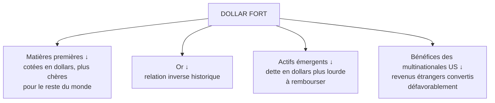

# Partie 5 — Le dollar et le Forex

> **Objectif.** Comprendre ce qui fait monter ou baisser une devise, maîtriser
> le DXY, et savoir pourquoi le dollar commande une grande partie des marchés
> mondiaux.

---

## 5.1 Ce qu'est vraiment un taux de change

Un taux de change n'est pas le « prix d'un pays ». C'est un **prix relatif** :
combien d'unités d'une monnaie il faut pour en obtenir une autre.

> **Conséquence permanente :** on ne trade jamais une devise seule, mais toujours
> **une paire**. L'EUR/USD peut monter parce que l'euro se renforce **ou** parce
> que le dollar s'affaiblit — ce n'est pas la même histoire.

D'où l'utilité d'un indice comme le DXY, qui mesure le dollar contre un panier :
il permet de savoir si le mouvement vient bien du dollar.

---

## 5.2 Les cinq forces qui font bouger une devise

### Force 1 — Le différentiel de taux d'intérêt (la plus puissante)

Les capitaux vont là où ils sont le mieux rémunérés, à risque comparable.

*Exemple stylisé.* Les taux américains sont à 5 %, les taux de la zone euro à
3 %. Un investisseur international a intérêt à détenir des actifs en dollars : il
vend des euros, achète des dollars. **Le dollar se renforce.**

Ce qui compte n'est pas le niveau, mais **l'écart et son évolution anticipée** :

| Évolution attendue | Effet sur la devise |
|--------------------|---------------------|
| Écart de taux qui **s'élargit** en sa faveur | Renforcement |
| Écart qui **se resserre** | Affaiblissement |
| Banque centrale plus *hawkish* que les autres | Renforcement |
| Banque centrale qui pivote la première | Affaiblissement |

> **C'est le canal n°1.** Si vous ne deviez suivre qu'une chose sur le Forex, ce
> serait la **divergence de politique monétaire** entre les deux banques
> centrales de la paire.

### Force 2 — L'inflation relative

Une inflation durablement plus élevée érode le pouvoir d'achat d'une monnaie et
tend à l'affaiblir à long terme (logique de parité de pouvoir d'achat).

Mais attention au paradoxe de court terme : une inflation qui surprend à la
hausse fait souvent **monter** la devise à court terme, car elle implique une
banque centrale plus restrictive. Le canal des taux domine à court terme ; le
canal du pouvoir d'achat domine à long terme.

### Force 3 — La balance commerciale et les flux courants

Un pays qui exporte plus qu'il n'importe voit affluer des devises étrangères
converties dans sa monnaie → soutien.

Un déficit commercial chronique implique une offre continue de sa monnaie sur le
marché → pression baissière structurelle.

*Nuance importante :* les États-Unis affichent un déficit commercial durable et
pourtant un dollar souvent fort. Pourquoi ? Parce que les **flux financiers**
(force 4) l'emportent largement sur les flux commerciaux dans leur cas.

### Force 4 — Les flux de capitaux et le statut de valeur refuge

En période de stress, les investisseurs mondiaux cherchent la sécurité et la
liquidité. Le dollar en bénéficie massivement, pour trois raisons :

1. Le marché des obligations d'État américaines est le plus **liquide** au monde.
2. Une part majeure du commerce international et de la dette mondiale est
   **libellée en dollars**.
3. Le dollar reste la principale **monnaie de réserve**.

D'où un comportement contre-intuitif : **une crise mondiale, même née aux
États-Unis, fait souvent monter le dollar.** C'est ce qui s'est produit en 2008
et en mars 2020.

### Force 5 — La dette publique et la crédibilité

Une dette élevée n'affaiblit pas mécaniquement une monnaie (le Japon en est la
démonstration). Ce qui compte, c'est la **crédibilité** : la capacité perçue de
l'État à honorer sa dette et de la banque centrale à défendre la valeur de la
monnaie.

Une perte de crédibilité — budget jugé insoutenable, banque centrale suspectée de
subir des pressions politiques — peut provoquer une chute rapide.

### Synthèse

| Facteur | Devise monte si… | Horizon |
|---------|------------------|---------|
| Différentiel de taux | Taux relatifs plus élevés / plus durables | Court à moyen terme |
| Inflation | Inflation basse et maîtrisée | Long terme |
| Balance commerciale | Excédent | Long terme |
| Flux de capitaux | Afflux, statut refuge | Court terme, brutal |
| Crédibilité | Institutions solides | Structurel |

---

## 5.3 Le DXY (*Dollar Index*)

### Définition

Le DXY mesure la valeur du dollar face à un **panier de six devises**, avec des
pondérations fixées à sa création.

| Devise | Pondération approximative |
|--------|---------------------------|
| **Euro (EUR)** | ~57,6 % |
| Yen japonais (JPY) | ~13,6 % |
| Livre sterling (GBP) | ~11,9 % |
| Dollar canadien (CAD) | ~9,1 % |
| Couronne suédoise (SEK) | ~4,2 % |
| Franc suisse (CHF) | ~3,6 % |

> **Le point le plus important à comprendre :** l'euro pèse près de **58 %** du
> DXY. Le DXY est donc, en grande partie, **l'inverse de l'EUR/USD**.
>
> Conséquence pratique : ne traitez jamais un signal DXY comme indépendant d'un
> signal EUR/USD — c'est très largement la même information. Et une divergence
> BCE/Fed suffit à faire bouger le DXY, même si le dollar est stable face aux
> devises asiatiques.

**Limites à connaître :** le panier est ancien, il ne contient **ni le yuan
chinois, ni le peso mexicain**, ni la plupart des devises émergentes, alors que
ces économies pèsent lourd dans le commerce américain. Pour une vision plus
fidèle, les professionnels utilisent des indices élargis pondérés par les
échanges (par exemple la série FRED `DTWEXBGS`).

### Facteurs de hausse et de baisse du DXY

| Le DXY monte quand… | Le DXY baisse quand… |
|---------------------|----------------------|
| La Fed est plus restrictive que les autres banques centrales | La Fed pivote avant les autres |
| Les rendements américains montent relativement | Les rendements américains baissent relativement |
| L'aversion au risque augmente (fuite vers la liquidité) | L'appétit pour le risque revient |
| La croissance américaine surperforme | Les autres économies rattrapent leur retard |
| L'inflation américaine surprend à la hausse | L'inflation américaine reflue plus vite qu'ailleurs |
| Une crise éclate — y compris ailleurs qu'aux États-Unis | Le stress mondial se dissipe |

---

## 5.4 Le dollar, pivot des marchés mondiaux

Le dollar n'est pas un actif parmi d'autres. Il est **l'unité de compte** d'une
grande partie du système financier.



### Le canal des matières premières

Le pétrole, l'or, le cuivre sont cotés en dollars. Si le dollar se renforce de
10 %, un acheteur européen paie mécaniquement 10 % plus cher **à prix inchangé en
dollars**. Sa demande tend donc à baisser, ce qui pèse sur les prix.

D'où la **relation inverse historique dollar / matières premières**.

### Le canal de la dette mondiale

De nombreux États et entreprises hors des États-Unis empruntent en dollars. Un
dollar fort alourdit le poids réel de leur dette : c'est un **resserrement des
conditions financières à l'échelle mondiale**, particulièrement douloureux pour
les économies émergentes.

> C'est pourquoi les grandes phases de dollar fort coïncident souvent avec des
> tensions financières internationales.

### ⚠️ Une relation forte, mais pas une loi

La corrélation dollar / or est **négative en moyenne**, mais elle n'est ni
constante ni garantie. Il existe des phases — typiquement les crises aiguës — où
**dollar et or montent ensemble**, tous deux recherchés comme refuges.

Vérifiez toujours la corrélation **récente** (30 et 90 jours) plutôt que de
supposer une règle immuable. C'est exactement ce que fait l'onglet Corrélations
d'un poste d'analyse macro.

---

## 5.5 Lire une paire de devises : méthode en 4 étapes

Prenons l'EUR/USD comme exemple.

**Étape 1 — Comparer les trajectoires de politique monétaire.**
Quelle banque centrale est la plus restrictive ? Laquelle pivotera la première ?
C'est 60 % de l'analyse.

**Étape 2 — Comparer les différentiels de rendement.**
Regardez le spread entre les rendements à 2 ans allemands et américains. Il suit
généralement l'EUR/USD de près.

**Étape 3 — Comparer les dynamiques économiques.**
Croissance, inflation, emploi de chaque côté. Une économie qui surperforme
soutient sa devise.

**Étape 4 — Évaluer le régime de risque.**
En cas de stress marqué, le dollar bénéficie d'un afflux refuge qui peut annuler
temporairement toutes les autres considérations.

### Grille d'analyse type

| Critère | Zone euro | États-Unis | Avantage |
|---------|-----------|------------|----------|
| Trajectoire des taux | | | |
| Rendement 2 ans | | | |
| Inflation sous-jacente | | | |
| Croissance / PMI | | | |
| Emploi | | | |
| **Conclusion de biais** | | | |

Remplissez ce tableau une fois par semaine : c'est la base d'un biais Forex
professionnel.

---

## 5.6 Étude de cas : le dollar en 2022

*Données arrondies, à titre illustratif.*

**Situation.** La Fed mène l'un des cycles de resserrement les plus rapides de
son histoire. La BCE, confrontée à un choc énergétique et à une économie plus
fragile, resserre plus tard et plus lentement. En parallèle, la guerre en Ukraine
déclenche une aversion au risque mondiale.

**Quatre forces alignées dans le même sens :**

1. Différentiel de taux **très favorable** au dollar ;
2. Croissance américaine **plus résiliente** que la croissance européenne ;
3. **Aversion au risque** élevée → afflux refuge vers le dollar ;
4. Choc énergétique frappant l'Europe bien plus durement (importatrice nette).

**Résultat.** Le DXY atteint des niveaux inédits depuis deux décennies, et
l'EUR/USD passe sous la parité — un seuil symbolique fort.

**Effets en chaîne :**

| Actif | Effet | Mécanisme |
|-------|-------|-----------|
| Or | Sous pression | Dollar fort + taux réels en hausse (double effet négatif) |
| Matières premières | Freinées en dollars | Renchérissement pour les acheteurs non américains |
| Actifs émergents | Sous tension | Dette en dollars alourdie |
| Bénéfices des multinationales américaines | Amputés | Conversion défavorable des revenus étrangers |

**La leçon centrale :** quand plusieurs forces s'alignent, une tendance devient
durable. Un trader macro ne cherche pas la prédiction parfaite, il cherche les
moments où **le faisceau de forces pointe dans une seule direction** — ce sont
les tendances les plus exploitables.

---

## 📌 Résumé

Un taux de change est un prix relatif : on trade toujours une paire, jamais une
devise seule. Cinq forces déterminent son évolution : le différentiel de taux
(la plus puissante à court terme), l'inflation relative, la balance commerciale,
les flux de capitaux et la crédibilité institutionnelle. Le DXY mesure le dollar
contre six devises, avec un poids de l'euro proche de 58 % — il est donc en
grande partie l'inverse de l'EUR/USD. Un dollar fort pèse mécaniquement sur les
matières premières, sur l'or et sur les actifs émergents.

## 🎯 Points essentiels à retenir

1. **On trade une paire, jamais une devise isolée.** Identifiez toujours quelle
   jambe bouge.
2. **Le différentiel de taux est le moteur principal** à court et moyen terme.
3. **Ce qui compte, c'est la divergence de trajectoire** entre banques centrales.
4. **L'euro pèse ~58 % du DXY** : DXY et EUR/USD sont quasiment le miroir l'un de
   l'autre.
5. **Le dollar est une valeur refuge** : une crise mondiale le fait souvent monter.
6. **Dollar fort = pression sur matières premières, or et émergents.**
7. **La corrélation dollar/or est forte mais pas absolue** : vérifiez-la sur les
   données récentes.

## ⚠️ Erreurs fréquentes

| Erreur | Correction |
|--------|-----------|
| Analyser une devise sans regarder l'autre jambe de la paire | Comparer systématiquement les deux économies et banques centrales |
| Croire qu'une dette élevée fait toujours chuter une monnaie | Le Japon prouve le contraire ; c'est la **crédibilité** qui compte |
| Traiter DXY et EUR/USD comme deux signaux indépendants | C'est en grande partie la même information |
| Supposer que dollar et or vont toujours en sens inverse | Vrai en moyenne, faux dans certaines crises |
| Oublier le canal refuge | Une mauvaise nouvelle américaine peut faire **monter** le dollar |
| Négliger que le DXY exclut le yuan | Utiliser un indice élargi pour une vision complète |

## 🗂 Fiche de révision — Partie 5

**Les 5 forces :** différentiel de taux (n°1) · inflation relative · balance
commerciale · flux de capitaux et refuge · crédibilité.

**DXY :** EUR ~57,6 % · JPY ~13,6 % · GBP ~11,9 % · CAD ~9,1 % · SEK ~4,2 % ·
CHF ~3,6 %. **Ne contient ni le yuan, ni le peso.**

**Chaîne de transmission :**
```
Fed plus restrictive que les autres
   → rendements US relativement plus élevés
   → afflux de capitaux vers le dollar
   → DXY ↑
   → or ↓ · matières premières ↓ · émergents sous tension
```

**Méthode paire de devises :** trajectoire des banques centrales → différentiel
de rendements 2 ans → dynamiques économiques → régime de risque.

## ✍️ Questions d'entraînement

1. La BCE devient plus restrictive tandis que la Fed signale une pause. Quel
   effet probable sur l'EUR/USD et sur le DXY ?
2. Pourquoi le dollar peut-il monter alors même que la crise trouve son origine
   aux États-Unis ?
3. Le DXY progresse de 5 % en un trimestre. Citez trois effets probables sur
   d'autres marchés.
4. L'EUR/USD monte. Quelles vérifications faites-vous avant de conclure que
   « l'euro est fort » ?
5. Un pays a une dette publique très élevée mais une monnaie stable. Comment
   l'expliquer ?
6. Pourquoi une inflation américaine plus forte que prévu fait-elle souvent
   monter le dollar à court terme, alors que l'inflation érode le pouvoir d'achat
   d'une monnaie à long terme ?

### Corrigé

1. Le différentiel de taux se déplace en faveur de l'euro : **EUR/USD ↑** et,
   l'euro pesant ~58 % de l'indice, **DXY ↓**.
2. Parce que le dollar est la monnaie de réserve et que le marché des Treasuries
   est le plus liquide au monde. En cas de panique, les investisseurs cherchent
   liquidité et sécurité : ils achètent des dollars, quelle que soit l'origine de
   la crise.
3. Pression baissière sur l'**or** ; renchérissement des **matières premières**
   pour les acheteurs non américains, donc pression sur leurs prix ; tension sur
   les **actifs émergents** dont la dette en dollars s'alourdit. (Également :
   bénéfices des multinationales américaines amputés à la conversion.)
4. Vérifier si le mouvement vient de l'euro ou du dollar : regarder le **DXY**,
   ainsi que l'euro face à d'autres devises (EUR/GBP, EUR/JPY). Si l'euro ne
   monte que contre le dollar, c'est **le dollar qui baisse**.
5. Parce que la **crédibilité** prime sur le niveau d'endettement : détention
   domestique de la dette, banque centrale crédible, excédent courant, statut de
   monnaie de réserve régionale. Le Japon en est l'exemple type.
6. Parce que le **canal des taux domine à court terme** : une inflation forte
   implique une banque centrale plus restrictive, donc des rendements plus élevés
   et un afflux de capitaux. Le canal du pouvoir d'achat, lui, ne s'exprime qu'à
   long terme.

---

➡️ **Partie 6 — Analyse fondamentale des matières premières** : la méthode
complète d'analyse de l'or.
