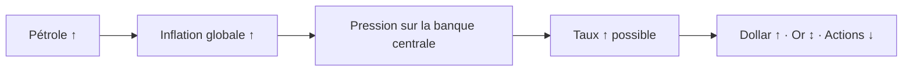

# Partie 6 — Analyse fondamentale des matières premières

> **Objectif.** Maîtriser l'analyse fondamentale de l'or avec une méthode
> reproductible, puis comprendre le pétrole, le cuivre et le gaz naturel.

---

# SECTION A — L'OR (XAUUSD)

## 6.1 Pourquoi l'or est un actif à part

L'or ne verse **aucun revenu** : ni coupon, ni dividende, ni loyer. Il ne produit
rien. Sa valeur ne repose donc pas sur des flux futurs, mais sur trois fonctions :

| Fonction | Description |
|----------|-------------|
| **Réserve de valeur** | Il traverse les siècles, les régimes et les monnaies |
| **Actif refuge** | Recherché quand la confiance dans le système se fissure |
| **Couverture monétaire** | Protection contre la dévalorisation des monnaies |

Cette absence de rendement est **la clé de toute son analyse**. Détenir de l'or,
c'est renoncer au rendement que vous auriez obtenu ailleurs. Ce renoncement est
le **coût d'opportunité**, et il est mesuré par… les taux réels.

---

## 6.2 Les six moteurs de l'or

### Moteur 1 — Les taux réels (le plus important, de loin)

$$\text{Taux réel} \approx \text{Taux nominal} - \text{Inflation anticipée}$$

| Taux réels | Coût d'opportunité de détenir de l'or | Effet historique |
|------------|--------------------------------------|------------------|
| **En hausse** | Augmente : les obligations rapportent réellement | **Défavorable** |
| **En baisse** | Diminue | **Favorable** |
| **Négatifs** | Nul : détenir des obligations fait *perdre* du pouvoir d'achat | **Très favorable** |

> **La règle qui corrige l'erreur la plus répandue :**
>
> ❌ « L'inflation monte, donc l'or monte. »
> ✅ « Les **taux réels** baissent, donc l'or est soutenu. »
>
> Si l'inflation monte de 1 point mais que les taux nominaux montent de 2 points,
> le taux réel **augmente** — et l'or souffre. C'est précisément ce qui s'est
> produit en 2022, avec une inflation record et un or en baisse.

**Où le mesurer :** le rendement des TIPS à 10 ans (série FRED `DFII10`) *est*
directement le taux réel à 10 ans. Ne le calculez pas : lisez-le.

### Moteur 2 — Le dollar

L'or est coté en dollars. Un dollar fort le rend plus cher pour les acheteurs
non américains → demande freinée → pression baissière.

Relation **inverse en moyenne**, mais pas absolue (voir Partie 5, §5.4).

### Moteur 3 — Le risque géopolitique

En cas de guerre, de sanctions ou de crise majeure, l'or bénéficie de flux
refuges. Caractéristiques de ces mouvements :

- **rapides** (quelques heures à quelques jours) ;
- souvent **partiellement effacés** si la crise ne s'aggrave pas ;
- d'autant plus durables que le choc affecte l'**énergie** ou le **système
  financier**.

> ⚠️ Piège classique : acheter l'or sur un titre de presse alarmiste, une fois le
> mouvement déjà réalisé. La prime de risque géopolitique s'intègre en quelques
> heures, puis s'érode.

### Moteur 4 — L'inflation anticipée

Elle agit **via** les taux réels (elle en est la composante soustraite). Une
hausse des anticipations d'inflation **non accompagnée** d'une hausse des taux
nominaux est très favorable à l'or : le taux réel baisse.

### Moteur 5 — Les banques centrales acheteuses

Les banques centrales de nombreux pays achètent de l'or pour diversifier leurs
réserves et réduire leur dépendance au dollar. C'est une demande **structurelle,
peu sensible au prix** : elle constitue un soutien de fond, mais n'explique pas
les mouvements de court terme.

### Moteur 6 — Le positionnement (COT)

Le rapport COT de la CFTC indique le positionnement net des spéculateurs. Un
positionnement net acheteur **extrême** signale une fragilité technique : le
marché devient vulnérable à un débouclage rapide en cas de nouvelle contraire.

C'est un indicateur de **risque**, pas de direction.

### Tableau de synthèse des moteurs

| Moteur | Or monte quand… | Poids relatif |
|--------|-----------------|:-------------:|
| **Taux réels** | Ils baissent | ⭐⭐⭐⭐⭐ |
| **Dollar** | Il s'affaiblit | ⭐⭐⭐⭐ |
| **Risque géopolitique** | Il s'intensifie | ⭐⭐⭐ (souvent temporaire) |
| **Inflation anticipée** | Elle monte sans hausse des taux nominaux | ⭐⭐⭐ |
| **Achats de banques centrales** | Ils s'intensifient | ⭐⭐ (structurel) |
| **Positionnement** | Il est extrême dans le sens inverse | ⭐⭐ (contrarien) |

---

## 6.3 Méthode complète d'analyse fondamentale de l'or

Voici une procédure en **7 étapes**, à exécuter dans l'ordre. Chaque étape
produit une note ; la somme donne un biais chiffré.

### Étape 1 — Taux réels (poids : 35 %)

**Question :** le rendement TIPS 10 ans (`DFII10`) monte-t-il ou baisse-t-il sur
les 5 à 20 derniers jours ?

| Constat | Note |
|---------|:----:|
| Baisse marquée (> 10 pb) | **+3** |
| Baisse légère | +1 |
| Stable | 0 |
| Hausse légère | −1 |
| Hausse marquée (> 10 pb) | **−3** |

*Bonus de niveau :* si le taux réel est **inférieur à 0,5 %**, ajoutez +1 ; s'il
est **supérieur à 2,2 %**, retranchez 1.

### Étape 2 — Dollar (poids : 20 %)

| DXY sur la période | Note |
|--------------------|:----:|
| Baisse > 1 % | **+2** |
| Baisse légère | +1 |
| Stable | 0 |
| Hausse légère | −1 |
| Hausse > 1 % | **−2** |

### Étape 3 — Politique monétaire (poids : 15 %)

| Orientation de la Fed | Note |
|-----------------------|:----:|
| Nettement *dovish* / pivot engagé | **+2** |
| Légèrement *dovish* | +1 |
| Neutre / *data dependent* | 0 |
| Légèrement *hawkish* | −1 |
| Nettement *hawkish* | **−2** |

### Étape 4 — Risque géopolitique (poids : 15 %)

| Niveau de tension | Note |
|-------------------|:----:|
| Escalade majeure, touchant énergie ou finance | **+3** |
| Tensions élevées | +2 |
| Tensions modérées | +1 |
| Calme | 0 |
| Désescalade nette | −1 |

### Étape 5 — Inflation anticipée (poids : 10 %)

| Point mort d'inflation 10 ans (`T10YIE`) | Note |
|------------------------------------------|:----:|
| En hausse, taux nominaux stables | **+2** |
| En hausse avec les taux nominaux | 0 (effet neutralisé) |
| En baisse | −1 |

### Étape 6 — Positionnement (poids : 5 %)

| COT spéculateurs | Note |
|------------------|:----:|
| Net vendeur extrême | +1 (potentiel de rachat) |
| Neutre | 0 |
| Net acheteur extrême | −1 (fragilité) |

### Étape 7 — Synthèse

Additionnez les notes pondérées et situez le total :

| Score total | Biais macro sur l'or |
|-------------|----------------------|
| **> +4** | Contexte **favorable** |
| +1 à +4 | Contexte légèrement favorable |
| −1 à +1 | **Neutre** — le contexte ne tranche pas |
| −4 à −1 | Contexte légèrement défavorable |
| **< −4** | Contexte **défavorable** |

> **Rappel de discipline.** Ce score est un **contexte**, pas un signal d'entrée.
> Il vous dit dans quel sens le vent souffle. Le point d'entrée relève de la
> Partie 11 (SMC) et de la Partie 12 (méthode intégrée).

### Fiche d'analyse à remplir

| Étape | Donnée observée | Note | Commentaire |
|-------|-----------------|:----:|-------------|
| 1. Taux réels (`DFII10`) | | | |
| 2. Dollar (DXY) | | | |
| 3. Politique monétaire | | | |
| 4. Géopolitique | | | |
| 5. Inflation anticipée | | | |
| 6. Positionnement (COT) | | | |
| **TOTAL** | | | **Biais :** |

---

## 6.4 Étude de cas : deux contextes opposés sur l'or

*Exemples stylisés, construits pour l'exercice.*

### Contexte A — Défavorable

| Étape | Observation | Note |
|-------|-------------|:----:|
| Taux réels | `DFII10` +15 pb en deux semaines, niveau 2,3 % | −3 −1 = **−4** |
| Dollar | DXY +1,4 % | **−2** |
| Politique monétaire | Discours *hawkish*, « higher for longer » | **−2** |
| Géopolitique | Calme relatif | **0** |
| Inflation anticipée | Breakeven stable | **0** |
| Positionnement | Net long élevé | **−1** |
| **TOTAL** | | **−9** |

**Lecture :** contexte nettement défavorable. Un trader Macro-SMC ne cherchera
pas d'achat ici : il attendra plutôt des configurations vendeuses, et traitera
tout signal acheteur technique avec une prudence accrue (taille réduite,
objectifs raccourcis).

### Contexte B — Favorable

| Étape | Observation | Note |
|-------|-------------|:----:|
| Taux réels | `DFII10` −18 pb, niveau 0,4 % | +3 +1 = **+4** |
| Dollar | DXY −1,2 % | **+2** |
| Politique monétaire | Pivot engagé, baisses anticipées | **+2** |
| Géopolitique | Tensions élevées sur un corridor énergétique | **+2** |
| Inflation anticipée | Breakeven en hausse, nominaux stables | **+2** |
| Positionnement | Neutre | **0** |
| **TOTAL** | | **+12** |

**Lecture :** contexte fortement favorable. Les configurations acheteuses
techniques bénéficient d'un vent porteur ; les signaux vendeurs méritent une
méfiance particulière.

---

# SECTION B — LE PÉTROLE

## 6.5 Ce qui fait le prix du pétrole

Le pétrole est un marché d'**offre et de demande physiques**, contrairement à
l'or qui est surtout un marché financier.

### Les déterminants de l'offre

| Facteur | Effet sur le prix |
|---------|-------------------|
| **Décisions de l'OPEP+** (quotas de production) | Réduction → prix ↑ ; augmentation → prix ↓ |
| **Production américaine** (schiste) | Très réactive au prix : elle plafonne les hausses |
| **Capacités de production disponibles** | Faibles réserves de capacité → marché nerveux |
| **Perturbations géopolitiques** | Menace sur un détroit ou un producteur → prime de risque |
| **Sanctions** | Retrait d'un producteur du marché → prix ↑ |

### Les déterminants de la demande

| Facteur | Effet |
|---------|-------|
| **Croissance mondiale** (surtout Chine) | Croissance ↑ → demande ↑ → prix ↑ |
| **PMI manufacturiers** | Indicateur avancé de demande industrielle |
| **Saisonnalité** | Conduite estivale, chauffage hivernal |
| **Transition énergétique** | Pression structurelle de long terme |

### Les stocks : l'arbitre

Les stocks hebdomadaires américains (EIA, publiés le mercredi) sont le juge de
paix du court terme :

| Variation des stocks | Lecture | Effet sur le prix |
|----------------------|---------|-------------------|
| Forte baisse | Demande > offre | ↑ |
| Stable | Marché équilibré | Neutre |
| Forte hausse | Offre > demande | ↓ |

### Pourquoi le pétrole compte même si vous ne le tradez pas

Le pétrole est un **intrant de l'inflation**. Une flambée du brut :

1. augmente les coûts de transport et de production ;
2. alimente l'inflation globale (*headline*) ;
3. contraint les banques centrales, surtout si des effets de second tour
   apparaissent sur les salaires ;
4. donc influence les taux → donc le dollar → donc l'or.



---

# SECTION C — LES AUTRES MATIÈRES PREMIÈRES

## 6.6 Le cuivre : le « docteur » de l'économie

Le cuivre est surnommé *Doctor Copper* car il diagnostique la santé de l'économie
mondiale. Il est présent partout : construction, électronique, réseaux
électriques, véhicules électriques.

| Le cuivre monte quand… | Le cuivre baisse quand… |
|------------------------|-------------------------|
| La croissance industrielle mondiale accélère | L'activité industrielle ralentit |
| La Chine relance son économie (premier consommateur) | La Chine ralentit |
| L'investissement en infrastructures s'intensifie | Le dollar se renforce |
| L'offre est perturbée (grèves minières, tensions) | Les stocks s'accumulent |

**Usage pour le trader macro :** un cuivre en hausse durable est un signal
d'expansion mondiale ; un cuivre qui décroche alors que les actions montent est
un **signal de divergence** à prendre au sérieux.

**Ratio utile :** le rapport **cuivre / or** est un indicateur d'appétit pour le
risque. Il monte quand la croissance est privilégiée (cuivre), il baisse quand la
peur domine (or).

## 6.7 Le gaz naturel

Marché **très régional** (contrairement au pétrole, mondialisé) et
**extrêmement volatil**.

| Facteur | Effet |
|---------|-------|
| Météo (vagues de froid ou de chaleur) | Impact immédiat et brutal |
| Stocks de stockage | Détermine la marge de sécurité saisonnière |
| Capacités de GNL et infrastructures | Contraintes physiques d'acheminement |
| Géopolitique (approvisionnement européen) | Choc de prix potentiel majeur |

**Point d'attention :** le gaz naturel connaît des amplitudes qui peuvent
dépasser de loin celles des autres marchés. Il exige une gestion du risque
particulièrement stricte et n'est pas un marché recommandé pour débuter.

---

## 📌 Résumé

L'or ne verse aucun revenu : sa valeur dépend donc du **coût d'opportunité**,
mesuré par les taux réels — son premier moteur. Viennent ensuite le dollar, le
risque géopolitique, l'inflation anticipée, les achats de banques centrales et le
positionnement. Une méthode en 7 étapes permet d'en tirer un biais chiffré. Le
pétrole obéit à une logique d'offre et de demande physiques (OPEP+, stocks,
croissance) et influence l'inflation, donc indirectement tous les marchés. Le
cuivre diagnostique la croissance mondiale ; le gaz naturel est un marché
régional et très volatil.

## 🎯 Points essentiels à retenir

1. **Les taux réels sont le premier moteur de l'or.** Tout le reste vient après.
2. **« Inflation ↑ donc or ↑ » est faux.** Calculez le taux réel.
3. Le rendement **TIPS 10 ans (`DFII10`) est directement le taux réel** : lisez-le.
4. **Le dollar joue en sens inverse de l'or**, en moyenne mais pas toujours.
5. **La prime géopolitique s'intègre vite et s'érode** si la crise ne s'aggrave pas.
6. **Le pétrole est un intrant de l'inflation** : il compte même si vous ne le
   tradez pas.
7. **Le cuivre est un thermomètre de croissance mondiale.**
8. **Le score macro est un contexte, jamais un signal d'entrée.**

## ⚠️ Erreurs fréquentes

| Erreur | Correction |
|--------|-----------|
| Acheter l'or dès que l'inflation monte | Vérifier la direction des **taux réels** |
| Acheter l'or sur un titre de guerre déjà publié | Le mouvement est souvent déjà fait ; la prime s'érode |
| Ignorer le dollar dans l'analyse de l'or | C'est le deuxième moteur |
| Traiter le COT comme un signal directionnel | C'est un indicateur de **fragilité**, contrarien |
| Trader le pétrole sans regarder les stocks | Les stocks EIA arbitrent le court terme |
| Confondre marché du gaz et marché du pétrole | Le gaz est régional et bien plus volatil |
| Utiliser le score macro comme déclencheur d'entrée | Il donne le **sens du vent**, pas le moment |

## 🗂 Fiche de révision — Partie 6

**Or — hiérarchie des moteurs :**
```
1. TAUX RÉELS  (DFII10)   ⭐⭐⭐⭐⭐   baissent → or soutenu
2. DOLLAR      (DXY)      ⭐⭐⭐⭐    baisse   → or soutenu
3. GÉOPOLITIQUE           ⭐⭐⭐      tension  → or soutenu (temporaire)
4. INFLATION ANTICIPÉE    ⭐⭐⭐      via les taux réels
5. BANQUES CENTRALES      ⭐⭐       soutien structurel
6. POSITIONNEMENT (COT)   ⭐⭐       extrême = fragilité
```

**Formule centrale :** `Taux réel ≈ Nominal − Inflation anticipée`

**Pétrole :** OPEP+ · production américaine · stocks EIA (mercredi) · croissance
chinoise · géopolitique. → influence l'inflation → influence les taux.

**Cuivre :** thermomètre de croissance mondiale. Ratio cuivre/or = appétit pour
le risque.

**Séries à suivre :** `DFII10` (taux réel) · `T10YIE` (breakeven) · `DTWEXBGS`
(dollar élargi).

## ✍️ Questions d'entraînement

1. L'inflation passe de 3 % à 5 %, et le rendement nominal à 10 ans de 4 % à 5 %.
   Que devient le taux réel, et quel biais pour l'or ?
2. Pourquoi l'or a-t-il baissé en 2022 alors que l'inflation atteignait des
   sommets ?
3. Un conflit éclate. L'or bondit de 3 % en deux heures. Que faites-vous ?
4. Le DXY baisse de 2 % et le rendement TIPS 10 ans recule de 20 points de base.
   Quel score approximatif obtenez-vous aux étapes 1 et 2 de la méthode ?
5. Les stocks de brut américains reculent fortement trois semaines de suite. Quel
   effet probable sur le pétrole, puis sur l'inflation ?
6. Le cuivre chute de 10 % alors que les indices actions montent. Comment
   interprétez-vous cette divergence ?

### Corrigé

1. Taux réel : de (4 − 3) = 1 % à (5 − 5) = **0 %**. Le taux réel **baisse** :
   contexte **favorable à l'or**, malgré la hausse des taux nominaux.
2. Parce que les taux nominaux montaient **plus vite** que les anticipations
   d'inflation : les taux réels sont passés de négatifs à nettement positifs. Le
   coût d'opportunité de détenir de l'or a fortement augmenté. Le dollar très
   fort a amplifié le mouvement.
3. **Rien dans l'immédiat.** La prime de risque est déjà intégrée ; entrer après
   un mouvement vertical expose à un retour en cas de désescalade. La démarche
   professionnelle consiste à attendre que le marché digère, puis à chercher une
   configuration technique valide **si** le contexte macro global reste favorable.
4. Étape 1 : baisse marquée du taux réel → **+3** (plus +1 si le niveau est bas).
   Étape 2 : DXY en baisse de plus de 1 % → **+2**. Sous-total : **+5 à +6**,
   contexte clairement favorable sur ces deux dimensions.
5. Pétrole : pression **haussière** (demande supérieure à l'offre). Ensuite :
   contribution **haussière à l'inflation globale**, ce qui complique la tâche de
   la banque centrale et peut soutenir les taux — donc le dollar.
6. C'est un **signal de divergence** : le cuivre reflète l'économie réelle
   (industrie, construction), les actions peuvent monter sur des anticipations de
   liquidité ou quelques valeurs dominantes. Historiquement, ce type de divergence
   invite à la prudence sur la solidité du cycle sous-jacent.

---

➡️ **Partie 7 — Géopolitique et marchés** : évaluer l'impact probable d'un choc.
