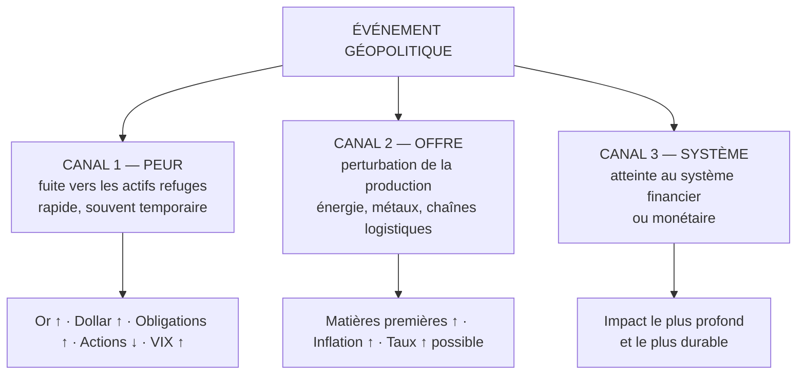

# Partie 7 — Géopolitique et marchés

> **Objectif.** Savoir évaluer méthodiquement l'impact probable d'un choc
> géopolitique, sans céder à l'émotion médiatique.

---

## 7.1 Comment les marchés traitent réellement un choc

Un choc géopolitique n'agit pas directement sur les prix. Il agit par **trois
canaux** — et c'est en identifiant le canal concerné que vous évaluerez l'ampleur
et la durée du mouvement.



### La règle de durée

| Canal activé | Ampleur | Durée typique | Exemple |
|--------------|---------|---------------|---------|
| **Peur seule** | Modérée | Heures à jours | Tension diplomatique, attentat isolé |
| **Peur + offre** | Forte | Semaines à mois | Conflit affectant un producteur d'énergie |
| **Peur + offre + système** | Très forte | Mois à années | Crise financière systémique |

> **Le réflexe professionnel :** face à un titre de presse, ne demandez pas
> « est-ce grave ? » (question morale) mais **« quel canal cela active-t-il, et
> pour combien de temps ? »** (question de marché).

---

## 7.2 Les grandes catégories de chocs

### 7.2.1 Les guerres et conflits armés

**Effet immédiat :** activation du canal peur. Or, dollar, obligations d'État
montent ; actions et devises émergentes baissent ; le VIX bondit.

**Ce qui détermine la durée :**

| Question | Si oui → impact durable |
|----------|------------------------|
| Un producteur majeur d'énergie ou de matières premières est-il impliqué ? | ✅ |
| Une route commerciale critique est-elle menacée (détroit, canal) ? | ✅ |
| Des puissances majeures risquent-elles d'être entraînées ? | ✅ |
| Le système financier est-il touché (sanctions, exclusion de systèmes de paiement) ? | ✅ |

Si la réponse est « non » à toutes ces questions, le mouvement est probablement
un **choc de peur** : violent mais réversible.

**Phénomène à connaître — l'effacement de la prime.** Historiquement, les marchés
« s'habituent » aux conflits qui s'installent sans s'étendre. La prime de risque
s'érode progressivement : le premier jour produit le mouvement principal, les
semaines suivantes le corrigent partiellement.

### 7.2.2 Les sanctions économiques

Elles agissent sur l'**offre** : elles retirent un producteur du marché mondial.

| Type de sanction | Effet marché |
|------------------|--------------|
| Sur l'énergie | Prix de l'énergie ↑ → inflation ↑ → pression sur les banques centrales |
| Sur les métaux | Prix des métaux concernés ↑ ; réorganisation des chaînes |
| Financières (accès aux paiements, gel d'avoirs) | Impact systémique potentiel ; incitation à la diversification hors dollar |
| Technologiques | Effet sectoriel de long terme (semi-conducteurs, équipements) |

**Effet indirect majeur :** les sanctions financières poussent certains États à
diversifier leurs réserves — ce qui alimente la demande structurelle d'or
(Partie 6, moteur 5).

### 7.2.3 Les élections et changements politiques

Les marchés n'ont pas de préférence idéologique. Ils réagissent à **trois
choses** :

1. **L'incertitude** — c'est le principal facteur. La volatilité monte *avant*
   le scrutin et retombe souvent après, quel que soit le résultat.
2. **La politique budgétaire attendue** — des dépenses accrues signifient plus de
   dette, donc une pression haussière sur les rendements obligataires.
3. **L'indépendance de la banque centrale** — toute menace perçue sur cette
   indépendance peut affaiblir durablement la devise.

> **Règle utile :** un résultat clair et rapide, même défavorable sur le papier,
> est souvent mieux accueilli qu'un résultat serré et contesté. Les marchés
> détestent l'incertitude plus que la mauvaise nouvelle.

### 7.2.4 Les crises bancaires et financières

Ce sont les chocs les plus dangereux, car ils touchent le **cœur du système**
(canal 3).

Rappel de la Partie 1 : les banques créent la monnaie par le crédit. Une crise de
confiance bancaire :

1. gèle le crédit interbancaire ;
2. contracte l'offre de crédit à l'économie ;
3. produit un **resserrement brutal des conditions financières**, équivalent à
   plusieurs hausses de taux — mais instantané et incontrôlé.

**Séquence typique observée :**

| Étape | Marché |
|-------|--------|
| Révélation du problème | Actions bancaires ↓↓ · VIX ↑↑ |
| Contagion perçue | Fuite vers les obligations d'État → rendements ↓↓ |
| Anticipation de réaction des autorités | Anticipations de baisses de taux → **or ↑↑** |
| Intervention (garanties, liquidité) | Stabilisation partielle, volatilité résiduelle |

C'est précisément la séquence de **mars 2023** lors des tensions sur les banques
régionales américaines : le rendement à 2 ans s'est effondré en quelques jours,
et l'or a fortement progressé.

### 7.2.5 Les tensions commerciales

Droits de douane, restrictions à l'export, guerres commerciales.

| Effet | Mécanisme |
|-------|-----------|
| Inflation ↑ | Les droits de douane renchérissent les biens importés |
| Croissance ↓ | Les échanges se contractent |
| Devises émergentes ↓ | Économies exportatrices pénalisées |
| Chaînes d'approvisionnement | Réorganisation coûteuse, effets sectoriels durables |

Configuration délicate pour une banque centrale : **inflation en hausse et
croissance en baisse** — c'est le schéma de la stagflation, où aucun outil
monétaire n'est pleinement satisfaisant.

### 7.2.6 Les catastrophes naturelles et sanitaires

**Impact généralement local et temporaire**, sauf lorsqu'elles touchent :

- une **zone de production critique** (raffineries, mines, ports) ;
- une **chaîne d'approvisionnement mondiale** ;
- ou lorsqu'elles prennent une **ampleur systémique** (pandémie).

La crise de 2020 appartient à cette dernière catégorie : elle a activé les trois
canaux simultanément.

---

## 7.3 Méthode d'évaluation d'un choc en 5 questions

À exécuter dans l'ordre, en moins de cinq minutes.

**Question 1 — Quel canal est activé ?**
Peur seule / peur + offre / peur + offre + système.
→ Détermine l'**ampleur** et la **durée**.

**Question 2 — Quelles ressources ou routes sont concernées ?**
Énergie ? Métaux ? Semi-conducteurs ? Détroit maritime ?
→ Détermine les **marchés directement touchés**.

**Question 3 — Le marché a-t-il déjà réagi ?**
Regardez l'or, le VIX, les obligations d'État, le pétrole.
→ Si le mouvement est déjà fait, **la prime est intégrée**.

**Question 4 — L'événement est-il susceptible de s'aggraver ou de se résorber ?**
→ Détermine s'il faut anticiper une **poursuite** ou un **effacement** de la prime.

**Question 5 — Cela change-t-il la trajectoire des banques centrales ?**
C'est la question la plus importante à moyen terme. Un choc qui modifie la
politique monétaire a des effets bien plus durables qu'un choc de peur.

### Grille de réponse type

| Question | Réponse | Implication |
|----------|---------|-------------|
| 1. Canal | | |
| 2. Ressources / routes | | |
| 3. Déjà intégré ? | | |
| 4. Aggravation probable ? | | |
| 5. Effet sur les banques centrales ? | | |
| **Conclusion** | | **Biais et durée :** |

---

## 7.4 Tableau d'impact par type de choc

| Type de choc | Or | Dollar | Pétrole | Actions | Obligations | Durée typique |
|--------------|:--:|:------:|:-------:|:-------:|:-----------:|---------------|
| **Conflit armé (hors énergie)** | ↑ | ↑ | ↕ | ↓ | ↑ | Jours |
| **Conflit touchant l'énergie** | ↑↑ | ↑ | ↑↑ | ↓↓ | ↕ | Semaines / mois |
| **Sanctions énergétiques** | ↑ | ↑ | ↑↑ | ↓ | ↓ (inflation) | Mois |
| **Élection incertaine** | ↑ léger | ↕ | → | ↓ avant, ↑ après | ↕ | Jours |
| **Crise bancaire** | ↑↑ | ↑ puis ↕ | ↓ | ↓↓ | ↑↑ | Semaines / mois |
| **Guerre commerciale** | ↑ | ↑ | ↓ | ↓ | ↕ | Mois / années |
| **Catastrophe locale** | → | → | ↕ selon zone | ↓ sectoriel | → | Jours |

*Légende : ↑ hausse · ↓ baisse · ↕ variable · → peu d'effet.*

> ⚠️ **Ligne à surveiller : la crise bancaire.** Le dollar monte d'abord (fuite
> vers la liquidité) puis peut se retourner si le marché anticipe que la banque
> centrale devra assouplir plus vite que ses homologues. C'est une des rares
> configurations où l'or et les obligations montent ensemble et fortement.

---

## 7.5 Étude de cas : le choc énergétique de 2022

*Données arrondies, à titre illustratif.*

**L'événement.** L'invasion de l'Ukraine en février 2022 déclenche un choc
géopolitique majeur, suivi de sanctions occidentales de grande ampleur.

**Analyse par la méthode des 5 questions :**

| Question | Réponse |
|----------|---------|
| 1. Canal | **Peur + offre**, avec une composante systémique via les sanctions financières |
| 2. Ressources | **Énergie** (gaz, pétrole), **céréales**, certains **métaux** |
| 3. Déjà intégré ? | Réaction immédiate et violente ; mais l'ampleur du choc énergétique européen a été **sous-estimée initialement** |
| 4. Aggravation ? | Oui — sanctions successives, réorganisation des flux énergétiques |
| 5. Banques centrales ? | **Oui, profondément** : le choc inflationniste a accéléré et durci le cycle de resserrement |

**Ce qui s'est produit :**

| Actif | Réaction | Explication |
|-------|----------|-------------|
| Or | Bond initial fort, puis reflux | Prime de peur intégrée rapidement, puis écrasée par la hausse des taux réels |
| Pétrole et gaz | Hausse violente et durable | Canal offre pleinement activé |
| Euro | Baisse durable | Europe importatrice nette d'énergie, plus exposée que les États-Unis |
| Actions européennes | Sous-performance | Choc énergétique + proximité géographique |
| Obligations | Sous pression | L'inflation a dominé l'effet refuge |

**Les trois leçons majeures :**

1. **Le canal détermine tout.** Un choc de peur seul aurait produit une hausse de
   l'or de quelques jours. Le canal offre a produit une inflation durable, qui a
   ensuite retourné l'or par la voie des taux réels.
2. **L'or n'est pas un pari géopolitique automatique.** Il a monté sur la peur,
   puis baissé quand les banques centrales ont réagi. Le moteur « taux réels »
   l'a emporté sur le moteur « géopolitique ».
3. **La géographie compte.** Même choc, effets très différents entre une économie
   importatrice d'énergie (Europe) et une économie productrice (États-Unis).

---

## 📌 Résumé

Un choc géopolitique agit par trois canaux : la peur (rapide, souvent
temporaire), l'offre (durable, inflationniste) et le système financier (le plus
profond). Identifier le canal activé permet d'estimer ampleur et durée. Les
grandes catégories — guerres, sanctions, élections, crises bancaires, tensions
commerciales, catastrophes — ont chacune une signature de marché. Une méthode en
5 questions permet d'évaluer un choc en quelques minutes, la question décisive
étant : **cela modifie-t-il la trajectoire des banques centrales ?**

## 🎯 Points essentiels à retenir

1. **Identifiez le canal** (peur / offre / système) avant toute conclusion.
2. **La prime de peur s'intègre en heures et s'érode ensuite** si rien ne s'aggrave.
3. **Un choc qui touche l'énergie devient un choc inflationniste**, donc monétaire.
4. **Les crises bancaires sont les plus dangereuses** : elles contractent le crédit
   brutalement.
5. **Les marchés détestent l'incertitude plus que la mauvaise nouvelle.**
6. **L'or n'est pas un pari géopolitique automatique** : les taux réels peuvent
   l'emporter.
7. **La question finale est toujours monétaire** : cela change-t-il la trajectoire
   des taux ?

## ⚠️ Erreurs fréquentes

| Erreur | Correction |
|--------|-----------|
| Acheter l'or dès l'annonce d'un conflit | Le mouvement est souvent déjà fait ; vérifier si la prime est intégrée |
| Croire qu'un conflit fait durablement monter l'or | Seulement si l'offre ou le système sont touchés, et si les taux réels ne remontent pas |
| Réagir émotionnellement aux titres de presse | Appliquer la grille des 5 questions, froidement |
| Ignorer la géographie de l'impact | Le même choc frappe différemment importateurs et exportateurs |
| Traiter une élection comme un événement directionnel | C'est surtout un événement de **volatilité** |
| Sous-estimer une crise bancaire | Elle équivaut à un resserrement monétaire brutal |

## 🗂 Fiche de révision — Partie 7

**Les 3 canaux :**
```
PEUR     → refuges (or, USD, obligations) · rapide · souvent réversible
OFFRE    → matières premières ↑ · inflation ↑ · durable
SYSTÈME  → crédit ↓ · le plus profond et le plus long
```

**Les 5 questions :** quel canal ? quelles ressources ? déjà intégré ?
aggravation probable ? effet sur les banques centrales ?

**Signature d'une crise bancaire :** actions ↓↓ · VIX ↑↑ · obligations ↑↑ ·
2 ans ↓↓ · **or ↑↑**.

**Règle d'or :** l'impact durable passe **toujours** par la politique monétaire.

## ✍️ Questions d'entraînement

1. Un attentat frappe une capitale européenne. Aucun producteur d'énergie n'est
   concerné. Quel canal est activé, et quelle durée d'impact anticipez-vous ?
2. Des sanctions visent les exportations de pétrole d'un grand producteur. Quels
   marchés sont touchés, et par quelle chaîne aboutit-on à un effet sur les taux ?
3. Pourquoi une crise bancaire est-elle plus dangereuse qu'un conflit régional ?
4. L'or bondit de 2 % sur une nouvelle géopolitique, puis efface son mouvement en
   trois jours. Comment expliquez-vous ce comportement ?
5. Une élection très serrée approche. Que se passe-t-il typiquement sur la
   volatilité avant et après le scrutin ?
6. Un même choc énergétique frappe l'Europe et les États-Unis. Pourquoi l'impact
   diffère-t-il ?

### Corrigé

1. Canal **peur seul**. Impact de quelques heures à quelques jours : hausse de
   l'or et du dollar, baisse des actions, puis normalisation rapide en l'absence
   d'aggravation.
2. Marchés touchés : pétrole ↑ (canal offre), devises des importateurs sous
   pression. Chaîne : pétrole ↑ → inflation globale ↑ → contrainte accrue sur la
   banque centrale → anticipations de taux ↑ → dollar ↑ et pression sur l'or via
   les taux réels.
3. Parce qu'elle touche le **mécanisme de création monétaire**. Le gel du crédit
   contracte l'économie de façon immédiate et généralisée, alors qu'un conflit
   régional n'affecte que certains secteurs ou zones.
4. C'est **l'effacement de la prime de peur**. Le mouvement initial reflète
   l'incertitude ; si la situation ne s'aggrave pas et qu'aucun canal offre ou
   système n'est activé, la prime se dissipe et les moteurs de fond (taux réels,
   dollar) reprennent la main.
5. La volatilité **monte avant** (incertitude) et **retombe après** la
   clarification du résultat — souvent quel que soit le vainqueur. Un résultat
   contesté prolonge en revanche la période de volatilité.
6. Parce que l'Europe est **importatrice nette** d'énergie tandis que les
   États-Unis sont largement **producteurs**. Le choc représente une perte de
   pouvoir d'achat et de compétitivité pour l'une, et un effet plus neutre voire
   partiellement favorable pour l'autre. D'où la divergence de trajectoire des
   devises et des marchés actions.

---

➡️ **Partie 8 — Le calendrier économique** : anticiper et exploiter les
publications.
