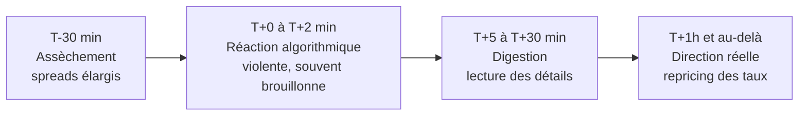

# Partie 8 — Le calendrier économique

> **Objectif.** Transformer le calendrier économique en outil de travail :
> anticiper les rendez-vous, lire une publication en temps réel, et comprendre
> pourquoi le marché réagit parfois « à l'envers ».

---

## 8.1 Le vocabulaire du calendrier

| Terme | Définition | Rôle |
|-------|-----------|------|
| **Précédent** | Valeur de la période antérieure | Point de comparaison |
| **Consensus** | Moyenne des prévisions d'économistes | **Ce qui est déjà dans les prix** |
| **Réel** | Le chiffre publié | Ce qui déclenche le mouvement |
| **Révision** | Correction d'une donnée antérieure | Souvent ignorée à tort |
| **Importance** | Niveau d'impact attendu (1 à 3 étoiles) | Guide de priorisation |

### La formule fondamentale

$$\text{Surprise} = \text{Réel} - \text{Consensus}$$

> Le marché a **déjà** intégré le consensus. Si le chiffre sort exactement comme
> prévu, il ne se passe théoriquement rien : l'information n'était pas nouvelle.
> C'est l'**écart** qui est l'information.

### La notion d'*indice de surprise économique*

Les professionnels agrègent les surprises sur l'ensemble des publications d'un
pays. Un indice de surprise positif signifie que les données ressortent
globalement meilleures qu'attendu — ce qui tend à soutenir la devise concernée.

Un usage subtil mais puissant : quand cet indice atteint des extrêmes, il a
tendance à **revenir vers zéro**, car les économistes finissent par ajuster leurs
prévisions. Des surprises positives répétées deviennent alors de plus en plus
difficiles à produire.

---

## 8.2 Les rendez-vous majeurs

### Hiérarchie d'impact

```
NIVEAU 1 (impact maximal)
  ├── FOMC (décision + conférence de presse)
  ├── CPI américain
  └── NFP (rapport emploi américain)

NIVEAU 2 (impact fort)
  ├── PCE (mesure d'inflation privilégiée par la Fed)
  ├── Décision et conférence de la BCE
  ├── PIB (première estimation)
  └── ISM manufacturier et services

NIVEAU 3 (impact modéré)
  ├── Ventes au détail
  ├── PPI
  ├── Confiance des consommateurs
  └── Inscriptions hebdomadaires au chômage

NIVEAU 4 (contexte)
  ├── Production industrielle
  ├── Stocks de pétrole (EIA)
  └── Indices régionaux
```

### Fiches de rendez-vous

#### FOMC — Réunion de la Fed

| | |
|---|---|
| **Fréquence** | 8 fois par an |
| **Horaire (États-Unis)** | Décision à 14h00 ET, conférence à 14h30 ET |
| **Ce qui compte** | 1. Le ton de la conférence · 2. Le *dot plot* (réunions trimestrielles) · 3. Les modifications du communiqué · 4. La décision elle-même |
| **Piège** | Le mouvement principal survient souvent **pendant la conférence**, pas à l'annonce. Deux mouvements opposés en 45 minutes sont fréquents |

#### CPI — Inflation américaine

| | |
|---|---|
| **Fréquence** | Mensuelle, vers le milieu du mois |
| **Horaire** | 8h30 ET |
| **Ce qui compte** | Le **core** (sous-jacent) plus que le global · le rythme **mensuel** · les services hors logement |
| **Piège** | Le *headline* peut surprendre à la baisse (grâce à l'énergie) alors que le *core* surprend à la hausse : dans ce cas, le marché suit généralement le **core** |

#### NFP — Rapport sur l'emploi américain

| | |
|---|---|
| **Fréquence** | Mensuelle, 1er vendredi |
| **Horaire** | 8h30 ET |
| **Ce qui compte** | Créations d'emplois · **salaire horaire moyen** · taux de chômage · **révisions des deux mois précédents** |
| **Piège** | Un chiffre principal fort accompagné de révisions négatives massives peut inverser la réaction attendue |

#### PIB

| | |
|---|---|
| **Fréquence** | Trimestrielle, en trois estimations |
| **Ce qui compte** | La **première estimation** (avancée) fait le mouvement · la composition (consommation vs stocks) |
| **Piège** | Une croissance gonflée par la constitution de stocks est de mauvaise qualité : elle se paiera au trimestre suivant |

#### PMI / ISM

| | |
|---|---|
| **Fréquence** | Mensuelle, en début de mois |
| **Ce qui compte** | Le seuil de **50** · la composante **prix payés** (signal d'inflation) · l'écart services / manufacturier |
| **Piège** | Le PMI manufacturier seul peut donner un signal de récession trompeur dans une économie de services |

---

## 8.3 Anatomie d'une réaction de marché

Une publication majeure produit typiquement une séquence en quatre temps.



### Phase 1 — Avant (T−30 min)

La liquidité s'assèche. Les *market makers* élargissent leurs fourchettes pour se
protéger. Le prix peut dériver sans signification particulière.

> **Conséquence pratique :** c'est la pire fenêtre pour entrer en position. Le
> risque de dérapage (*slippage*) est maximal et le mouvement est aléatoire.

### Phase 2 — L'impact (T+0 à T+2 min)

Les algorithmes réagissent en millisecondes au chiffre principal. Mouvement
brutal, souvent **exagéré**, parfois dans les deux sens successivement.

C'est ici que se produisent les **faux mouvements** qui piègent les traders
particuliers : une première impulsion suivie d'un retournement complet.

### Phase 3 — La digestion (T+5 à T+30 min)

Les humains lisent les détails : composantes, révisions, sous-jacent. C'est ici
que le mouvement se **corrige** si le détail contredit le chiffre principal.

### Phase 4 — La direction réelle (T+1h et au-delà)

Le marché a repricé la trajectoire des taux. La direction qui s'installe reflète
la **nouvelle réalité macro**, pas la réaction émotionnelle initiale.

> **La règle qui fait gagner du temps et de l'argent :**
> **Ne tradez pas la nouvelle. Tradez la conséquence de la nouvelle.**
>
> Les phases 1 et 2 relèvent du hasard pour un trader particulier. Les phases 3
> et 4 relèvent de l'analyse — c'est là que se situe votre avantage.

---

## 8.4 Pourquoi le marché réagit parfois « à l'envers »

Cinq explications couvrent la quasi-totalité des cas déroutants.

| Raison | Explication | Exemple |
|--------|-------------|---------|
| **1. C'était déjà dans les prix** | Le marché avait anticipé au-delà du consensus officiel | Tout le monde « savait » que le chiffre serait mauvais ; le mauvais chiffre ne surprend personne |
| **2. Le détail contredit le titre** | Le chiffre principal est bon mais les composantes sont mauvaises | NFP fort mais révisions très négatives |
| **3. Le régime a changé** | Bonne/mauvaise nouvelle change de camp | En régime inflation, une économie forte fait **baisser** les actions |
| **4. Le positionnement était extrême** | Trop de monde du même côté ; débouclage | Prise de bénéfices massive malgré une nouvelle favorable |
| **5. Un autre événement domine** | Une information plus importante éclipse la publication | Une crise bancaire le jour d'un PMI |

> **Le réflexe à acquérir.** Devant une réaction incompréhensible, ne concluez
> pas « le marché est manipulé ». Passez la liste des cinq raisons ci-dessus :
> l'une d'elles s'applique presque toujours.

---

## 8.5 Étude de cas 1 : un CPI plus faible qu'attendu

*Exemple stylisé.*

**Contexte.** La Fed a beaucoup resserré. Le marché espère un pivot.

| | Consensus | Réel |
|---|---|---|
| CPI global (YoY) | 3,4 % | 3,1 % |
| CPI sous-jacent (YoY) | 3,8 % | 3,6 % |

**Séquence observée :**

| Moment | Mouvement | Explication |
|--------|-----------|-------------|
| T+0 | Dollar ↓ brutalement, or ↑, indices ↑ | Réaction algorithmique à la surprise baissière |
| T+15 min | Mouvement confirmé | Le sous-jacent confirme le chiffre global : signal **cohérent** |
| T+2h | Tendance installée | Le marché a repricé une baisse de taux plus proche |
| Jours suivants | Poursuite | Le rendement à 2 ans baisse durablement, les taux réels se détendent |

**Ce qu'un trader Macro-SMC en tire :** le contexte macro devient **favorable à
l'or**. Il ne se précipite pas pour acheter à T+0 ; il attend un repli technique
et une configuration valide dans le sens du contexte (Parties 11-12).

## 8.6 Étude de cas 2 : un NFP contradictoire

*Exemple stylisé.*

| | Consensus | Réel |
|---|---|---|
| Créations d'emplois | 180 k | **265 k** |
| Salaire horaire (MoM) | 0,3 % | **0,1 %** |
| Révision des 2 mois précédents | — | **−90 k** |

**Analyse :**

- Le chiffre principal est **très fort** → réaction initiale : dollar ↑.
- Mais le **salaire horaire ralentit** → moins de pression inflationniste.
- Et les **révisions effacent 90 000 emplois** des mois précédents → la force
  apparente est en partie illusoire.

**Séquence typique :**

| Moment | Mouvement |
|--------|-----------|
| T+0 | Dollar ↑ fortement (algorithmes sur le chiffre principal) |
| T+10 min | Mouvement qui s'essouffle |
| T+30 min | **Retournement** — le marché privilégie les salaires et les révisions |
| T+2h | Dollar en baisse par rapport à son niveau d'avant publication |

**La leçon :** c'est le scénario qui piège le plus de traders particuliers. Ceux
qui achètent le dollar dans les deux premières minutes se retrouvent à
contre-sens trente minutes plus tard. **Attendre la phase 3 est un avantage, pas
une timidité.**

## 8.7 Étude de cas 3 : le FOMC en deux temps

*Exemple stylisé.*

**14h00 — La décision.** La Fed maintient ses taux, comme attendu. Réaction :
quasi nulle, l'information était intégrée.

**14h30 — La conférence de presse.** Le président déclare qu'il serait
« prématuré d'envisager des baisses de taux » et que la politique restera
restrictive « aussi longtemps que nécessaire ».

**Réaction :**

| Actif | Mouvement | Mécanisme |
|-------|-----------|-----------|
| Rendement 2 ans | ↑ nettement | Repricing : moins de baisses anticipées |
| Dollar | ↑ | Différentiel de taux plus favorable |
| Or | ↓ | Taux réels en hausse |
| Indices | ↓ | Valorisations comprimées |

**La leçon :** la décision ne valait rien, le **ton valait tout**. Un trader qui
avait fermé son écran après 14h05 a manqué l'intégralité du mouvement.

---

## 8.8 Comment travailler son calendrier : routine hebdomadaire

### Le dimanche soir (15 minutes)

1. Ouvrir le calendrier de la semaine.
2. **Surligner les événements de niveau 1 et 2.**
3. Noter jour et heure dans son agenda de trading.
4. Pour chaque événement majeur, écrire **à l'avance** :
   - le consensus ;
   - le scénario si le chiffre surprend à la hausse ;
   - le scénario si le chiffre surprend à la baisse.

> Ce dernier point est le plus important. Écrire ses scénarios **avant** évite de
> les inventer sous le coup de l'émotion.

### Fiche de préparation type

| Événement | Date / heure | Consensus | Si supérieur → | Si inférieur → | Ma position |
|-----------|--------------|-----------|----------------|----------------|-------------|
| CPI US | | | | | |
| FOMC | | | | | |
| NFP | | | | | |

### Chaque matin (5 minutes)

- Y a-t-il un événement de niveau 1 ou 2 aujourd'hui ? À quelle heure ?
- Si oui : **réduire l'exposition ou éviter d'ouvrir des positions** dans la
  fenêtre de 30 minutes qui précède.
- Noter le résultat après publication et sa lecture par le marché.

---

## 📌 Résumé

Le calendrier économique s'articule autour d'une formule : surprise = réel −
consensus. Les rendez-vous se hiérarchisent en quatre niveaux, dominés par le
FOMC, le CPI et le NFP. Toute publication majeure produit une séquence en quatre
phases : assèchement, réaction algorithmique, digestion, direction réelle — et
l'avantage du trader particulier se situe dans les phases 3 et 4. Lorsque le
marché semble réagir « à l'envers », cinq explications suffisent presque toujours :
information déjà intégrée, détail contredisant le titre, changement de régime,
positionnement extrême, ou événement concurrent.

## 🎯 Points essentiels à retenir

1. **Le marché cote la surprise, pas la donnée.**
2. **Ne tradez pas la nouvelle, tradez sa conséquence.**
3. **Le FOMC se joue en conférence de presse**, pas à l'annonce.
4. **Dans le NFP, les salaires et les révisions comptent souvent plus** que le
   chiffre principal.
5. **La fenêtre T−30 min à T+2 min est la plus dangereuse** de toute la journée.
6. **Écrivez vos scénarios avant la publication**, jamais pendant.
7. **Une réaction « à l'envers » a toujours une explication** : passez la liste
   des cinq raisons.

## ⚠️ Erreurs fréquentes

| Erreur | Correction |
|--------|-----------|
| Entrer en position juste avant une publication majeure | Spreads élargis, mouvement aléatoire : attendre |
| Trader la première bougie après le chiffre | C'est la zone algorithmique ; attendre la digestion |
| Ne lire que le chiffre principal | Lire les composantes et les révisions |
| Quitter son écran après l'annonce du FOMC | La conférence produit souvent le vrai mouvement |
| Conclure que « le marché est manipulé » | Chercher laquelle des 5 raisons s'applique |
| Ignorer les publications d'autres zones | La BCE, la BoJ et les données chinoises affectent aussi vos paires |
| Ne pas préparer son calendrier le week-end | La préparation est ce qui distingue l'amateur du professionnel |

## 🗂 Fiche de révision — Partie 8

**Formule :** `Surprise = Réel − Consensus`

**Hiérarchie :** `FOMC ≈ CPI > NFP > PCE ≈ BCE ≈ PIB ≈ ISM > Ventes au détail > Confiance`

**Les 4 phases d'une publication :**
```
T-30 min  assèchement    → ne pas entrer
T+0-2 min algorithmes    → mouvement brut, souvent faux
T+5-30    digestion      → le détail corrige
T+1h et + direction      → repricing des taux : la vraie information
```

**Les 5 raisons d'une réaction « inverse » :** déjà intégré · détail contradictoire
· changement de régime · positionnement extrême · événement concurrent.

**Routine :** dimanche = repérer et écrire les scénarios · matin = vérifier
l'agenda du jour · après = noter la réaction observée.

## ✍️ Questions d'entraînement

1. Le CPI sort exactement au consensus. Pourquoi le marché peut-il tout de même
   bouger fortement ?
2. Le NFP dépasse largement les attentes, mais le dollar baisse après trente
   minutes. Donnez deux explications plausibles.
3. Pourquoi ne faut-il pas ouvrir de position trente minutes avant un CPI ?
4. La Fed maintient ses taux comme prévu, et pourtant les indices chutent de 2 %.
   Que s'est-il passé ?
5. Vous préparez votre semaine. Quelles informations écrivez-vous pour chaque
   événement majeur ?
6. L'indice de surprise économique d'un pays est à un plus haut historique. Quelle
   lecture prudente en tirez-vous ?

### Corrigé

1. Parce que le **détail** peut surprendre : le sous-jacent, le rythme mensuel ou
   une composante clé peuvent diverger. Par ailleurs, le marché anticipait
   peut-être un chiffre différent du consensus officiel (le « consensus de
   couloir » diffère parfois du consensus publié).
2. (a) Le **salaire horaire** a ralenti et/ou les **révisions** ont été fortement
   négatives, contredisant la force apparente. (b) Le marché était **déjà
   massivement positionné long dollar** et prend ses bénéfices.
3. Parce que la liquidité s'assèche, les fourchettes s'élargissent, le risque de
   dérapage est maximal et le mouvement des minutes qui suivent est largement
   algorithmique donc imprévisible.
4. Le **ton de la conférence de presse** a été plus restrictif qu'attendu. La
   décision était intégrée ; c'est la trajectoire future qui a été révisée.
5. Le **jour et l'heure**, le **consensus**, et surtout **les deux scénarios
   écrits à l'avance** (si supérieur → …, si inférieur → …), plus votre exposition
   prévue au moment de la publication.
6. Que les prévisions des économistes sont probablement devenues trop pessimistes
   et vont être révisées à la hausse — rendant les surprises positives futures
   plus difficiles. Un extrême a tendance à **revenir vers la moyenne** ; c'est un
   signal de prudence sur la poursuite de la tendance, pas un signal de
   retournement immédiat.

---

➡️ **Partie 9 — Construire un biais macro professionnel** : la méthode en 8
étapes qui synthétise tout ce qui précède.
