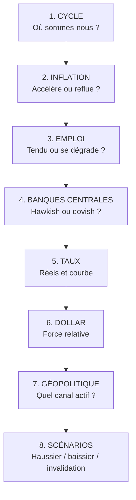

# Partie 9 — Construire un biais macro professionnel

> **Objectif.** Transformer tout ce qui précède en une méthode reproductible qui
> produit, chaque jour, un **biais argumenté et chiffré** sur les actifs que vous
> suivez.

---

## 9.1 Qu'est-ce qu'un biais macro ?

Un biais macro est une **orientation de contexte** : il dit dans quel sens le vent
souffle sur un actif, avec quel degré de conviction.

Ce qu'il **est** :

- une synthèse structurée de plusieurs faisceaux d'indices ;
- une échelle graduée (fortement favorable → neutre → fortement défavorable) ;
- un document **écrit**, daté, révisable.

Ce qu'il **n'est pas** :

- ❌ un signal d'entrée ;
- ❌ une prédiction ;
- ❌ une certitude.

> **La distinction fondamentale de tout ce livre :**
>
> | | Rôle | Répond à |
> |---|---|---|
> | **Macro** | Le contexte | *Dans quel sens ?* et *avec quelle conviction ?* |
> | **Technique** | L'exécution | *Où ?* et *quand ?* |
>
> Un biais macro sans exécution technique ne produit rien. Une exécution
> technique sans biais macro navigue à l'aveugle.

---

## 9.2 La méthode en 8 étapes

Chaque étape pose **une question**, produit **une note** et se documente en une
ligne. Comptez 15 à 20 minutes la première fois, 5 à 8 minutes une fois rodé.



---

### Étape 1 — Situer le cycle économique

**Question :** dans quelle phase se trouve l'économie de référence ?

| Phase | Indices caractéristiques |
|-------|--------------------------|
| Expansion | PMI > 52 et en hausse · chômage bas · inflation qui monte |
| Ralentissement | PMI qui décroît · croissance qui décélère · taux élevés |
| Récession | PMI < 48 · chômage qui monte · inflation qui reflue |
| Reprise | PMI qui repasse au-dessus de 50 · taux bas · confiance qui revient |

**À documenter :** *« Phase : ralentissement. PMI services 51,2 en baisse depuis
3 mois ; manufacturier 48,4. »*

---

### Étape 2 — Lire l'inflation

**Questions :** l'inflation sous-jacente accélère-t-elle ou reflue-t-elle ? À
quelle distance de la cible ? Le rythme mensuel confirme-t-il la tendance
annuelle ?

| Constat | Implication monétaire |
|---------|----------------------|
| Core en baisse régulière | Ouvre la voie à un assouplissement |
| Core stagnant au-dessus de la cible | *Higher for longer* |
| Core qui réaccélère | Risque de resserrement supplémentaire |

⚠️ Regardez toujours le **rythme mensuel annualisé** : l'annuel est un
rétroviseur qui met des mois à refléter un retournement.

---

### Étape 3 — Analyser l'emploi

**Questions :** le marché du travail se détend-il ? Les salaires ralentissent-ils ?
Les inscriptions au chômage remontent-elles ?

| Constat | Lecture |
|---------|---------|
| Emploi fort + salaires accélérant | Pression inflationniste : contexte restrictif |
| Emploi fort + salaires ralentissant | **Atterrissage en douceur** : configuration idéale pour les actifs risqués |
| Emploi qui se dégrade | Anticipations d'assouplissement, mais risque de récession |

**Rappel :** le salaire horaire compte souvent plus que le nombre d'emplois créés.

---

### Étape 4 — Positionner les banques centrales

**Questions :** quelle est l'orientation actuelle ? Qu'anticipe le marché ? Quelle
divergence entre les grandes banques centrales ?

| Élément | Où le trouver |
|---------|---------------|
| Orientation officielle | Dernier communiqué et conférence de presse |
| Trajectoire projetée | *Dot plot* (Fed), projections macroéconomiques |
| Anticipations du marché | Rendement à 2 ans, courbe des taux à court terme |

**Le point décisif :** l'écart entre ce que dit la banque centrale et ce
qu'anticipe le marché. Cet écart est un réservoir de volatilité — il finira par
se résoudre, et la résolution produira un mouvement.

---

### Étape 5 — Lire les taux

**Trois lectures indispensables :**

| Mesure | Série FRED | Ce qu'elle dit |
|--------|-----------|----------------|
| Rendement 2 ans | `DGS2` | Anticipations de politique monétaire |
| Spread 10Y−2Y | `T10Y2Y` | Position dans le cycle |
| **Taux réel 10 ans** | `DFII10` | **Coût d'opportunité — pilote de l'or** |

Complétez par le point mort d'inflation (`T10YIE`) pour évaluer la crédibilité
anti-inflation de la banque centrale.

---

### Étape 6 — Évaluer le dollar

**Questions :** le DXY monte-t-il ou baisse-t-il ? Quel différentiel de taux ?
Le mouvement vient-il du dollar ou de la contrepartie ?

**Vérification systématique :** si l'EUR/USD monte, regardez l'euro contre
d'autres devises. Si l'euro ne progresse que contre le dollar, c'est **le dollar
qui baisse** — l'information n'est pas la même.

---

### Étape 7 — Intégrer la géopolitique

Appliquez la méthode des 5 questions de la Partie 7 :

1. Quel canal (peur / offre / système) ?
2. Quelles ressources ou routes concernées ?
3. Le marché a-t-il déjà réagi ?
4. Aggravation ou résorption probable ?
5. Cela change-t-il la trajectoire des banques centrales ?

---

### Étape 8 — Écrire les scénarios

C'est l'étape que la plupart des traders sautent. C'est pourtant celle qui
transforme une analyse en **plan**.

Pour chaque actif suivi, rédigez trois lignes :

| Scénario | Contenu |
|----------|---------|
| **Principal** | Ce que vous jugez le plus probable, et pourquoi |
| **Alternatif** | L'autre issue plausible, et son déclencheur |
| **Invalidation** | Le fait précis qui prouverait que vous avez tort |

> **Pourquoi l'invalidation est capitale.** Sans elle, vous défendrez votre biais
> contre les faits. Avec elle, vous savez à l'avance ce qui vous fera changer
> d'avis — c'est la différence entre une analyse et une opinion.

---

## 9.3 La fiche de biais macro

Voici le document à produire. Un actif par fiche.

```
═══════════════════════════════════════════════════════════
FICHE DE BIAIS MACRO          Actif : ............
                              Date  : ............
═══════════════════════════════════════════════════════════

1. CYCLE ................................. Note : ___
   Observation : ..........................................

2. INFLATION ............................. Note : ___
   Core YoY : ____  MoM : ____  Tendance : ................

3. EMPLOI ................................ Note : ___
   Salaires : ____  Chômage : ____  Claims : ..............

4. BANQUES CENTRALES ..................... Note : ___
   Orientation : ..........  Marché anticipe : ............

5. TAUX .................................. Note : ___
   2 ans : ____  Spread 10-2 : ____  Taux réel : ____

6. DOLLAR ................................ Note : ___
   DXY : ____  Variation : ____  Origine du mouvement : ....

7. GÉOPOLITIQUE .......................... Note : ___
   Canal actif : ..........  Déjà intégré ? ...............

─────────────────────────────────────────────────────────
SCORE TOTAL : ______        BIAIS : ....................
CONFIANCE   : ______ %
─────────────────────────────────────────────────────────

8. SCÉNARIOS
   Principal    : ..........................................
   Alternatif   : ..........................................
   INVALIDATION : ..........................................

RISQUE ÉVÉNEMENTIEL À VENIR : ............................
═══════════════════════════════════════════════════════════
```

### Barème de notation

Chaque étape est notée de **−3 à +3** dans le sens favorable à l'actif analysé.

| Score total | Biais | Conduite à tenir |
|-------------|-------|------------------|
| **+10 à +21** | Fortement favorable | Privilégier les configurations dans ce sens ; taille normale |
| **+4 à +9** | Favorable | Configurations dans ce sens ; prudence sur le sens inverse |
| **−3 à +3** | **Neutre** | **Le contexte ne tranche pas** — réduire l'activité ou s'en tenir à la technique pure, avec des objectifs courts |
| **−9 à −4** | Défavorable | Symétrique |
| **−21 à −10** | Fortement défavorable | Symétrique |

> **La zone neutre est une information, pas un échec.** Un biais neutre bien
> identifié vous évite de forcer des trades dans un marché sans direction. La
> plupart des pertes évitables viennent de là.

---

## 9.4 Exemple complet de fiche remplie

*Exemple stylisé, construit pour l'exercice — actif : XAUUSD.*

| Étape | Observation | Note |
|-------|-------------|:----:|
| **1. Cycle** | Ralentissement confirmé : PMI manufacturier 47,8, services 51,0 en décélération | **+1** *(un ralentissement favorise l'or via l'anticipation de baisses de taux)* |
| **2. Inflation** | Core à 3,4 % YoY, en baisse régulière depuis 5 mois ; MoM annualisé à 2,8 % | **+2** *(ouvre la voie à un assouplissement)* |
| **3. Emploi** | Créations en décélération, salaires à 3,6 % contre 4,2 % il y a six mois, claims en légère hausse | **+2** |
| **4. Banques centrales** | Fed en pause, retrait du biais haussier dans le communiqué ; marché anticipe deux baisses | **+2** |
| **5. Taux** | 2 ans en baisse de 30 pb sur le mois ; taux réel `DFII10` à 1,6 %, en repli de 25 pb ; courbe encore inversée mais se re-pentifiant | **+3** |
| **6. Dollar** | DXY en baisse de 1,8 % sur le mois, tendance baissière confirmée | **+2** |
| **7. Géopolitique** | Tensions modérées, aucun canal offre activé | **+1** |
| **SCORE TOTAL** | | **+13** |

**Biais : fortement favorable à l'or. Confiance : 75 %.**

**Scénarios :**

- **Principal** — La détente des taux réels et l'affaiblissement du dollar
  soutiennent l'or. Contexte porteur tant que la désinflation se confirme.
- **Alternatif** — Une réaccélération de l'inflation ferait remonter les taux
  réels et retournerait le contexte.
- **Invalidation** — `DFII10` repasse durablement au-dessus de 2,0 % **ou** le
  core CPI réaccélère deux mois consécutifs.

**Risque événementiel :** CPI dans 4 jours, FOMC dans 12 jours.

**Traduction opérationnelle :** le trader privilégiera les **configurations
acheteuses** sur l'or. Il ne les crée pas : il les attend (Parties 11-12). Les
signaux vendeurs seront traités avec une taille réduite et des objectifs courts.

---

## 9.5 Checklist macro quotidienne (10 minutes)

À exécuter chaque matin avant l'ouverture de votre session.

```
□ 1. RISQUE ÉVÉNEMENTIEL
     Publications de niveau 1 ou 2 aujourd'hui ? À quelle heure ?

□ 2. TAUX
     Rendement 2 ans : direction sur 24 h ?
     Taux réel 10 ans (DFII10) : direction ?

□ 3. DOLLAR
     DXY : direction et amplitude sur 24 h ?

□ 4. VOLATILITÉ
     VIX : niveau et direction ? (>25 = régime d'aversion au risque)

□ 5. ACTUALITÉ
     Un événement a-t-il changé le contexte depuis hier ?
     Si oui : quel canal ? déjà intégré ?

□ 6. BIAIS
     Mon biais de la fiche est-il toujours valide ?
     Une condition d'invalidation est-elle atteinte ?

□ 7. PLAN DU JOUR
     Actifs surveillés : ...................
     Sens privilégié   : ...................
     Ce qui me ferait rester à l'écart : ...................
```

> **Discipline :** si une condition d'invalidation est atteinte, **le biais tombe
> immédiatement**. On ne négocie pas avec sa propre invalidation.

---

## 9.6 Erreur structurelle à éviter : le biais de confirmation

Une fois un biais écrit, votre cerveau va chercher ce qui le confirme et ignorer
ce qui le contredit. C'est automatique et universel.

**Trois protections concrètes :**

1. **Écrire l'invalidation avant** de s'attacher au biais.
2. **Chercher activement l'argument contraire** : consacrez deux minutes à
   construire le meilleur dossier contre votre propre conclusion.
3. **Dater et relire** : reprenez vos fiches d'il y a un mois. Vous verrez vos
   erreurs récurrentes — c'est le meilleur outil de progression qui existe.

---

## 📌 Résumé

Un biais macro est une orientation de contexte, chiffrée et écrite, jamais un
signal d'entrée. Il se construit en 8 étapes : cycle, inflation, emploi, banques
centrales, taux, dollar, géopolitique, scénarios. Chaque étape est notée de −3 à
+3 ; le total situe le biais sur une échelle de fortement favorable à fortement
défavorable, avec une zone neutre qui constitue une information à part entière.
La fiche se conclut par trois scénarios, dont une **condition d'invalidation
explicite** — la meilleure protection contre le biais de confirmation.

## 🎯 Points essentiels à retenir

1. **La macro donne le sens, la technique donne le moment.** Jamais l'inverse.
2. **Un biais s'écrit.** Une analyse non écrite se déforme au fil de la journée.
3. **L'invalidation se définit avant**, pas au moment où elle survient.
4. **La zone neutre est une information** : elle vous dit de ne pas forcer.
5. **Le taux réel (`DFII10`) est la variable la plus rentable à suivre** pour l'or.
6. **L'écart entre discours des banques centrales et anticipations du marché**
   est un réservoir de volatilité.
7. **Relisez vos anciennes fiches** : c'est l'outil de progression le plus
   efficace.

## ⚠️ Erreurs fréquentes

| Erreur | Correction |
|--------|-----------|
| Utiliser le biais macro comme déclencheur d'entrée | C'est un contexte ; l'entrée relève de la technique |
| Ne pas écrire son analyse | Ce qui n'est pas écrit se déforme et devient irréfutable |
| Omettre la condition d'invalidation | C'est la seule protection contre l'entêtement |
| Refaire son biais à chaque bougie | Un biais macro s'actualise **quotidiennement**, pas en continu |
| Forcer un trade en zone neutre | La neutralité est un signal de retrait |
| Ignorer le risque événementiel du jour | Un CPI dans deux heures invalide toute planification de moyen terme |
| Chercher uniquement la confirmation | Consacrer deux minutes à l'argument contraire |

## 🗂 Fiche de révision — Partie 9

**Les 8 étapes :**
```
1. CYCLE              → où sommes-nous ?
2. INFLATION          → accélère ou reflue ?
3. EMPLOI             → salaires surtout
4. BANQUES CENTRALES  → hawkish / dovish + écart aux anticipations
5. TAUX               → 2 ans · spread 10-2 · TAUX RÉEL
6. DOLLAR             → DXY et origine du mouvement
7. GÉOPOLITIQUE       → quel canal ?
8. SCÉNARIOS          → principal · alternatif · INVALIDATION
```

**Barème :** chaque étape de −3 à +3 · total de −21 à +21 · zone neutre = −3 à +3.

**Les 4 séries FRED du quotidien :** `DGS2` · `T10Y2Y` · `DFII10` · `T10YIE`

**Règle absolue :** un biais sans invalidation écrite n'est pas un biais, c'est
une opinion.

## ✍️ Questions d'entraînement

1. Quelle est la différence entre un biais macro et un signal de trading ?
2. Votre fiche donne un score de +2 sur l'or. Que faites-vous ?
3. Pourquoi la condition d'invalidation doit-elle être écrite **avant** de se
   forger une conviction ?
4. L'inflation core recule, les salaires ralentissent, la Fed retire son biais
   haussier et le taux réel baisse de 20 points de base. Quel biais sur l'or, et
   quelles notes approximatives attribuez-vous ?
5. Le marché anticipe trois baisses de taux mais la banque centrale n'en projette
   qu'une. Que représente cet écart, et pourquoi est-il important ?
6. Vous avez un biais favorable à l'or, mais le taux réel remonte fortement
   pendant trois séances consécutives. Que faites-vous ?

### Corrigé

1. Le biais macro indique **le sens et la conviction du contexte** ; le signal de
   trading indique **le point et le moment d'exécution**. Le premier ne déclenche
   jamais une position à lui seul.
2. Score de +2 → **zone neutre**. Le contexte ne tranche pas. Conduite : réduire
   l'activité, ne pas forcer, ou traiter uniquement des configurations techniques
   de haute qualité avec des objectifs courts et une taille réduite.
3. Parce qu'une fois la conviction installée, le biais de confirmation vous
   poussera à réinterpréter les faits contraires. Écrite à froid, l'invalidation
   est une règle ; écrite à chaud, elle devient négociable.
4. Notes approximatives : inflation **+2**, emploi **+2**, banques centrales
   **+2**, taux **+3**, soit déjà **+9** sur ces quatre étapes. Biais **favorable
   à fortement favorable** à l'or, sous réserve du dollar et du cycle.
5. C'est un **écart d'anticipations**. Il constitue un réservoir de volatilité :
   soit la banque centrale se rapproche du marché, soit le marché se rapproche de
   la banque centrale. La résolution produira un mouvement significatif, souvent
   à l'occasion d'une publication ou d'une conférence de presse.
6. Vous vérifiez votre **condition d'invalidation**. Si elle est atteinte, le
   biais tombe — sans discussion. Sinon, vous dégradez la note de l'étape 5,
   recalculez le score, et ajustez votre conduite (taille réduite, objectifs
   raccourcis) plutôt que de défendre une position devenue fragile.

---

➡️ **Partie 10 — Analyse fondamentale + trading** : comment articuler
concrètement le contexte et le timing.
