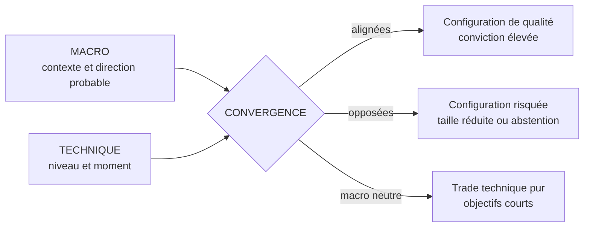
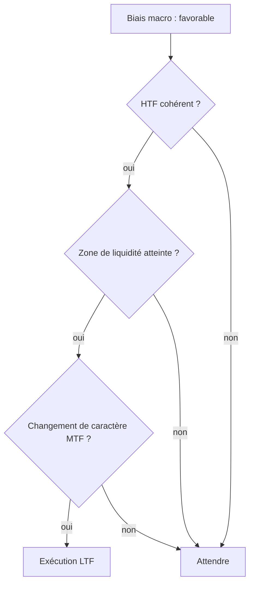

# Partie 10 — Analyse fondamentale + trading

> **Objectif.** Comprendre précisément **comment** le contexte macro et
> l'exécution technique s'articulent — et pourquoi utiliser l'un sans l'autre
> est une erreur coûteuse.

---

## 10.1 Deux questions, deux outils

Tout trade répond à deux questions distinctes. Les confondre est la source
principale des mauvaises décisions.

| Question | Outil | Horizon | Produit |
|----------|-------|---------|---------|
| **Dans quel sens ?** | Analyse macro / fondamentale | Jours à mois | Un **biais** |
| **Où et quand ?** | Analyse technique / SMC | Minutes à jours | Une **exécution** |



### L'analogie qui résume tout

Vous voulez traverser une rivière.

- La **macro** vous dit dans quel sens coule le courant, et à quelle force.
- La **technique** vous dit où se trouve le gué, et quand l'eau est basse.

Nager à contre-courant est possible — mais épuisant, plus lent, et beaucoup plus
risqué. Nager dans le sens du courant sans savoir où est le gué, c'est se laisser
emporter.

---

## 10.2 Pourquoi la macro seule ne suffit pas

Vous pouvez avoir raison sur le fond et perdre de l'argent. Quatre raisons :

| Problème | Illustration |
|----------|--------------|
| **Le timing** | Une courbe des taux inversée annonce un ralentissement… qui peut mettre deux ans à venir |
| **L'amplitude des mouvements adverses** | Un actif peut aller loin contre vous avant de vous donner raison |
| **Le niveau d'entrée** | Le bon sens au mauvais prix produit une perte, ou un ratio inexploitable |
| **La gestion du risque** | Sans niveau d'invalidation technique, où placez-vous votre protection ? |

> **La formule à retenir :** *avoir raison* et *gagner de l'argent* sont deux
> choses différentes. Le marché ne récompense pas la justesse de l'analyse, il
> récompense la **qualité de l'exécution d'une analyse juste**.

---

## 10.3 Pourquoi la technique seule ne suffit pas

Symétriquement :

| Problème | Conséquence |
|----------|-------------|
| **Absence de filtre directionnel** | Vous prenez tous les signaux, y compris ceux qui vont contre le courant dominant |
| **Vulnérabilité aux événements** | Une configuration parfaite est balayée par un CPI que vous n'aviez pas noté |
| **Pas de hiérarchie** | Tous les signaux se valent, alors qu'ils n'ont pas la même probabilité |
| **Incompréhension des mouvements** | Sans contexte, les mouvements paraissent aléatoires — d'où le sentiment de « manipulation » |

**Le bénéfice concret de la macro pour un trader technique** n'est pas de prendre
plus de trades. C'est d'en **prendre moins, mais de meilleure qualité**, en
filtrant ceux qui rament à contre-courant.

---

## 10.4 La matrice de convergence

C'est l'outil central de cette partie.

| | **Macro favorable** | **Macro neutre** | **Macro défavorable** |
|---|---|---|---|
| **Signal technique acheteur** | ✅ **Configuration A**<br/>Conviction élevée, taille normale, objectifs étendus | 🟡 **Configuration B**<br/>Trade technique pur, objectifs courts | ⚠️ **Configuration C**<br/>Contre-courant : taille réduite ou abstention |
| **Signal technique vendeur** | ⚠️ **Configuration C**<br/>Contre-courant | 🟡 **Configuration B** | ✅ **Configuration A**<br/>Conviction élevée |
| **Pas de signal technique** | ⏸️ Attendre | ⏸️ Attendre | ⏸️ Attendre |

### Lecture de la matrice

**Configuration A — Alignement.** Le contexte et l'exécution vont dans le même
sens. Ce sont les meilleures opportunités. Elles sont **rares** : c'est normal,
et c'est le but.

**Configuration B — Macro neutre.** Le contexte ne tranche pas. Le trade reste
possible mais devient purement technique : objectifs plus courts, exigence accrue
sur la qualité du signal.

**Configuration C — Conflit.** Le signal technique existe mais rame à
contre-courant. Trois options, par ordre de préférence :

1. **S'abstenir** (le choix le plus fréquent chez les professionnels) ;
2. réduire fortement la taille et raccourcir l'objectif ;
3. attendre que la macro se neutralise.

> ⚠️ **Ne jamais inverser la logique.** La macro ne doit **jamais** vous faire
> entrer sans signal technique. Un contexte très favorable n'est pas un signal
> d'achat : c'est un contexte. La dernière ligne de la matrice est
> catégorique — pas de signal, pas de trade.

---

## 10.5 Le rôle exact de chaque échelle de temps

L'articulation macro/technique se traduit dans une hiérarchie d'unités de temps.

| Échelle | Rôle | Ce qu'on y cherche |
|---------|------|--------------------|
| **Macro** (semaines/mois) | Le courant | Biais, régime, risque événementiel |
| **HTF** — H4, Daily, Weekly | La carte | Structure, zones de liquidité, zones institutionnelles |
| **MTF** — H1, M15 | La transition | Réaction aux zones, changement de caractère |
| **LTF** — M5, M1 | L'exécution | Point d'entrée précis, invalidation serrée |

**Règle de cohérence :** on ne descend d'une échelle que si l'échelle supérieure
est cohérente avec le biais.



---

## 10.6 Le pont vers les Smart Money Concepts

Pourquoi la macro s'articule-t-elle si naturellement avec l'approche SMC/ICT ?

Parce que les deux décrivent **le même phénomène**, à deux échelles différentes.

| Vision macro | Traduction SMC |
|--------------|----------------|
| Les grandes institutions repositionnent leurs portefeuilles selon le contexte | Les gros ordres doivent être exécutés quelque part |
| Un fonds ne peut pas acheter des milliards d'un coup sans faire exploser le prix | Il a besoin de **liquidité** en face de lui |
| Il achète donc là où beaucoup de vendeurs sont présents | Sous les plus bas, où sont les ordres de protection |
| Ce qui produit une chasse aux protections avant le vrai mouvement | **Liquidity sweep** puis retournement |

> **L'idée centrale qui relie tout le livre :**
>
> La macro explique **pourquoi** les institutions veulent acheter ou vendre.
> Le SMC explique **comment** et **où** elles le font.
>
> C'est la même histoire racontée depuis deux altitudes.

### Ce que cela change concrètement

Un trader SMC sans macro voit une prise de liquidité et se demande si le
retournement va tenir. Un trader Macro-SMC sait que :

- une prise de liquidité **dans le sens du courant macro** a une probabilité de
  suivi supérieure ;
- une prise de liquidité **contre le courant macro** est plus souvent un simple
  mouvement de correction.

Ce filtre, à lui seul, transforme les statistiques d'une méthode technique.

---

## 10.7 Étude de cas comparée

*Exemples stylisés, construits pour l'exercice.*

### Cas 1 — Alignement (Configuration A)

| Élément | Constat |
|---------|---------|
| **Macro** | Score or : **+13** (taux réels en baisse, dollar faible, Fed en pivot) |
| **HTF (Daily)** | Structure haussière, dernier point bas plus haut que le précédent |
| **Liquidité** | Une zone d'égalité de plus bas (*equal lows*) subsiste sous le marché |
| **Déclencheur** | Le prix balaie ces plus bas, puis produit un changement de caractère en H1 |
| **Exécution** | Entrée sur retour dans la zone institutionnelle à l'origine du mouvement |

**Résultat de la lecture :** configuration de qualité maximale. Le courant, la
carte et le moment concordent. Taille normale, objectif étendu vers la liquidité
opposée.

### Cas 2 — Conflit (Configuration C)

| Élément | Constat |
|---------|---------|
| **Macro** | Score or : **−9** (taux réels en hausse, dollar fort, discours restrictif) |
| **HTF** | Le prix rebondit sur un support majeur |
| **Signal** | Configuration acheteuse techniquement valide |

**Lecture :** le signal existe, mais il rame contre un courant fort. La
probabilité qu'il ne s'agisse que d'un rebond correctif est élevée.

**Conduite professionnelle :** s'abstenir, ou réduire fortement la taille avec un
objectif court (le premier obstacle intermédiaire) et une invalidation stricte.
Ne pas viser un renversement de tendance à contre-courant.

### Cas 3 — Macro neutre (Configuration B)

| Élément | Constat |
|---------|---------|
| **Macro** | Score or : **+1** (données contradictoires, banque centrale attentiste) |
| **HTF** | Marché en range, sans direction claire |
| **Signal** | Prise de liquidité au sommet du range, changement de caractère baissier |

**Lecture :** contexte sans direction, marché en range. Le trade technique est
jouable **à l'intérieur du range**, avec un objectif au bas du range et une
taille modérée. Ne pas espérer une tendance : le contexte ne la porte pas.

---

## 10.8 La règle de gestion du risque adaptative

Le biais macro ne doit pas seulement filtrer vos trades : il doit moduler votre
**exposition**.

| Configuration | Taille suggérée | Objectif | Invalidation |
|---------------|-----------------|----------|--------------|
| **A — Alignement** | 100 % de votre taille standard | Étendu (liquidité opposée) | Standard |
| **B — Neutre** | 50 à 70 % | Court (premier obstacle) | Standard |
| **C — Conflit** | 0 à 30 % | Très court | Resserrée |
| **Événement majeur dans moins de 2 h** | 0 % (ou réduire les positions existantes) | — | — |

> **Ce tableau vaut plus que n'importe quelle stratégie d'entrée.** La plupart
> des traders cherchent un meilleur point d'entrée ; les professionnels ajustent
> surtout leur **exposition au contexte**.

---

## 📌 Résumé

La macro répond à « dans quel sens ? », la technique à « où et quand ? ». Chacune
est insuffisante seule : la macro sans technique manque le timing, le niveau et
l'invalidation ; la technique sans macro prend des trades à contre-courant et
subit les événements. La matrice de convergence classe chaque situation en trois
configurations — alignement, neutralité, conflit — auxquelles correspondent des
tailles de position et des objectifs différents. Enfin, macro et SMC racontent la
même histoire à deux altitudes : la macro explique **pourquoi** les institutions
se positionnent, le SMC **comment et où**.

## 🎯 Points essentiels à retenir

1. **Macro = sens. Technique = moment.** Ne jamais intervertir.
2. **La macro ne déclenche jamais une entrée** — il faut un signal technique.
3. **Configuration A (alignement) est rare, et c'est normal.** La rareté fait la
   qualité.
4. **En conflit, l'abstention est le choix professionnel le plus fréquent.**
5. **La macro module la taille**, pas seulement la direction.
6. **Un biais neutre autorise le trade technique**, avec objectifs courts.
7. **Avoir raison ≠ gagner.** L'exécution transforme l'analyse en résultat.

## ⚠️ Erreurs fréquentes

| Erreur | Correction |
|--------|-----------|
| Acheter parce que « la macro est haussière » | Attendre un signal technique : sans lui, pas de trade |
| Ignorer la macro parce qu'« on ne trade que le graphique » | Le contexte détermine la probabilité de suivi d'un signal |
| Prendre tous les signaux techniques indistinctement | Filtrer par la matrice de convergence |
| Utiliser la même taille dans toutes les configurations | Moduler l'exposition selon l'alignement |
| Chercher un retournement majeur à contre-courant macro | Statistiquement défavorable ; viser au mieux une correction |
| Oublier le risque événementiel | Un CPI dans une heure annule toute planification |

## 🗂 Fiche de révision — Partie 10

**Matrice de convergence :**
```
                    MACRO +        MACRO 0        MACRO −
Signal ACHAT          A  ✅          B  🟡          C  ⚠️
Signal VENTE          C  ⚠️          B  🟡          A  ✅
Aucun signal          ⏸️            ⏸️             ⏸️
```

**Gestion adaptative :** A = 100 % · B = 50-70 % · C = 0-30 % · événement < 2 h = 0 %.

**Hiérarchie des échelles :** Macro (courant) → HTF (carte) → MTF (transition) →
LTF (exécution). On ne descend que si le niveau supérieur est cohérent.

**Le pont Macro-SMC :** la macro dit *pourquoi* les institutions se positionnent ;
le SMC dit *où* et *comment* elles trouvent la liquidité pour le faire.

## ✍️ Questions d'entraînement

1. Votre biais macro sur l'or est fortement favorable, mais aucun signal
   technique n'apparaît. Que faites-vous ?
2. Un signal vendeur de haute qualité apparaît alors que le biais macro est
   fortement favorable. Quelle configuration, et quelle conduite ?
3. Pourquoi peut-on avoir raison sur l'analyse macro et perdre de l'argent ?
4. Quel bénéfice concret la macro apporte-t-elle à un trader purement technique ?
5. Le biais est neutre et le marché évolue en range. Comment adaptez-vous vos
   objectifs et votre taille ?
6. Expliquez en deux phrases pourquoi macro et SMC décrivent le même phénomène.

### Corrigé

1. **Rien.** Un contexte favorable n'est pas un signal. On attend une
   configuration technique ; sans elle, il n'y a pas de trade, quelle que soit la
   force du biais.
2. **Configuration C (conflit).** Conduite : s'abstenir de préférence ; sinon,
   taille très réduite (0-30 %), objectif court, invalidation resserrée. Ne pas
   viser un retournement de tendance à contre-courant.
3. Parce que le **timing**, le **niveau d'entrée** et l'**amplitude du mouvement
   adverse** peuvent vous éliminer avant que l'analyse ne se réalise. Le marché
   récompense l'exécution, pas la justesse en soi.
4. Il prend **moins de trades, de meilleure qualité** : la macro filtre les
   signaux à contre-courant et hiérarchise les opportunités. Elle lui évite aussi
   d'être surpris par les publications majeures.
5. Objectifs **courts** (les bornes du range), taille **modérée** (50 à 70 %), et
   aucune attente de tendance. On trade le range comme un range, pas comme un
   début de mouvement directionnel.
6. Les institutions se positionnent en fonction du contexte macro (pourquoi), mais
   leur taille les oblige à chercher de la liquidité pour exécuter (comment et
   où). Le SMC lit les traces de cette exécution sur le graphique ; la macro en
   explique la motivation.

---

➡️ **Partie 11 — Smart Money Concepts** : liquidité, structure et zones
institutionnelles.
