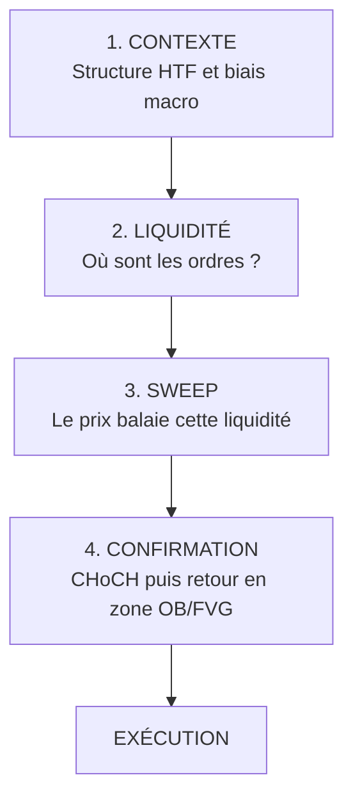

# Partie 11 — Smart Money Concepts et trading institutionnel

> **Objectif.** Maîtriser la lecture institutionnelle d'un graphique : la
> liquidité, la structure de marché et les zones d'intérêt.

---

## 11.1 Le problème que résout le SMC

Un fonds veut acheter pour 500 millions de dollars d'or. S'il passe un ordre au
marché, il fait exploser le prix contre lui-même : ses derniers contrats seront
achetés bien plus cher que les premiers.

**Il lui faut donc des vendeurs en face.** Beaucoup de vendeurs, concentrés au
même endroit.

Où trouve-t-on des vendeurs en masse ?

- Sous les **plus bas visibles**, où se trouvent les ordres de protection des
  acheteurs (qui deviennent des ordres de vente quand ils sont déclenchés) ;
- là où les vendeurs à découvert entrent en cassure ;
- aux niveaux « évidents » que tout le monde regarde.

> **L'idée fondatrice du SMC :** le prix ne se déplace pas au hasard vers des
> niveaux quelconques. Il est **attiré par les zones où la liquidité est
> concentrée**, parce que c'est là que les gros ordres peuvent être exécutés.

⚠️ **Précision honnête et importante.** Le SMC est un **cadre de lecture**, pas
une vérité observable. Personne, en dehors des institutions elles-mêmes, ne voit
leurs ordres. Ce que vous lisez, ce sont des **traces probables** sur le prix. Ce
cadre a de la valeur parce qu'il structure la décision et concentre l'attention
sur des zones où les réactions sont statistiquement plus fréquentes — pas parce
qu'il révélerait un secret. Méfiez-vous de quiconque le présente comme une
certitude.

---

## 11.2 La liquidité

### Définition opérationnelle

La liquidité, pour un trader SMC, désigne les **zones où sont concentrés des
ordres en attente** — principalement des ordres de protection (*stop loss*) et
des ordres d'entrée en cassure.

### Les deux côtés

| Type | Localisation | Composition |
|------|--------------|-------------|
| **Buy-side liquidity** | **Au-dessus** des plus hauts | Protections des vendeurs + achats en cassure |
| **Sell-side liquidity** | **En-dessous** des plus bas | Protections des acheteurs + ventes en cassure |

```
                    ╱╲        ← BUY-SIDE LIQUIDITY
        ═══════════╱══╲═══════   (au-dessus des sommets)
              ╱╲ ╱      ╲
             ╱  V        ╲
    ────────╱             ╲────
                           ╲
        ═══════════════════╲═══  ← SELL-SIDE LIQUIDITY
                            ╲     (sous les creux)
```

**Point de vocabulaire trompeur.** *Buy-side liquidity* ne signifie pas « zone où
acheter ». Cela signifie « zone contenant des ordres d'**achat** en attente » —
donc précisément la zone où un gros vendeur trouvera des contreparties. Beaucoup
de débutants font l'erreur inverse.

### Les zones à forte liquidité

| Configuration | Pourquoi la liquidité s'y concentre |
|---------------|-------------------------------------|
| **Equal Highs** (plusieurs sommets au même niveau) | Niveau « évident » : tout le monde y place ses protections |
| **Equal Lows** (plusieurs creux au même niveau) | Idem, côté opposé |
| Plus haut / plus bas de la journée, de la semaine | Références suivies par tous |
| Sommets et creux de session (Asie, Londres) | Repères horaires universels |
| Anciens sommets et creux majeurs | Mémoire de marché |

Les **egalités de plus hauts et de plus bas** sont les plus significatives : leur
netteté même en fait des aimants. Un niveau que tout le monde voit est un niveau
où tout le monde place sa protection.

### Le *stop hunt*

C'est le mouvement par lequel le prix vient chercher ces zones avant de repartir
en sens inverse.

**Ce que ce n'est pas :** un complot personnel contre vous. Votre position ne
représente rien à l'échelle du marché.

**Ce que c'est :** un mécanisme d'exécution. Les gros intervenants ont besoin de
contreparties ; les zones de protections en offrent en abondance. Le mouvement
vers ces zones est la conséquence mécanique d'un besoin de liquidité.

---

## 11.3 Le *liquidity sweep* (balayage de liquidité)

### Définition

Un *sweep* est un mouvement qui **dépasse** un niveau de liquidité, déclenche les
ordres qui s'y trouvent, puis **rejette rapidement** ce niveau.

C'est l'un des signaux les plus importants du SMC.

### Distinguer un vrai *sweep* d'une vraie cassure

C'est **la** compétence à acquérir, celle qui sépare le trader rentable des
autres.

| Critère | Vrai *sweep* (retournement probable) | Vraie cassure (continuation) |
|---------|--------------------------------------|------------------------------|
| **Vitesse de rejet** | Rapide — souvent dans la même bougie ou la suivante | Le prix reste au-delà du niveau |
| **Clôture** | **Revient** du bon côté du niveau | **Clôture** au-delà du niveau |
| **Mèche** | Longue mèche dépassant le niveau | Corps de bougie franc |
| **Suite** | Changement de caractère (CHoCH) dans la foulée | Continuation, puis retest du niveau cassé devenu support/résistance |
| **Volume** | Pic bref puis retrait | Volume soutenu dans la durée |
| **Contexte macro** | Le *sweep* va **contre** le courant macro → retournement plus probable | La cassure va **dans le sens** du courant → continuation plus probable |

> **La dernière ligne est votre avantage.** C'est exactement là que la macro
> transforme le SMC : elle vous donne une probabilité a priori sur l'issue.
>
> - Contexte macro haussier + *sweep* des plus bas → **retournement haussier
>   probable** (les institutions accumulent).
> - Contexte macro baissier + cassure des plus bas → **continuation baissière
>   probable**.

### Les trois temps du *sweep*

```
1. CONSTRUCTION     Le marché forme des egalités de plus bas (equal lows).
                    Les protections s'accumulent en-dessous.

2. BALAYAGE         Le prix plonge sous ces plus bas. Les protections sont
                    déclenchées → vagues de ventes forcées.
                    Les acheteurs institutionnels absorbent.

3. RETOURNEMENT     Le prix rejette rapidement, remonte au-dessus du niveau,
                    puis produit un changement de caractère.
```

⚠️ **Le piège à éviter absolument.** Un *sweep* seul ne suffit pas. Attendre la
**confirmation structurelle** (CHoCH) est obligatoire. Entrer sur le simple
balayage revient à parier que le retournement aura lieu — sans preuve.

---

## 11.4 La structure de marché

### Les définitions de base

Une tendance se lit dans la succession des points hauts et bas.

| Tendance | Structure |
|----------|-----------|
| **Haussière** | Sommets de plus en plus hauts **et** creux de plus en plus hauts |
| **Baissière** | Sommets de plus en plus bas **et** creux de plus en plus bas |
| **Range** | Sommets et creux sans progression nette |

### BOS — *Break of Structure* (cassure de structure)

Le prix casse le **dernier sommet** (en tendance haussière) ou le **dernier
creux** (en tendance baissière), dans le **sens de la tendance en cours**.

**Signification : continuation.** La tendance se confirme.

```
Tendance haussière :

              ╱╲    ← BOS (casse le sommet précédent)
        ╱╲   ╱  ╲
   ════╱══╲═╱    ╲    ← sommet précédent
      ╱    V
     ╱
```

### CHoCH — *Change of Character* (changement de caractère)

Le prix casse un niveau structurel **dans le sens opposé** à la tendance en
cours : en tendance haussière, il casse le dernier **creux** significatif.

**Signification : premier signal de retournement potentiel.**

```
Tendance haussière puis retournement :

        ╱╲
       ╱  ╲   ╱╲
      ╱    ╲ ╱  ╲
     ╱      V    ╲
    ╱   creux     ╲
   ════════════════╲═══  ← CHoCH (casse le creux : la tendance
                    ╲     haussière n'est plus intacte)
```

### La distinction essentielle

| | BOS | CHoCH |
|---|-----|-------|
| **Direction** | Dans le sens de la tendance | Contre la tendance |
| **Signification** | Continuation | Retournement potentiel |
| **Usage** | Confirme un biais existant | Signale un changement de régime |
| **Fiabilité** | Élevée en tendance établie | À confirmer — c'est un **premier** signal |

> **Le CHoCH est un signal, pas une preuve.** Beaucoup de CHoCH ne débouchent
> sur rien. Sa valeur augmente considérablement quand il survient **après un
> sweep** et **dans le sens du courant macro**. C'est cette combinaison des trois
> — liquidité, structure, contexte — qui constitue une configuration
> professionnelle.

---

## 11.5 Les zones institutionnelles

### Order Block (OB)

**Définition :** la dernière bougie (ou zone) de sens opposé avant un mouvement
impulsif qui casse la structure.

**Logique :** c'est la zone où les gros ordres ont probablement été accumulés
avant de propulser le prix. Lorsque le prix y revient, une partie de ces
intervenants peut y défendre leurs positions ou compléter leur exécution.

| Type | Localisation | Rôle |
|------|--------------|------|
| **Bullish OB** | Dernière bougie baissière avant une impulsion haussière | Zone de soutien potentiel |
| **Bearish OB** | Dernière bougie haussière avant une impulsion baissière | Zone de résistance potentielle |

**Critères de qualité d'un OB :**

1. Il précède un mouvement **impulsif** (pas un mouvement mou) ;
2. Ce mouvement **casse une structure** (BOS) ;
3. Il laisse un **déséquilibre** derrière lui (voir FVG) ;
4. Il n'a pas encore été retesté (un OB « frais » a plus de valeur) ;
5. Il se situe dans une zone cohérente (*discount* pour un achat, *premium* pour
   une vente).

### Fair Value Gap (FVG) et déséquilibre

**Définition :** un espace de prix parcouru si rapidement qu'aucun échange
équilibré n'y a eu lieu. Techniquement, il se repère sur trois bougies
consécutives : la mèche de la première et celle de la troisième ne se chevauchent
pas.

```
Bougie 1 : ▐    haut de la bougie 1
                ↕  ← FVG (espace non comblé)
Bougie 3 : ▐    bas de la bougie 3

Le prix a « sauté » cette zone sans échanger.
```

**Logique :** les marchés ont tendance à revenir combler ces zones de
déséquilibre — sans que ce soit une règle absolue. Un FVG constitue une zone
d'intérêt, surtout lorsqu'il coïncide avec un Order Block.

> **Le principe de confluence.** Une zone isolée a une valeur modérée. Une zone
> où se superposent un **OB**, un **FVG** et une position en **discount** a une
> valeur nettement supérieure. Cherchez toujours l'empilement.

### Premium et Discount

On divise le dernier mouvement significatif en deux moitiés par son point médian
(50 %).

| Zone | Position | Usage |
|------|----------|-------|
| **Premium** | Moitié **haute** du mouvement | Zone de **vente** privilégiée |
| **Équilibre** | Autour du 50 % | Zone neutre |
| **Discount** | Moitié **basse** du mouvement | Zone d'**achat** privilégiée |

```
100 % ─────────────────  sommet du mouvement
              ▲
         PREMIUM         ← vendre ici (cher)
              ▼
 50 % ═════════════════  équilibre
              ▲
         DISCOUNT        ← acheter ici (bon marché)
              ▼
  0 % ─────────────────  base du mouvement
```

**Règle de bon sens institutionnel :** on achète bas et on vend haut. Acheter en
*premium* revient à payer cher un actif que les institutions ont accumulé plus
bas. C'est un filtre simple qui élimine beaucoup de mauvaises entrées.

---

## 11.6 Assembler les concepts : l'anatomie d'une configuration

Une configuration SMC complète superpose **quatre éléments**.



### Grille de qualité d'une configuration

Cochez ; plus le score est élevé, meilleure est la configuration.

```
□ Le biais macro va dans le sens du trade                        (+3)
□ La structure HTF est cohérente avec le trade                   (+2)
□ Une liquidité identifiable a été balayée                       (+2)
□ Le sweep a été rejeté rapidement (mèche, clôture du bon côté)  (+2)
□ Un CHoCH confirme sur une unité de temps inférieure            (+2)
□ L'entrée se situe dans un OB frais                             (+1)
□ Un FVG coïncide avec cet OB                                    (+1)
□ L'entrée est en discount (achat) ou premium (vente)            (+1)
□ Aucun événement macro majeur dans les 2 heures                 (+1)
□ Le ratio risque/rendement est d'au moins 1:2                   (+2)

Score : ___ / 17
```

| Score | Lecture |
|-------|---------|
| **13 – 17** | Configuration de haute qualité |
| **9 – 12** | Configuration correcte, taille réduite |
| **< 9** | Configuration insuffisante — s'abstenir |

---

## 📌 Résumé

Le SMC part d'un constat : les grosses positions ont besoin de contreparties, et
celles-ci se concentrent autour des zones de liquidité (au-dessus des sommets,
sous les creux, sur les égalités). Un *sweep* balaie cette liquidité puis rejette
le niveau ; le distinguer d'une vraie cassure repose sur la vitesse de rejet, la
clôture, la suite structurelle — et sur le contexte macro. La structure se lit
par le BOS (continuation) et le CHoCH (retournement potentiel). Les zones
institutionnelles — Order Block, Fair Value Gap, premium/discount — indiquent où
l'exécution est la plus pertinente. Une configuration professionnelle superpose
contexte, liquidité, *sweep* et confirmation.

## 🎯 Points essentiels à retenir

1. **Le prix est attiré par la liquidité**, parce que c'est là que les gros
   ordres peuvent s'exécuter.
2. **Buy-side liquidity = au-dessus des sommets** (et non « zone où acheter »).
3. **Un *sweep* sans confirmation n'est pas un signal** — attendez le CHoCH.
4. **BOS = continuation. CHoCH = retournement potentiel.**
5. **Un OB de qualité précède un mouvement impulsif qui casse la structure.**
6. **Cherchez la confluence** : OB + FVG + discount vaut bien plus qu'une zone
   isolée.
7. **Le contexte macro donne la probabilité a priori** du *sweep* : c'est votre
   avantage sur un trader purement technique.
8. **Le SMC est un cadre de lecture, pas une révélation.** Traitez-le avec la
   rigueur d'un outil probabiliste.

## ⚠️ Erreurs fréquentes

| Erreur | Correction |
|--------|-----------|
| Entrer dès le balayage, sans confirmation | Attendre le CHoCH sur une unité inférieure |
| Confondre *sweep* et vraie cassure | Vérifier vitesse de rejet, clôture, contexte macro |
| Voir un Order Block partout | Un OB valide précède une **impulsion** qui **casse la structure** |
| Acheter en zone premium | Acheter en discount, vendre en premium |
| Croire que le marché « chasse vos stops » personnellement | C'est un mécanisme d'exécution, pas une intention |
| Ignorer l'unité de temps supérieure | La structure HTF prime toujours sur la LTF |
| Traiter le SMC comme une vérité absolue | C'est un cadre probabiliste ; le risque doit toujours être géré |
| Empiler les indicateurs SMC sans contexte | La confluence a du sens, la surcharge non |

## 🗂 Fiche de révision — Partie 11

**Liquidité :**
```
BUY-SIDE   → au-dessus des sommets  → ordres d'achat en attente
SELL-SIDE  → sous les creux         → ordres de vente en attente
Zones fortes : Equal Highs / Equal Lows · extrêmes de session · plus hauts/bas du jour
```

**Sweep vs cassure :** rejet rapide + clôture du bon côté + CHoCH = **sweep** ·
clôture au-delà + continuation = **cassure**.

**Structure :** BOS = continuation (sens de la tendance) · CHoCH = retournement
potentiel (contre la tendance).

**Zones :** OB (dernière bougie opposée avant impulsion) · FVG (déséquilibre sur
3 bougies) · Premium (haut, vendre) / Discount (bas, acheter).

**Séquence complète :**
```
CONTEXTE → LIQUIDITÉ → SWEEP → CHoCH → ENTRÉE OB/FVG en discount/premium
```

## ✍️ Questions d'entraînement

1. Où se situe la *buy-side liquidity*, et pourquoi ce nom peut-il induire en
   erreur ?
2. Quelle différence structurelle entre un BOS et un CHoCH ?
3. Le prix casse un plus bas, clôture en-dessous et continue de baisser deux
   heures. *Sweep* ou vraie cassure ?
4. Quels sont les cinq critères de qualité d'un Order Block ?
5. Le biais macro est fortement haussier et le prix balaie une zone d'égalité de
   plus bas. Que devient la probabilité de retournement, et qu'attendez-vous
   avant d'entrer ?
6. Pourquoi acheter en zone premium est-il généralement une mauvaise idée ?
7. Un CHoCH apparaît mais aucun *sweep* ne l'a précédé et le contexte macro est
   opposé. Quel score approximatif obtenez-vous sur la grille de qualité, et
   qu'en concluez-vous ?

### Corrigé

1. **Au-dessus des sommets.** Le nom induit en erreur car il ne désigne pas une
   zone où il faut acheter, mais une zone **contenant des ordres d'achat en
   attente** — donc l'endroit où un vendeur institutionnel trouvera ses
   contreparties.
2. Le **BOS** casse un niveau dans le **sens de la tendance** (continuation) ; le
   **CHoCH** casse un niveau **contre la tendance** (retournement potentiel).
3. **Vraie cassure.** La clôture au-delà du niveau et la continuation dans le
   temps excluent le *sweep*, qui se caractérise par un rejet rapide et un retour
   du bon côté.
4. Il précède un mouvement **impulsif** ; ce mouvement **casse la structure** ; il
   laisse un **déséquilibre (FVG)** ; il est **frais** (non retesté) ; il se situe
   dans une zone cohérente (**discount** pour un achat, **premium** pour une
   vente).
5. La probabilité de retournement **augmente nettement** : le *sweep* va contre le
   courant macro, ce qui suggère une accumulation plutôt qu'une cassure. On attend
   néanmoins un **CHoCH** sur une unité inférieure, puis un retour dans un OB/FVG
   pour exécuter.
6. Parce que cela revient à acheter cher un actif que les institutions ont
   probablement accumulé dans la moitié basse du mouvement. Le ratio
   risque/rendement s'en trouve mécaniquement dégradé.
7. Score faible : on perd les 3 points du contexte macro, les 2 points du *sweep*
   et les 2 points du rejet, soit environ **6-8/17 au mieux**. Conclusion :
   configuration **insuffisante**, on s'abstient.

---

➡️ **Partie 12 — Méthode Macro-SMC complète** : la stratégie de bout en bout.
