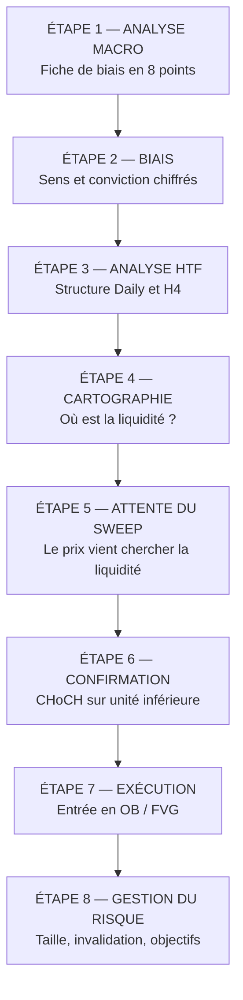

# Partie 12 — La méthode Macro-SMC complète

> **Objectif.** Assembler tout le livre en une stratégie exécutable, étape par
> étape, avec des exemples complets sur XAUUSD.

---

## 12.1 Vue d'ensemble de la méthode



**Principe de non-négociation :** chaque étape est une **condition**. Si une
étape n'est pas remplie, on n'avance pas. On attend, ou on abandonne la
configuration. Aucune étape ne se « saute parce que ça a l'air bien ».

---

## 12.2 Les huit étapes en détail

### Étape 1 — Analyse macro

Remplissez la fiche de biais de la Partie 9 (cycle, inflation, emploi, banques
centrales, taux, dollar, géopolitique).

**Fréquence :** une fois par jour, avant l'ouverture de votre session. Actualisation
uniquement en cas de publication majeure ou de choc.

**Sortie :** un score de −21 à +21.

### Étape 2 — Définition du biais

| Score | Biais | Sens autorisé |
|-------|-------|---------------|
| **> +9** | Fortement favorable | Achats privilégiés, ventes évitées |
| **+4 à +9** | Favorable | Achats privilégiés, ventes réduites |
| **−3 à +3** | **Neutre** | Technique pure, objectifs courts, taille réduite |
| **−9 à −4** | Défavorable | Ventes privilégiées |
| **< −9** | Fortement défavorable | Ventes privilégiées, achats évités |

**Sortie :** un sens privilégié + une taille maximale autorisée.

### Étape 3 — Analyse des unités de temps supérieures

Sur **Daily** puis **H4** :

- Quelle est la structure ? (haussière, baissière, range)
- Où se situe le prix dans le dernier mouvement ? (premium ou discount)
- Quelles zones institutionnelles majeures (OB, FVG) sont encore inexploitées ?

**Condition de passage :** la structure HTF doit être **cohérente** avec le biais
macro, ou au minimum ne pas le contredire frontalement.

> Si la macro est haussière mais que la structure Daily est franchement baissière,
> vous êtes dans une configuration de conflit. Attendez que l'un des deux
> s'aligne — le plus souvent, la structure finit par suivre le contexte.

### Étape 4 — Cartographie de la liquidité

Marquez sur votre graphique :

```
□ Egalités de plus hauts (equal highs)
□ Egalités de plus bas (equal lows)
□ Plus haut / plus bas de la veille
□ Plus haut / plus bas de la semaine
□ Extrêmes de la session asiatique
□ Sommets et creux majeurs non revisités
```

**Question centrale :** *vers quelle liquidité le marché est-il le plus
susceptible d'aller avant de repartir dans le sens du biais ?*

C'est là que vous **attendrez** votre configuration.

### Étape 5 — Attente du *sweep*

Vous ne créez pas l'opportunité, vous l'attendez.

| Biais macro | Ce que vous attendez |
|-------------|----------------------|
| **Haussier** | Un balayage de la **sell-side liquidity** (sous les creux), suivi d'un rejet |
| **Baissier** | Un balayage de la **buy-side liquidity** (au-dessus des sommets), suivi d'un rejet |

**Critères de validation du *sweep* :**

```
□ Le niveau de liquidité est dépassé
□ Le rejet est rapide (mèche marquée)
□ La clôture revient du bon côté du niveau
□ Le mouvement va CONTRE le courant macro (donc probable accumulation/distribution)
```

Si le prix **clôture au-delà** et y reste : ce n'est pas un *sweep*, c'est une
cassure. La configuration est annulée ; réévaluez.

### Étape 6 — Confirmation structurelle

Descendez sur **M15** ou **H1** et cherchez un **CHoCH** dans le sens du biais.

```
Biais haussier :
  sweep sous les creux → le prix remonte → casse le dernier sommet mineur
  = CHoCH haussier  ✅

Biais baissier :
  sweep au-dessus des sommets → le prix redescend → casse le dernier creux mineur
  = CHoCH baissier  ✅
```

**Sans CHoCH, pas d'entrée.** C'est la règle la plus importante de la méthode. Le
*sweep* seul est une hypothèse ; le CHoCH est la première preuve.

### Étape 7 — Exécution

Après le CHoCH, le prix revient généralement tester la zone à l'origine du
mouvement.

| Élément | Choix |
|---------|-------|
| **Zone d'entrée** | Order Block du mouvement de CHoCH, idéalement superposé à un FVG |
| **Position dans le mouvement** | Discount pour un achat, premium pour une vente |
| **Type d'ordre** | Ordre limite dans la zone, ou entrée au marché après réaction visible |

**Trois modes d'entrée, du plus agressif au plus conservateur :**

| Mode | Déclencheur | Avantage | Inconvénient |
|------|-------------|----------|--------------|
| **Agressif** | Ordre limite dans l'OB, sans attendre | Meilleur prix | Plus de faux départs |
| **Standard** | Réaction visible dans l'OB (bougie de rejet) | Bon compromis | Prix légèrement moins bon |
| **Conservateur** | CHoCH sur unité encore inférieure dans l'OB | Confirmation maximale | Ratio dégradé, opportunités manquées |

Choisissez **un** mode et tenez-vous-y. Changer de mode selon l'humeur détruit
toute possibilité d'évaluer votre méthode.

### Étape 8 — Gestion du risque

C'est l'étape qui détermine votre survie. Elle prime sur toutes les autres.

#### Placement de l'invalidation

| Type de trade | Invalidation |
|---------------|--------------|
| Achat après *sweep* | Sous l'extrême du *sweep* (le plus bas de la mèche), avec une marge |
| Vente après *sweep* | Au-dessus de l'extrême du *sweep*, avec une marge |

> **Ne placez jamais votre invalidation exactement sur le point extrême.** C'est
> précisément là que se trouve la liquidité résiduelle. Ajoutez une marge liée à
> la volatilité de l'actif.

#### Taille de position

$$\text{Taille} = \frac{\text{Capital} \times \text{Risque \%}}{\text{Distance à l'invalidation}}$$

Le risque par trade est une **décision personnelle**, généralement située entre
0,5 % et 2 % du capital chez les traders disciplinés. Le point important n'est
pas le chiffre exact, mais qu'il soit **constant et défini à l'avance**.

#### Modulation par le contexte (rappel Partie 10)

| Configuration | Taille |
|---------------|--------|
| A — Macro et technique alignées | 100 % de votre taille standard |
| B — Macro neutre | 50 à 70 % |
| C — Conflit | 0 à 30 %, ou abstention |
| Événement majeur dans moins de 2 h | 0 % |

#### Objectifs

| Objectif | Localisation |
|----------|--------------|
| **TP1** | Première zone de liquidité opposée |
| **TP2** | Liquidité majeure suivante (HTF) |
| **Gestion** | Sécurisation partielle à TP1, suivi de la structure pour le reste |

**Ratio minimal exigé : 1:2.** Si la configuration n'offre pas au moins deux fois
le risque, elle ne mérite pas d'être prise — même si tout le reste est parfait.

---

## 12.3 Exemple complet 1 — Scénario acheteur sur XAUUSD

*Exemple stylisé, construit pour l'exercice.*

### Étape 1-2 — Macro

| Étape | Observation | Note |
|-------|-------------|:----:|
| Cycle | Ralentissement confirmé | +1 |
| Inflation | Core en repli, 4e mois consécutif | +2 |
| Emploi | Salaires en décélération | +2 |
| Banque centrale | Fed retire son biais haussier | +2 |
| **Taux** | `DFII10` −22 pb sur deux semaines | **+3** |
| Dollar | DXY −1,5 % | +2 |
| Géopolitique | Tensions modérées | +1 |
| **TOTAL** | | **+13** |

→ **Biais : fortement favorable. Sens autorisé : achats. Taille : 100 %.**

### Étape 3 — HTF

- **Daily :** structure haussière (creux ascendants), prix en repli après
  impulsion.
- **H4 :** correction en cours, prix descendu en **discount** (sous le 50 % du
  dernier mouvement).
- **Cohérence :** ✅ structure et macro alignées.

### Étape 4 — Cartographie

Deux creux quasi identiques (*equal lows*) se sont formés en H4 sous le prix. La
**sell-side liquidity** est clairement identifiée.

```
        ╱╲
       ╱  ╲    ╱╲
      ╱    ╲  ╱  ╲
     ╱      ╲╱    ╲
    ╱               ╲
   ══════════════════╲═══   ← prix actuel
                      ╲
   ─────────────────────────  EQUAL LOWS  ← liquidité visée
```

### Étape 5 — Le *sweep*

Le prix plonge sous les *equal lows*, forme une mèche marquée, puis **clôture
au-dessus du niveau** en H1.

✅ Niveau dépassé · ✅ rejet rapide · ✅ clôture du bon côté · ✅ mouvement contre
le courant macro (donc probable accumulation).

### Étape 6 — Confirmation

En M15, le prix remonte et **casse le dernier sommet mineur** de la jambe
baissière. **CHoCH haussier confirmé.** ✅

### Étape 7 — Exécution

- Identification de l'**Order Block** à l'origine du mouvement de CHoCH (dernière
  bougie baissière avant l'impulsion haussière).
- Un **FVG** se superpose à cette zone. ✅ Confluence.
- L'ensemble se situe en **discount**. ✅
- Ordre limite placé dans la zone (mode standard : attente d'une réaction).

### Étape 8 — Risque

| Paramètre | Valeur |
|-----------|--------|
| Invalidation | Sous le plus bas du *sweep*, avec marge de volatilité |
| Risque | 1 % du capital (taille standard, configuration A) |
| TP1 | Sommet intermédiaire précédent |
| TP2 | *Buy-side liquidity* majeure en H4 |
| Ratio estimé | 1:3 |

### Grille de qualité

```
✅ Biais macro dans le sens du trade        +3
✅ Structure HTF cohérente                  +2
✅ Liquidité identifiable balayée           +2
✅ Sweep rejeté rapidement                  +2
✅ CHoCH confirmé                           +2
✅ OB frais                                 +1
✅ FVG superposé                            +1
✅ Entrée en discount                       +1
✅ Aucun événement majeur imminent          +1
✅ Ratio ≥ 1:2                              +2
                                    TOTAL : 17/17
```

→ **Configuration de qualité maximale.**

---

## 12.4 Exemple complet 2 — Scénario vendeur sur XAUUSD

*Exemple stylisé.*

### Étape 1-2 — Macro

| Étape | Observation | Note |
|-------|-------------|:----:|
| Cycle | Économie résiliente, PMI en hausse | −1 |
| Inflation | Core réaccélère deux mois consécutifs | −2 |
| Emploi | Marché tendu, salaires à 4,3 % | −2 |
| Banque centrale | Discours restrictif, « prématuré d'assouplir » | −2 |
| **Taux** | `DFII10` +25 pb, niveau 2,3 % | **−3** |
| Dollar | DXY +1,7 %, tendance haussière | −2 |
| Géopolitique | Calme | 0 |
| **TOTAL** | | **−12** |

→ **Biais : fortement défavorable. Sens autorisé : ventes.**

### Étape 3-4 — HTF et liquidité

- **Daily :** structure baissière confirmée.
- **H4 :** rebond correctif en cours, prix remonté en **premium**.
- **Liquidité identifiée :** *equal highs* au-dessus du prix, formés lors du
  précédent rebond.

### Étape 5-6 — *Sweep* et confirmation

Le prix monte, **balaie les *equal highs***, forme une longue mèche haute, puis
**clôture sous le niveau**.

En M15, il casse ensuite le dernier creux mineur → **CHoCH baissier**. ✅

### Étape 7-8 — Exécution et risque

| Paramètre | Valeur |
|-----------|--------|
| Zone d'entrée | Bearish OB du mouvement de CHoCH, superposé à un FVG |
| Position | **Premium** ✅ |
| Invalidation | Au-dessus du plus haut du *sweep*, avec marge |
| Risque | 1 % (configuration A) |
| TP1 | Creux intermédiaire |
| TP2 | *Sell-side liquidity* majeure en H4 |
| Ratio | 1:2,5 |

---

## 12.5 Exemple 3 — Le trade qu'il ne faut PAS prendre

*Exemple stylisé — le plus instructif des trois.*

**Situation :** biais macro **fortement défavorable à l'or (−12)**, mais le prix
rebondit fortement sur un support Daily majeur et forme une configuration
acheteuse techniquement irréprochable : *sweep* des plus bas, CHoCH haussier, OB
frais en discount.

**Le raisonnement du débutant :** « La configuration technique est parfaite,
17/17 sur le papier. Je prends. »

**Le raisonnement du professionnel :**

| Critère | Évaluation |
|---------|-----------|
| Biais macro dans le sens du trade | ❌ **0 au lieu de +3** |
| Configuration technique | ✅ Excellente |
| Nature probable du mouvement | **Rebond correctif** contre un courant fort |
| Configuration selon la matrice | **C — Conflit** |

**Décision :** s'abstenir, ou taille réduite à 30 % maximum avec objectif limité
au premier obstacle et invalidation resserrée. **Ne jamais viser un retournement
de tendance à contre-courant macro.**

> **La leçon la plus importante de cette partie.** Votre progression ne viendra
> pas des trades que vous prenez, mais de ceux que vous **refusez**. Une méthode
> qui n'a pas de critère d'abstention n'est pas une méthode : c'est une
> justification.

---

## 12.6 La routine complète

### Le dimanche (30 minutes)

```
□ Remplir la fiche de biais macro pour chaque actif suivi
□ Repérer les publications de niveau 1 et 2 de la semaine
□ Écrire les scénarios pour chaque publication majeure
□ Marquer les zones de liquidité HTF sur les graphiques
□ Définir : sens privilégié, taille maximale, jours à éviter
```

### Chaque matin (10 minutes)

```
□ Checklist macro quotidienne (Partie 9)
□ Vérifier si une condition d'invalidation est atteinte
□ Actualiser les niveaux de liquidité (nouveaux plus hauts/bas)
□ Noter les heures des publications du jour
□ Décider : je trade aujourd'hui ? dans quel sens ? avec quelle taille ?
```

### Avant chaque trade (2 minutes)

```
□ Grille de qualité remplie — score ≥ 13 ?
□ Configuration A, B ou C ?
□ Taille cohérente avec la configuration ?
□ Invalidation définie AVANT l'entrée ?
□ Ratio ≥ 1:2 ?
□ Aucun événement majeur dans les 2 heures ?
```

### Après chaque trade (3 minutes)

```
□ Capture d'écran du graphique
□ Score de la grille de qualité
□ Résultat
□ La méthode a-t-elle été respectée ? (indépendamment du résultat)
□ Que ferais-je différemment ?
```

> **Le point le plus contre-intuitif :** évaluez-vous sur le **respect de la
> méthode**, pas sur le résultat. Un trade perdant exécuté correctement est un
> **bon** trade. Un trade gagnant pris en violation de vos règles est un
> **mauvais** trade — parce qu'il vous apprend à recommencer.

---

## 📌 Résumé

La méthode Macro-SMC enchaîne huit étapes conditionnelles : analyse macro, biais
chiffré, structure HTF, cartographie de la liquidité, attente du *sweep*,
confirmation par CHoCH, exécution en zone institutionnelle, gestion du risque.
Chaque étape est une condition : si elle n'est pas remplie, on n'avance pas. Le
biais macro détermine le sens autorisé et module la taille ; la technique
détermine le point d'entrée et l'invalidation. La grille de qualité (17 points)
objective la décision, et un score inférieur à 9 impose l'abstention.

## 🎯 Points essentiels à retenir

1. **Chaque étape est une condition**, pas une suggestion.
2. **Sans CHoCH, pas d'entrée.** Le *sweep* seul est une hypothèse.
3. **Le biais macro détermine le sens autorisé et la taille.**
4. **Ratio minimal 1:2**, sans exception.
5. **L'invalidation se place avec une marge**, jamais sur le point extrême.
6. **Configuration C : l'abstention est la réponse par défaut.**
7. **On s'évalue sur le respect de la méthode**, pas sur le résultat d'un trade.
8. **Votre progression vient des trades que vous refusez.**

## ⚠️ Erreurs fréquentes

| Erreur | Correction |
|--------|-----------|
| Sauter l'étape macro « parce que la configuration est belle » | La configuration ne dit rien du courant |
| Entrer sur le *sweep* sans CHoCH | Attendre la confirmation structurelle |
| Placer l'invalidation exactement sur le plus bas | Ajouter une marge liée à la volatilité |
| Prendre un trade à ratio 1:1 | Exiger 1:2 minimum |
| Changer de mode d'entrée selon l'humeur | Choisir un mode et le tenir pour pouvoir l'évaluer |
| Augmenter la taille après des pertes | La taille dépend du contexte et du capital, jamais de l'émotion |
| Trader pendant une publication majeure | Rester à l'écart, ou réduire l'exposition avant |
| Juger un trade sur son résultat | Juger sur le respect du processus |

## 🗂 Fiche de révision — Partie 12

**Les 8 étapes :**
```
1. MACRO        → fiche de biais (8 points)
2. BIAIS        → sens autorisé + taille maximale
3. HTF          → structure Daily / H4, premium ou discount
4. LIQUIDITÉ    → où sont les ordres ?
5. SWEEP        → le prix balaie, puis rejette
6. CHoCH        → confirmation sur unité inférieure  ← OBLIGATOIRE
7. ENTRÉE       → OB + FVG, en discount/premium
8. RISQUE       → invalidation avec marge, taille selon configuration, ratio ≥ 1:2
```

**Seuils de la grille de qualité :** ≥ 13 = haute qualité · 9-12 = taille réduite
· < 9 = abstention.

**Taille selon configuration :** A = 100 % · B = 50-70 % · C = 0-30 % ·
événement imminent = 0 %.

**Règle suprême :** pas de signal technique → pas de trade, quelle que soit la
force du biais macro.

## ✍️ Questions d'entraînement

1. Le biais macro est fortement haussier, le prix balaie les *equal lows* mais
   aucun CHoCH n'apparaît. Que faites-vous ?
2. Une configuration obtient 11/17 sur la grille de qualité. Quelle conduite ?
3. Pourquoi ne place-t-on jamais son invalidation exactement sur l'extrême du
   *sweep* ?
4. Le biais est fortement défavorable mais une configuration acheteuse parfaite
   apparaît. Quelle est la conduite professionnelle, et pourquoi ?
5. Vous avez respecté toutes vos règles et le trade est perdant. Comment évaluez-
   vous ce trade ?
6. Un CPI est publié dans 90 minutes et une configuration se présente. Que
   faites-vous ?
7. Décrivez la séquence complète d'un scénario vendeur, de la macro à l'entrée.

### Corrigé

1. **On attend.** Le *sweep* est une hypothèse, le CHoCH est la preuve. Sans
   confirmation structurelle, il n'y a pas d'entrée — même avec un biais macro
   parfait.
2. Score entre 9 et 12 → configuration **correcte mais imparfaite**. Conduite :
   entrer avec une **taille réduite**, objectif plus court, et vigilance accrue.
   Identifier quels critères manquent pour comprendre la faiblesse.
3. Parce que c'est précisément là que se concentre la liquidité résiduelle : un
   second balayage mineur y déclencherait votre protection avant que le mouvement
   ne parte. Une marge liée à la volatilité de l'actif est indispensable.
4. **Configuration C.** Conduite : abstention de préférence, ou taille maximale de
   30 % avec objectif limité au premier obstacle. Le mouvement est probablement un
   **rebond correctif** contre un courant fort, pas un retournement.
5. C'est un **bon trade**. Le résultat d'une opération isolée relève du hasard ;
   seule la répétition d'un processus solide produit un résultat. Évaluez le
   processus, pas l'issue.
6. **Aucune position.** La règle est claire : pas d'entrée dans les deux heures
   précédant un événement majeur. On attend la publication, puis la phase de
   digestion (Partie 8), et on réévalue le contexte avant d'envisager une entrée.
7. Macro défavorable (score négatif) → sens autorisé : ventes → structure HTF
   baissière, prix remonté en **premium** → identification des *equal highs*
   au-dessus → attente du **balayage** de cette *buy-side liquidity* avec rejet
   rapide et clôture sous le niveau → **CHoCH baissier** en M15 → entrée sur
   retour dans le **bearish OB** superposé à un **FVG** → invalidation au-dessus
   de l'extrême du *sweep* avec marge, objectifs sur la *sell-side liquidity*,
   ratio minimal 1:2.

---

➡️ **Partie 13 — Psychologie du trader** : ce qui fait tenir — ou céder — au
moment décisif.
